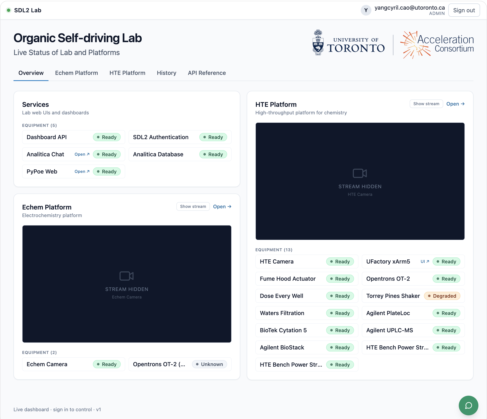
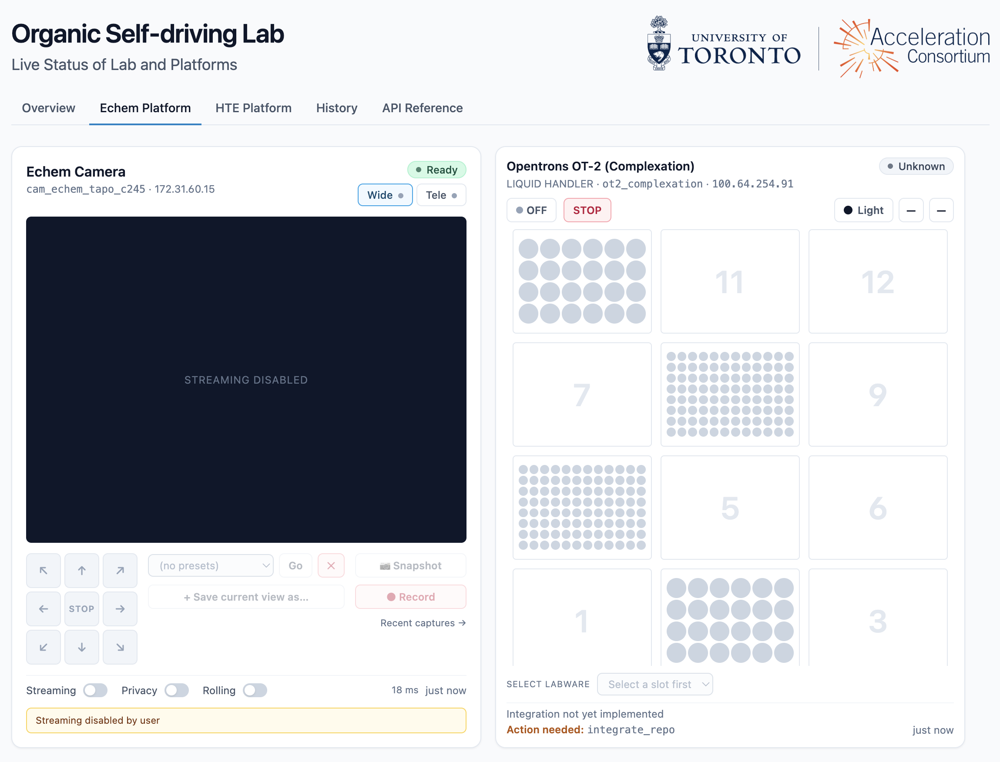

# AC Organic Lab

Monorepo for the Acceleration Consortium (AC) Organic Self-driving Lab platform stack: the equipment-status contract, the inventory, the Python SDK that workflows and the dashboard share, the dashboard's web server and Next.js UI, the lab's login service, and the read-only lab assistant.

The dashboard runs on a single Tailscale-attached server and aggregates status from each lab equipment's REST API into one normalized contract. The browser only ever talks to the dashboard server; the dashboard server is the only client that calls the equipment APIs over the lab Tailnet. Workflow code uses the same SDK directly without going through the dashboard.

## Dashboard Preview



The platform detail page (`/platforms/hte`) with the per-device control tiles:



## Architecture

```
Browser  ->  Next.js (web/, port 8000)  ->  FastAPI (api/, port 8001)  ->  lab-skills (skills/)  ->  Equipment APIs over Tailscale
                                                                                       ^
                                                       Workflow scripts ----------------+
```

- **`skills/`** — `lab-skills` Python SDK. Owns the registry, polling aggregator, per-device adapters, and the workflow-facing session API. Imported by `api/` and by project workflow repos.
- **`api/`** — FastAPI dashboard server. Thin presentation layer over `skills/`.
- **`web/`** — Next.js 14 (App Router) + TypeScript + TanStack Query.
- **`equipment.yaml`** — equipment inventory (committed). Hardware identity, adapter, URLs, tile sizing, and pill config. Edit when hardware physically changes.
- **`platforms.yaml`** — Overview layout config (committed). Defines sections, display order, and which equipment ids belong to each section. Edit when the dashboard layout changes.
- **`auth/`** — `ac_auth`, the lab's email-code login service + `roster.yaml` allow-list (see [`docs/AUTH_DESIGN.md`](docs/AUTH_DESIGN.md)).
- **`deploy/`** — systemd units for the three services + the Caddy edge config.
- **`docs/`** — architectural docs, device contract, runbooks, roadmap. See [Documentation](#documentation) below.

## Services

Everything below runs on the one Tailscale-attached dashboard host:

| Service | Unit / source | Port | What it provides |
|---|---|---|---|
| Dashboard UI | `ac-organic-lab-web.service` (`web/`) | 8000 | Next.js frontend — the only thing browsers talk to. |
| Dashboard API | `ac-organic-lab-api.service` (`api/`) | 8001 | FastAPI aggregator over `lab-skills`: normalized equipment status, the audited control passthrough (claim-gated on v1.1 devices), the history endpoints (`/api/history/*`, backed by `lab.db`), and the read-only **lab assistant** (`claude` CLI subprocess + the `lab-history` MCP tools). |
| Auth service | `ac-organic-lab-auth.service` (`auth/`) | `<tailscale-ip>:8009` | `ac_auth` email-code login and roster/grant checks. Control-route enforcement lives in the Next.js middleware calling `GET /auth/verify`; Caddy `forward_auth` ([`deploy/Caddyfile.auth-snippet`](deploy/Caddyfile.auth-snippet)) is the edge alternative. See [`docs/AUTH_DESIGN.md`](docs/AUTH_DESIGN.md). |
| Edge (Caddy) | [`deploy/Caddyfile`](deploy/Caddyfile) | 443/80 | TLS over Tailscale (`tailscale cert`), fronting the UI and the camera streams; the auth snippet wires `forward_auth`. |

Companion services on the same host from sibling repos:
[`kasa-tapo-services`](https://github.com/cyrilcaoyang/kasa_tapo_services)
(camera + smart-plug gateway, deliberately loopback-only on
`127.0.0.1:8002`) and its `ac-go2rtc` streaming service (MSE/WebRTC).
The AnaliticaDB record service is separate infrastructure on the data
server (`100.64.254.6:8010`, own repo).

## Working with coding agents

This repo is the **canonical base** for how coding agents (Hermes, Codex,
Claude Code, others) work across the lab. Three files, in precedence order:

- **[`AGENTS.md`](AGENTS.md)** — shared, model-agnostic instructions for
  *every* agent: working conventions, commands, layout, the memory policy.
  Read this first.
- **[`CLAUDE.md`](CLAUDE.md)** — Claude-Code-specific notes only; imports
  `AGENTS.md`. Other agents keep their own equivalent.
- **[`docs/AGENT_RULES.md`](docs/AGENT_RULES.md)** + [`docs/STATUS_SPEC.md`](docs/STATUS_SPEC.md)
  — the **binding contract** (lab operating rules + device contract). Agents
  reference it; they never weaken or bypass it.

Every other repo layers its own `AGENTS.md` / thin `CLAUDE.md` / `AGENT_RULES.md`
on this base (see [`organic-hte-template`](https://github.com/AccelerationConsortium/organic-hte-template)).
Durable repo-wide facts go in `AGENTS.md` (git is the source of truth, portable
to any machine); cross-repo/machine facts go in each agent's own global memory.

## Documentation

All design documents live in [`docs/`](docs/). Start with [`STATUS_SPEC.md`](docs/STATUS_SPEC.md) if you are bringing a new piece of equipment online, and [`ARCHITECTURE.md`](docs/ARCHITECTURE.md) if you want to understand how the platform fits together.

| Document | What it covers |
|---|---|
| [`docs/STATUS_SPEC.md`](docs/STATUS_SPEC.md) | **Authoritative device contract.** Combined v1.0 baseline + v1.1 additions (cooperative claims, `allowed_actions`, `details.claimed_by`). Includes the conformance checklists every device repo follows and an appendix comparing this contract to the **SiLA 2** standard. |
| [`docs/ARCHITECTURE.md`](docs/ARCHITECTURE.md) | Long-form description of the monorepo's layering, the responsibilities of `skills/`, `api/`, `web/`, `equipment.yaml`, and `platforms.yaml`, and the key design decisions. |
| [`docs/EQUIP_GUIDE.md`](docs/EQUIP_GUIDE.md) | **Guideline** (durable how-to): registering a new device, editing `equipment.yaml` and `platforms.yaml`, tile sizing, sensor map positions, maintenance windows, camera + smart-plug onboarding, control-lock policy (§1–§6b). |
| [`docs/EQUIP_STATUS.md`](docs/EQUIP_STATUS.md) | **Current implementation** (as-built): how each device's dashboard tile renders today — status derivation, control passthrough, per-device troubleshooting for the fume hood, press, plate sealer, robot arm, and OT-2 (§7–§11). |
| [`docs/SKILLS_CATALOG.md`](docs/SKILLS_CATALOG.md) | How the SDK describes "what the lab can do right now": `SkillDef` (static) vs `Skill` (runtime), how `allowed_actions` is computed, evolution from hard-coded → device-declared. |
| [`docs/INTERLOCKS.md`](docs/INTERLOCKS.md) | Four-layer safety model (hardware limits → device state machine → skill preconditions → project plan interlocks); `validate_plan` / `execute_plan` API. |
| [`docs/DEVICE_PC_SETUP.md`](docs/DEVICE_PC_SETUP.md) | Canonical install recipe for a Windows device PC (uv + NSSM + Tailscale). Linked from every device repo's README rather than duplicated per-repo. |
| [`docs/OBSERVABILITY.md`](docs/OBSERVABILITY.md) | Logging tiers (journald → events.jsonl → central SQLite), the history DB schema, dashboard history endpoints, retention guidance. |
| [`docs/ALERTING.md`](docs/ALERTING.md) | How alerting works end-to-end — Uptime Kuma (services) + the aggregator notifier (devices) → PyPoe → Slack + Claude investigation. Overview, runbook, troubleshooting. |
| [`docs/ROADMAP.md`](docs/ROADMAP.md) | Per-device migration status (`legacy_http` → v1.0 → v1.1), SDK milestones (v0.1 → v0.5), and live operational regressions. |
| [`docs/AUTH_DESIGN.md`](docs/AUTH_DESIGN.md) | **Canonical auth doc.** Email-code login (`ac_auth`), roster allow-list, per-scope grants, claim-before-control, data isolation, and the phased rollout (Phase 0 shipped). |
| [`AGENTS.md`](AGENTS.md) / [`CLAUDE.md`](CLAUDE.md) | **Agent entry point.** Shared working instructions for all agents (`AGENTS.md`) + Claude-Code specifics (`CLAUDE.md`). See [Working with coding agents](#working-with-coding-agents). |
| [`docs/AGENT_RULES.md`](docs/AGENT_RULES.md) | Lab-wide rules for agents operating on lab infrastructure (safety, records, change control, escalation). Project repos link here from their own `AGENT_RULES.md`. |
| [`docs/ANALITICADB_ELN_LIMS_DESIGN.md`](docs/ANALITICADB_ELN_LIMS_DESIGN.md) | Design for generalizing AnaliticaDB into the lab's ELN+LIMS record layer (mirror — the canonical copy lives in the AnaliticaDB repo). |
| [`docs/ELN_UI_PLAN.md`](docs/ELN_UI_PLAN.md) | Cross-repo plan for the ELN *user experience* — the design → execute → analyze (DMTA) loop made operable from one UI. Spans LaAgenteAnalitica, `lab-skills`, organic-solubility, and AnaliticaDB. |
| [`deploy/README.md`](deploy/README.md) | Linux server deployment, systemd units, Caddy + Tailscale TLS, day-to-day operations. |

## Local development

### Python (uv workspace)

The two Python packages (`skills/` and `api/`) share one `.venv` at the repo root, managed by [uv](https://docs.astral.sh/uv/):

```bash
uv sync                                # creates .venv/ at the root, installs both members editable
uv run uvicorn api.app.main:app --reload \
    --reload-include "*.py" --reload-include "*.yaml" --reload-include "*.yml" \
    --port 8001
```

The API reads `equipment.yaml` and `platforms.yaml` from the repo root at startup. Override paths with `LAB_REGISTRY_PATH` and `LAB_PLATFORMS_PATH`.

The extra `--reload-include` flags are required: `uvicorn --reload` only watches `*.py` by default. With them set, saving either YAML file triggers an automatic API restart and the browser picks up the change on its next poll.

### Frontend (Next.js)

```bash
cd web
npm install
npm run dev
```

The dev server runs on `http://sdl2-server-gaia.tail6a1dd7.ts.net:8000` and proxies `/api/*` to `http://localhost:8001`.

The `dev` script sets `WATCHPACK_POLLING=true` so Next.js's file watcher uses polling instead of FSEvents. This avoids the `EMFILE: too many open files` errors that happen on macOS because `launchctl limit maxfiles` defaults to 256 (way below what Next.js watches). Polling adds ~1-2% CPU and no dev-experience downside.

If you want native FSEvents back (slightly lower idle CPU), raise the system limit permanently and remove the env vars from `web/package.json`:

```bash
sudo cp deploy/limit.maxfiles.plist /Library/LaunchDaemons/limit.maxfiles.plist
sudo chown root:wheel /Library/LaunchDaemons/limit.maxfiles.plist
sudo chmod 644 /Library/LaunchDaemons/limit.maxfiles.plist
sudo launchctl load -w /Library/LaunchDaemons/limit.maxfiles.plist
# reboot, then verify: launchctl limit maxfiles  -> 65536 65536
```

To regenerate the TypeScript types from the live FastAPI OpenAPI doc (the aggregator must be running):

```bash
cd web
npm run gen:api-types   # writes src/types/api.generated.ts
```

`web/src/types/api.ts` is hand-curated and re-exports the friendly type names from the auto-generated file. Edit `api.ts` if you want to add aliases; never edit `api.generated.ts`.

## Customising the layout

Everything visible on the dashboard — section order, equipment membership, tile sizes, and sensor positions on the lab map — is driven by `equipment.yaml` and `platforms.yaml`. No frontend code changes are needed for layout tweaks.

See [`docs/EQUIP_GUIDE.md`](docs/EQUIP_GUIDE.md) for the step-by-step instructions.

## Tests

Python tests (both packages):

```bash
uv run pytest skills/tests api/tests -q
```

Frontend type-check and build:

```bash
cd web
npm run typecheck
npm run build
```

## Deployment (Linux server with systemd)

The services (see [Services](#services)) run as separate systemd units on one Tailscale-attached Linux server. Access is gated by Tailscale ACLs at the network layer; dashboard login (email-code via `ac_auth`) is rolling out per [`docs/AUTH_DESIGN.md`](docs/AUTH_DESIGN.md) — device REST APIs themselves carry no per-equipment authentication yet (see the *Control-surface exposure* section of [`docs/ROADMAP.md`](docs/ROADMAP.md)).

See [`deploy/README.md`](deploy/README.md) for:

- The complete one-time server setup (user, venv, build, static-asset copy, systemd install).
- Day-to-day operations (log tailing, redeploy commands, restart flow when YAML files change).
- How to front the service with Caddy over Tailscale's `tailscale cert` for TLS, or bind it directly to the tailnet.
- Sandboxing directives included in each unit.
- A troubleshooting table.

For equipment onboarding and maintenance/offline procedures, see
[`docs/EQUIP_GUIDE.md`](docs/EQUIP_GUIDE.md). For
the canonical install recipe on a Windows device PC see
[`docs/DEVICE_PC_SETUP.md`](docs/DEVICE_PC_SETUP.md).

The unit files themselves live at [`deploy/ac-organic-lab-api.service`](deploy/ac-organic-lab-api.service) and [`deploy/ac-organic-lab-web.service`](deploy/ac-organic-lab-web.service). Both set `Restart=on-failure`, journal logging, `LimitNOFILE=65536`, and standard systemd hardening directives (`ProtectSystem=strict`, `NoNewPrivileges`, etc.).

## Cameras and smart plugs

Tapo cameras and Kasa smart plugs are integrated through a companion
gateway service ([`kasa-tapo-services`](https://github.com/cyrilcaoyang/kasa_tapo_services))
that translates the proprietary device protocols into the same
[STATUS_SPEC](docs/STATUS_SPEC.md) HTTP envelope as every other piece of equipment.

When a camera is registered in `equipment.yaml` with `kind: camera`,
the dashboard renders a richer tile on its platform panel:

- live MSE video feed (active lens), with a Wide/Tele tab strip on
  dual-lens models;
- 8-direction PTZ pad on the left;
- preset selector + "Save current view as…" in the middle;
- snapshot, record (start/stop/cancel), and "Recent captures →" link
  on the right;
- Streaming / Privacy toggles and a staleness indicator at the bottom.

Snapshots and recordings are written by the gateway on the dashboard
host (default: `/var/lib/kasa-tapo-media/{snapshots,recordings}/<camera_id>/<lens>/`)
and exposed back through `GET /api/equipment/<id>/media` (listing) and
`GET /api/equipment/<id>/media/<kind>/<lens>/<file>` (binary download).
The minimal "Recent captures" page at
`/platforms/<platform>/media/<camera_id>` lists everything currently on
disk.

See [`deploy/README.md` § _Optional: cameras + smart plugs_](deploy/README.md#optional-cameras--smart-plugs-kasa-tapo-services)
for the production wiring.

## Status

**Current:** live monitoring of the full fleet plus control through the
audited dashboard passthrough (claim-gated on v1.1 devices), full camera
control (PTZ, presets, snapshot, recording) and Kasa plugs through
`kasa-tapo-services`, and persistent history (`lab.db` + the
`/api/history/*` endpoints). Overview page (`/`) is driven by
`platforms.yaml`; per-platform detail pages (e.g. `/platforms/hte`) are
also section-order-driven. Polling every 2-3 seconds.

**Future:** WebSocket-based real-time pages, the MCP agent surface
(SDK v0.4, see [`docs/ROADMAP.md`](docs/ROADMAP.md)), and the remaining
auth rollout phases ([`docs/AUTH_DESIGN.md`](docs/AUTH_DESIGN.md)).
