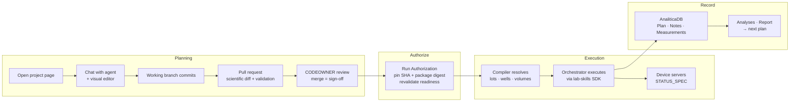

# Agentic ELN — Design

**Status:** consolidated design (2026-07-22). Architecture reviewed against the
binding contracts; **not itself part of the lab contract.** This document
merges the former `AGENTIC_ELN_ASSESSMENT.md` (the why, the landscape, the
gaps), the design halves of `ELN_UI_PLAN.md` (what each repo owns, the three
ELN surfaces), and `AGENT_ASSISTED_HTE_WORKFLOW.md` (the planning page,
repository lifecycle, AG-UI, authorization/compile/execute semantics). The
implementation sequencing lives in [`AGENTIC_ELN_PLAN.md`](AGENTIC_ELN_PLAN.md);
the record-layer (database) design lives in
[`DATABASE_DESIGN.md`](DATABASE_DESIGN.md).

**Binding contracts** (referenced, never weakened here):
[`AGENTIC_LAB_DESIGN.md`](AGENTIC_LAB_DESIGN.md) (lab operating rules) and
[`STATUS_SPEC.md`](STATUS_SPEC.md) (device contract). Where this document says
"binding", the authoritative text lives there.

Labels: **[BINDING]** existing requirement or merged decision ·
**[PROPOSED]** agreed direction, not built · **[OPEN]** needs human input
(collected in [`AGENTIC_ELN_PLAN.md`](AGENTIC_ELN_PLAN.md) §4).

---

## 1. Vision and verdict

An ELN records *intent, execution, observation, and conclusion*. A LIMS
tracks *materials, containers, and locations*. "Agentic" means an LLM does
real authoring and interpretation across that record — not autocomplete —
while a human stays the signing authority.

**The lab is ~70% of the way to an agentic ELN and it is mostly a matter of
assembly, not invention.** The capability is spread across four repos that
were never assembled into one product:

- **AnaliticaDB** — the durable record layer, with a designed ELN+LIMS
  generalization: append-only notes, versioned plans, a materials ledger, an
  agent-facing ontology contract ([`DATABASE_DESIGN.md`](DATABASE_DESIGN.md)).
- **LaAgenteAnalitica** — a production-grade chat + workspace agent with real
  analysis workflows and a human-gated commit step. Reference implementation
  for `bitacora` to learn from — not a dependency.
- **ac-organic-lab** — the real-time platform: safety, claims, interlocks,
  observability, the `lab-skills` SDK and its MCP surface.
- **PyPoe** — the coordination layer: human front door and approval
  chokepoint.
- **bitacora** (new) — the ELN agent platform that does the assembly: its own
  runtime, planning page, run authorizer, compiler, protocol edit service, and
  conversation store. Inspired by LaAgenteAnalitica's patterns, not
  dependent on it; a client of AnaliticaDB (contract), `lab-skills` (SDK), and
  Undermind (literature search). Also hosts the experiment templates —
  including the **HTE template** (core structural blocks: design matrix,
  plate map, step list, QC, materials) at `bitacora/templates/hte/`, absorbed
  from the former `organic-hte-template` repo; new project repos are stamped
  from here. Per-project chemistry extensions stay in the project repo.
  Naming: *bitácora* — the logbook of a voyage of discovery (Columbus's
  daily log is the archetypal bitácora); the ELN is the bitácora of the DMTA
  loop.

What is missing is **assembly**: closing the loop from a conversationally- or
protocol-authored *plan* through validated execution to an immutable,
provenance-linked record, behind human-approval gates.

The governing distinction (settled in the record-layer design): the ELN is an
**append-only narrative timeline**; the LIMS is a **ledger plus computed
current state**. What unifies them is **provenance** (W3C PROV): a *Plan*
(intent) → *Activities* (execution, analysis, transactions) → *Entities*
(samples, lots, files, results) → *Agents* (human and AI principals).

The target loop is the DMTA cycle made durable: **Plan → Notes (execution
actuals) → Measurements (instrument data) → Analyses (interpretations) →
Report → next Plan** — with a human approving the two stages that touch
reality: the plan that will run, and the result that becomes the record.

## 2. What exists today — the four seams

| Repo | Owns | ELN role | Maturity |
|---|---|---|---|
| **LaAgenteAnalitica** (`graphchat/` UI + agent runtime) | human↔agent conversation, room workspace, deferred-tool approval, analysis capabilities | **the ELN front end** | ~85–95% built; production LC-MS/LC-UV; 16 AnaliticaDB CRUD tools from the versioned ontology; Yjs rooms, workspace explorer, NPZ/molecule viewers |
| **ac-organic-lab** (`lab-skills` SDK + `api/` + MCP servers) | `validate_plan`/`execute_plan`, skill catalog, claims/interlocks, live `/status`, control-capable + read-only MCP servers | **execution engine + live-state source** | shipped through SDK v0.4 (`lab-skills mcp serve --allow-control`) |
| **organic-solubility** (+ `bitacora/templates/hte`) | git-authored, PR/CODEOWNERS-approved **protocols**; CI-stable `step_id`s | **the reviewed procedure** a Plan instantiates | template published; first campaign slice landed 2026-07-04 |
| **AnaliticaDB** | `Plan` (versioned, `draft→approved→executing→completed`), `Note` (append-only, step-anchored), `Measurement`, `Analysis`, reports | **the notebook itself** | ELN core shipped 2026-07-03; LIMS ledger designed, unbuilt |

**The load-bearing fact:** LaAgenteAnalitica and AnaliticaDB grew up *outside*
the lab's SDK/claim/observability fabric — the agent reaches the Agilent
instrument through its own REST API, not the audited claim path. The agentic
ELN is largely the project of **joining these two worlds** at three seams the
architecture already names: plan executions referencing validated plans,
notes/measurements carrying `equipment.yaml` ids, and trace/session ids
linking records to chat rooms.

### Field context (why this shape)

Three external reference points, in brief (full source list in §17):

- **Agents that operate labs** (Coscientist, ChemCrow, A-Lab): landmark but
  narrow; A-Lab's published correction is the cautionary tale — *autonomy
  without a trustworthy, auditable record layer is fragile*. SDL 2.0 syntheses
  converge on machine-readable ontologies, version-controlled
  provenance-tracked recipes, and human-in-the-loop as first-class
  infrastructure.
- **The ELN/LIMS market went "agentic" in 2025** (Benchling AI, Sapio,
  Dotmatics/Siemens; open-source: Chemotion, eLabFTW, Airalogy). The
  differentiator the vendors mostly lack — and this lab has — is a **physical
  execution fabric with real interlocks and claims under the notebook**.
- **Standards & compliance floor**: AiiDA (provenance DAG), ESCALATE
  (template-vs-object, nominal-vs-actual), SiLA 2 / AnIML / Allotrope for
  interchange, 21 CFR Part 11 / ALCOA+ for auditability — precisely the
  append-only + `AgentAction` + author-kind posture AnaliticaDB already
  adopts. MCP is the de-facto agent tool protocol; the lab already uses it.

Requirements-vs-stack mapping: immutable attributable record — **yes**;
queryable provenance graph — **yes**; template-vs-run-instance — **yes**;
agent as untrusted tool-caller — **yes**; human-in-the-loop on side effects —
**partial** (gates exist, not unified); physical-action safety — **yes**;
AnIML/AFO export — **gap**; unified materials ledger — **designed, unbuilt**;
one agent across design→execute→record — **gap (the assembly)**.

## 3. Architectural principles

1. **[BINDING] The agent proposes; a human approves; hardware obeys only
   validated, `main`-merged, authorized plans.** ([`AGENTIC_LAB_DESIGN.md`](AGENTIC_LAB_DESIGN.md) §1.3, §3.1)
2. **[BINDING] All hardware access goes through the `lab-skills` SDK** —
   never raw device `/control/*`, never bypassing interlocks, claims, or
   readiness checks. The SDK refusing a call is the safety system working.
3. **[BINDING] Git holds authored artifacts; AnaliticaDB holds operational
   records; no run data in git.** A commit hash on each database row ties the
   two ([`DATABASE_DESIGN.md`](DATABASE_DESIGN.md), project-repo blueprint).
4. **[PROPOSED] One canonical protocol model.** Agent edits, chat-approved
   edits, and visual-editor edits all mutate the same protocol document on the
   same working branch. There MUST NOT be separate "chat", "UI", and
   "execution" plans.
5. **[PROPOSED] Transport is not schema.** AG-UI streams the interaction
   (messages, tool activity, state deltas, approval requests); the experiment
   is defined by the typed, versioned HTE protocol schema. AG-UI events
   reference the protocol; they never *become* it.
6. **[PROPOSED] Merge ≠ execute.** Merging to `main` accepts a plan into
   canonical project history. Execution requires a separate, revalidated,
   pinned **run authorization** — the platform executes the authorized commit/package,
   never the moving head of `main`.
7. **Fail fast, record truthfully.** Validation failures, deviations, and
   partial results surface as-is, to the human and to the record layer
   ([`AGENTIC_LAB_DESIGN.md`](AGENTIC_LAB_DESIGN.md) §2.3).
8. **Chat is optional; the record is mandatory.** The DMTA chain
   (`Plan → Notes → Measurements → Analyses → Report → next Plan`) is the
   spine of the record, but conversation is only one way to produce it. A
   chemist who runs an instrument directly, or edits a protocol in the visual
   editor without saying a word to the agent, produces exactly the same
   record rows. No entity in AnaliticaDB may *require* a conversation to
   exist, and entry mid-chain (e.g. measurements with no agent-drafted Plan)
   MUST remain possible.

## 4. Authorities and trust boundaries

| Authority | Decides | Must not |
|---|---|---|
| **Agent** | drafts protocols, proposes edits, answers questions | write to `main`; approve anything; touch hardware; hold human credentials |
| **Scientist / reviewer** | scientific content; PR approval; run approval | be impersonated — approvals carry the authenticated human principal (`ac_auth`), never an agent identity |
| **Git (project repo)** | versioned intent: protocols, decision records, analysis code, review history | hold run data, secrets, machine-local paths |
| **Run authorizer** [PROPOSED] | that one exact commit + protocol + compiled package is authorized to execute | re-interpret the protocol; execute anything itself |
| **Compiler** [PROPOSED] | resolution of scientific intent into concrete operations (lots, wells, volumes, device parameter sets) | change scientific intent; talk to devices |
| **Orchestrator** | sequencing, claims, retries, operator handoffs during execution | bypass the SDK, interlocks, claims, or device readiness ([`AGENTIC_LAB_DESIGN.md`](AGENTIC_LAB_DESIGN.md) §1) |
| **Device servers** | their own state and refusals (412/423/409), per [`STATUS_SPEC.md`](STATUS_SPEC.md) | be driven by anything other than the SDK path |
| **AnaliticaDB** | the durable record of what actually happened and how results were produced | be edited retroactively — corrections are new records (`corrects`/`supersedes`) |
| **Dashboard** | coherent projections and controls | become a competing source of truth; hold control logic in the browser ([`UI_DESIGN.md`](UI_DESIGN.md) §3.1) |

Separation of *artifacts*:

| Artifact | Lives in | Authority |
|---|---|---|
| Scientific intent (objective, hypotheses, rationale) | protocol header + decision record, git | scientist (agent-drafted) |
| Approved plan | `main` merge commit of the protocol | human CODEOWNER review |
| Authorized execution package | authorization record (pins + digest) | run approver + run authorizer |
| Actual execution | AnaliticaDB `Plan`/`Note`/`Measurement` rows | orchestrator + devices, recorded |
| Interpretation & conclusions | AnaliticaDB `Analysis` rows + reports | scientist (agent-assisted), commit-stamped analysis code |

Trust boundaries the architecture review added:

- **The agent's git identity is its own** (bot account / GitHub App
  installation), distinct from every human. It MUST NOT be a CODEOWNER, MUST
  NOT have ruleset-bypass rights, and its PRs MUST NOT be approvable by
  itself. ([`AGENTIC_LAB_DESIGN.md`](AGENTIC_LAB_DESIGN.md) §2.4: identity is not negotiable.)
- **The run authorizer MUST verify** the pinned SHA is an ancestor of `main`
  with required CI checks green — otherwise a branch commit could be authorized.
- **The compiler MUST be deterministic and pinned** (its version recorded in
  the authorization), or the package digest is meaningless.
- **The AG-UI channel is a presentation transport** and MUST NOT carry
  credentials, secrets, or hidden reasoning (§9, §14).

### The two sign-off authorities (do not fork them)

Two legitimate human sign-off mechanisms exist and stay distinct:

- **Protocol-authored plans** — the procedure lives in a project git repo;
  *merge to `main` under CODEOWNERS review is the sign-off*. The orchestrator
  renders it into a `Plan` with `source_commit` and executes only authorized
  commits.
- **Conversational / ad-hoc plans** — negotiated in chat; *an approval card
  (human principal via `ac_auth` / PyPoe's gate) is the sign-off*, stamped
  onto the AnaliticaDB `Plan`'s `draft → approved` transition.

Support both; never let one masquerade as the other. GraphChat-style chat is
the *design surface*; AnaliticaDB stays the *system of record*; the approval
gate owns *identity*. The gate must front AnaliticaDB's own contract, not
re-declare the ontology.

## 5. End-to-end user journey



1. Scientist opens the project's planning page (new project → repo creation
   §7; existing project → resume its workspace).
2. Scientist and agent iterate in chat; the agent edits the protocol on a
   working branch; the visual editor renders and accepts direct edits into
   the same document (§8–§9).
3. The page opens/updates a PR; review sees scientific diffs and validation
   results (§10–§11).
4. A human CODEOWNER merges. **[BINDING]** Merge to `main` is the sign-off;
   nothing actuates yet.
5. A separate **Run Authorization** pins the exact commit, protocol,
   schema/template versions, and compiled package digest; revalidates
   inventory/devices/readiness; records the approving user (§12).
6. The compiler resolves the authorization into a concrete execution package (§13);
   the orchestrator executes it through the SDK (§14 of this doc's execution
   boundary, §6 surfaces); AnaliticaDB records actuals linked to the authorization.
7. Post-run analysis proceeds on the analysis surface (§6); the report seeds
   the next plan.

## 6. The three ELN surfaces (target UX)

One room/project, three surfaces on a single workspace shell. Chat stays the
coordination panel; the workspace is the work surface.

- **Design — "let's plan an experiment."** Conversational plan-builder: the
  human states intent; the agent drafts by composing lab-skills catalog steps
  (validated live via `validate_plan`/`preflight_plan`), renders a plan
  preview (steps + per-step role/skill/args + warnings + estimated
  duration/devices), and iterates (`add_step`/`edit_step`/`remove_step`).
  The **dynamic-but-lockable plan-as-data pattern** (proven on
  LaAgenteAnalitica's `AnalysisPlan`: discuss → edit → preview → approve →
  lock; run only locked plans) generalizes to the experiment plan — the agent
  composes only from implemented skills, so it *cannot invent a step with no
  implementation*. Approval = human principal → AnaliticaDB `Plan.approved`.
  For repo-backed campaigns the agent renders the git **protocol** into the
  Plan and the sign-off is the PR merge (§4), not a UI button.
- **Execute — "watch it run."** On approve→run, `execute_plan` runs behind
  the deferred-tool approval gate + lab claims. The panel renders a **step
  timeline** (streamed `StepRunReport`s: running / done / blocked-with-
  violation / failed / skipped, keyed by `step_id`), a **live deck + plate
  heatmap** (from `/api/equipment`: OT-2 `details.snapshot.deck` +
  `details.loaded_plate`, polled ~2–3 s), and **device tiles** (claim holder,
  status, key metrics). Human observations/deviations append as `Note`s
  anchored to (`plan_id`, `step_id`). The dashboard-side runner + SSE contract
  is specified in [`UI_DESIGN.md`](UI_DESIGN.md) §3.
- **Analyze — "what did we get."** Post-run measurements are step-correlated
  in AnaliticaDB; the chemist stages files, runs analysis capabilities
  conversationally, commits accepted results as `Analysis` rows via the
  existing human-gated commit, and generates an experiment-level report whose
  conclusions seed the next Plan — closing the loop in the same room.

### Page layout — follow the GraphChat pattern

The planning page SHOULD adopt the **proven GraphChat layout** from
LaAgenteAnalitica (`graphchat/packages/frontend/src/App.tsx`): a horizontal
resizable split with a **collapsible chat panel on the left** (foldable to a
thin rail so the work surface stands alone) and a **persistent tabbed work
surface on the right**, always mounted and keyed to the active
project/session. Only the layout pattern is prescribed — LaAgenteAnalitica's
pydantic backend design is explicitly **not** required. Right-side tabs for
planning:

| Tab | Renders | Source |
|---|---|---|
| **Protocol** | workflow graph + step editor | the canonical document |
| **Design** | condition/factor matrix, controls, replicates | the canonical document |
| **Plate map** | nominal plate/well editor | the canonical document |
| **Materials** | materials + quantities, stock check results | document + validation |
| **Validation** | current findings per layer (§11), unresolved-warning count | validation service |
| **Review** | PR state, scientific diff (§10), authorization status (§12) | GitHub + run authorizer |
| **Raw** | the structured document, read-only advanced view | the canonical document |

Direct manipulation in any tab issues typed edits to the edit service (§9);
the agent narrates/acknowledges over AG-UI.

### The room is the session container — the experiment is what you navigate

A **room** *is* the planning session: it owns the working branch, the server
worktree, and the tabbed surface. Consequences:

- **The experiment is the spine; chat is a floating companion.** *(Amended
  twice on 2026-08-09, at the operator's request, after a week of real use —
  the arc is worth keeping, because each step was falsified by use rather than
  reasoned to.)* The original bet was to open on the Protocol tab with chat
  folded to a rail, on the theory that a chemist editing directly should never
  have to touch chat. Use falsified it: every substantive change in the first
  week (design, plate map, controls, parameters, the action map) went *through*
  conversation. So the surface flipped to open on the conversation, with a room
  rail on the left. Use falsified *that* too — a room list is a list of git
  branches, and what a scientist navigates is **experiments**. The settled
  shape: an **experiments rail** on the left (each design expanding to the
  protocols that realize it), the work surface in the centre, and chat as a
  **draggable, minimisable bubble floating over** it — consulted against the
  work, never resizing it. A room still exists underneath every view and is
  still the branch and the PR; it is simply no longer the thing you steer by.
  The invariant that made both flips safe is unchanged: **both paths flow
  through the same edit service and produce the same commits** — only which
  surface is default moved. Layout detail lives in `bitacora`'s
  `docs/DESIGN_FIRST_UI_PLAN.md`; it is not repeated here, to keep one
  authority.
- **Lazy branch minting.** Opening a room does not create a branch. The
  working branch (and worktree) is minted on the **first edit** — from either
  the agent or the visual editor. A room in which nothing was edited leaves
  no git residue and can be garbage-collected silently.
- **One room, one owner.** The room's **starter is its owner** — the
  scientific reviewer who sees the conversation through and consents to the
  PR. Others can join and chat (labeled by ID), but the starter owns the
  approval. A chemist who disagrees does not edit someone else's branch —
  they start their own room, draft their own plan, open their own PR; the
  PI/CODEOWNER sees the competing PRs and picks which to merge. The owner is
  always a **human** (binding contract: only a human principal approves); if
  the agent starts a room on someone's behalf, the human who commissioned it
  is the owner. The starter's consent is the *scientific* sign-off; the
  CODEOWNER merge is the *canonical* sign-off (§4) — in a small lab, often
  the same person.
- **Room vs. dashboard run view.** Rooms are for *changing the protocol*;
  the dashboard run view ([`UI_DESIGN.md`](UI_DESIGN.md) §3)
  is for *executing and watching an authorized plan*. A rerun that changes only
  run-scoped parameters (which plate, which day) happens from the run
  view; anything that changes scientific content goes back to a room and
  through review.

### What to borrow from LaAgenteAnalitica (and what to skip)

LaAgenteAnalitica proved several patterns this design adopts; it also carries
machinery that HTE planning does not need. Pin the boundary explicitly:

| Borrow | Why |
|---|---|
| GraphChat page layout (collapsible chat + tabbed surface) | proven UX; prescribed above |
| Deferred-tool approval gate | the human-in-the-loop pattern for any actuating tool |
| Dynamic-but-lockable plan-as-data (discuss → edit → preview → approve → lock) | generalizes directly to the experiment protocol |
| Persistence discipline (`persistence-boundaries.md`) | one owner per datum; conversation store ≠ record layer (§13) |
| Ontology-pinned tool generation (`ontology.json`, exact-version check) | fail-fast cross-repo contract, already how AnaliticaDB tools are built |

| Skip | Why |
|---|---|
| pydantic-graph conversation engine | the protocol document + the three state machines (§15) already structure the interaction; a graph engine would duplicate them |
| Separate graph database | the provenance graph HTE needs already exists as AnaliticaDB's relational FKs (`Plan → Experiment → Sample → Measurement → Analysis`) |
| Per-project MongoDB instances | one conversation store with project-scoped rows (§13) — same multi-tenancy pattern as AnaliticaDB's denormalized `project_id` |
| Free-form per-room filesystem workspace as the primary surface | the primary surface here is the versioned protocol in the git worktree; scratch space stays scratch |

### Tool domains in `bitacora`

The agent composes across external services, each a tool domain (the pattern
is borrowed from LaAgenteAnalitica's `domains/` layout):

| Domain | Client of | Purpose |
|---|---|---|
| `domains/lab/` | `lab-skills mcp serve` | list equipment/skills, `validate_plan`, `preflight_plan`; `execute_plan` behind `--allow-control` + human approval (Track 1 Step 1) |
| `domains/analitica_db/` | AnaliticaDB HTTP, pinned to `ontology.json` (exact `SCHEMA_VERSION`) | read/write the record layer — Plans, Notes, Analyses, run-authorization linkage |
| `domains/undermind/` | Undermind (literature search API) | research papers, synthesize prior art, cite — the capability that expands the agent beyond lab operations into experimental design informed by the literature |

## 7. Repository creation and server workspace lifecycle [PROPOSED]

### Template, not fork — seeded, not generated

**Decision (revised 2026-07-25): seed-from-local template stamping.** The
platform creates an **empty** private repo under the lab org and seeds the
`bitacora/templates/<name>/` tree into it as **one root commit** (Git Data
API: inline tree → parentless commit → branch ref). Implemented in
`bitacora` (`stamping.py`, `GitHubApp.create_org_repo` /
`seed_initial_commit`).

This supersedes the original decision here (GitHub template-based creation,
`POST /repos/{owner}/{template}/generate`), which turned out unimplementable
as designed: `/generate` copies a **whole repository** and the template lives
in a *subdirectory* of `bitacora` — using it would have required splitting
`templates/hte/` into a separately-maintained `bitacora-hte-template` repo
kept in sync forever. It also records no provenance (the registry's
`stamp_commit` sat at a `"HEAD"` placeholder). What the original rationale
actually wanted survives unchanged and is now delivered more directly: a
private, independently named, org-owned repo with a clean single-commit
start, no fork network, and provenance via `pins.yaml` — now with the **real
template commit SHA** recorded at stamp time, because the server derives
`template_version` + `stamp_commit` from the tree it actually stamps (they
are no longer request fields).

The **fork** half of the original decision stands: never a private fork —
fork networks couple visibility and lifecycle for nothing.

### Creation flow

On "create project", the platform (server-side, never the browser):

1. Registers the project ↔ repo mapping in the platform's project registry
   **first** — the row is durable, and a subsequent stamp failure is reported
   (`stamp_error` on the response, error-level log), never silently swallowed.
2. Creates the **empty** repo (no auto-init), private, under the lab org, with
   the user-supplied name (org is server-side config, never a request field).
3. Seeds the customized template tree as one root commit: `.github/CODEOWNERS`
   with the project's human reviewers (request `codeowners`, default from
   config — required, because step 4's ruleset demands code-owner review and
   an unresolvable owner would make that gate vacuous), `PROJECT_NAME`
   placeholders → project id, and `pins.yaml` with an appended `stamp:` block
   (template, version, commit SHA, timestamp). The `AGENT_RULES.md` link-back
   ships in the template tree itself.
4. Applies branch protection via API **last** — it makes `main` PR-only, so
   applying it before step 3 would refuse the very seed commit it protects:
   PR-only `main`, human CODEOWNERS review, squash-merge only, required
   `protocols` CI check, no force-push, no deletion, linear history, no
   bypass actors.
5. Creates the AnaliticaDB `Project` row if absent (unchanged; not yet
   implemented).

### Server-side workspace

Planning operates on a **controlled server-side clone** — never browser-side
git, never the scientist's laptop:

- One **bare clone per project** plus one **worktree per active planning
  session** (branch-per-session, §15), so concurrent sessions never share a
  checkout.
- Workspaces are cache, not truth: platform-owned directory, quota, GC after
  session close + branch push; the UI MUST make push/commit state visible.
- The agent process operating in a workspace is sandboxed (§14).

### Project-repository structure [PROPOSED, extends the template]

The `bitacora/templates/hte` layout is kept as-is, with one addition:

```
project-repo/
├── protocols/                    # canonical protocol documents (§8) — unchanged
├── schema/protocol.schema.json   # protocol shape; CI validates every PR — unchanged
├── planning/                     # NEW — per-session planning records
│   └── <session-id>/
│       └── decisions.md          # structured decision record (§13); links the
│                                 #   conversation store by session_id — no
│                                 #   transcript copies in git (resolved, §13)
├── analysis/  configs/  pins.yaml  scripts/  .github/   # unchanged
```

Rules carried over unchanged **[BINDING]**: `step_id`s are permanent once
merged and executed; comments are for humans, fields are for machines; no run
data in git; machine paths and secrets stay in gitignored `*.local.json`; no
filename versioning.

## 8. Canonical protocol representation

The experiment is defined by a **typed, versioned, machine-readable protocol
document** in `protocols/`, validated by `schema/protocol.schema.json` — the
same artifact the template already defines; the planning page introduces no
second model. Schema versioning rides `TEMPLATE_VERSION` + `pins.yaml`.

**Protocol ≠ Plan** (settled terminology): the *protocol* is the reusable,
parameterized, PR-reviewed procedure (ESCALATE's template side); the
AnaliticaDB `Plan` is one rendered run of it (concrete parameters,
`source_commit`, `protocol_path` — the object side). "Workflow" means the
execution engine. LaAgente's `AnalysisPlan` is the post-hoc analysis pipeline
— parallel pattern, distinct object.

### Schema extension [PROPOSED]

Today's schema is minimal (`protocol`, `description`, `parameters`,
`steps[step_id, action, params]`). It grows, deliberately and versioned,
toward: scientific objective and hypotheses; factors, levels, and conditions;
controls and replicates; materials with quantities/concentrations/units;
plates, wells, samples, and planned lineage (nominal plate map); workflow
steps or graph with device capability requirements expressed as **roles +
skills** (never `equipment_id`s — [`ARCHITECTURE.md`](ARCHITECTURE.md)
decision #4); inputs and expected outputs per step; QC and acceptance
criteria; human approval/handoff points as first-class steps; failure, retry,
and recovery semantics; analysis methods and result requirements.

Constraints on growth: **nominal only** (actual lots, barcodes, resolved
volumes belong to compilation §13 and the record layer — never committed back
into the protocol) and **renderable without execution** (everything the
visual editor shows derives from schema fields).

### Single-writer edit path [PROPOSED]

All three edit surfaces — agent tool calls, chat-approved suggestions, direct
visual-editor manipulation — MUST funnel through one server-side **protocol
edit service** that applies a typed edit to the working-branch document,
re-validates against the schema, and commits with an attributed author (human
edits under the human's identity, agent edits under the bot identity). No
client-side copy can drift.

## 9. AG-UI and the visual editor [PROPOSED]

AG-UI is the streaming interaction protocol between the project-scoped agent
and the planning page: chat messages, tool-activity events, progress, state
snapshots/patches, approval requests. **AG-UI MUST NOT become the experiment
schema.** Concretely:

- AG-UI state snapshots MAY carry the current protocol document (plus
  validation findings) *for rendering*; persisted truth is the working-branch
  commit. A reconnecting client re-hydrates from the branch, not from
  replayed events.
- Approval requests over AG-UI gate *edits during planning*. They are UX
  affordances — **not** the scientific sign-off (the PR merge, §10) and
  **not** the execution authorization (the run authorization, §12).
- AG-UI events MUST NOT carry credentials, secrets, hidden chain-of-thought,
  or system prompts. What streams to the browser is exactly what is eligible
  for the interaction record in the conversation store (§13).

The agent backend behind AG-UI is deliberately unconstrained — pydantic-ai
(as in LaAgenteAnalitica) or any other runtime, provided it speaks AG-UI to
the page and respects the edit path (§8).

## 10. Branching, commits, pull requests, and review

- **[BINDING] The agent MUST NOT write to `main`.** Planning happens on a
  working branch (`plan/<session-id>` [PROPOSED]), enforced by the ruleset,
  not convention.
- Commits are attributed per author (§8). Squash-merge keeps `main` at one
  commit per approved change — what `source_commit` on the `Plan` pins.
- **The PR is the scientific review surface** and MUST expose meaningful
  scientific diffs, not only raw YAML: experimental design, condition matrix,
  plate map, material requirements, workflow graph, QC criteria, validation
  and simulation results, unresolved warnings. [PROPOSED] Implement as a CI
  job rendering a diff report from the two protocol versions — derived from
  the same schema the editor renders.
- **[BINDING] Merge by a human CODEOWNER is the sign-off.** CI (`protocols`
  check: schema validation + permanent-`step_id` enforcement) must pass.
  Nothing here changes the template's CI contract.

## 11. Validation layers [PROPOSED, composing existing machinery]

Validation runs continuously during planning, again in PR CI, and again at
authorization:

| Check | Mechanism |
|---|---|
| Schema conformance | `protocol.schema.json` (CI: `validate_protocols.py`) — exists |
| Units and quantities | schema types + units-aware validator — new |
| Scientific coherence (factors×levels, objective↔design) | protocol-level rules — new |
| Controls and replicates per design rules | protocol-level rules — new |
| Labware and volume feasibility | protocol-level rules + labware definitions — new |
| Material requirements vs inventory | AnaliticaDB LIMS queries (Phase 2 dependency; advisory until then) |
| Device capability compatibility (role/skill exists, args valid) | `lab-skills` `validate_plan` (layer 3/4) — exists |
| Workflow completeness (no orphan steps, reachable graph) | protocol-level rules — new |
| Human handoffs explicit | schema field + completeness rule — new |
| Compliance with the binding contracts | `validate_plan` interlocks + review; rules files are guidance, checks are enforcement |
| Compilation / simulation readiness | dry-run compile (§13) + `execute_plan(dry_run=True)` preflight — exists |

Protocol-level rules belong to the project/template layer; device-facing ones
to `lab-skills` — the [`INTERLOCKS.md`](INTERLOCKS.md) layer-3/4 split. Which
checks block merge vs. warn is a template-level policy [OPEN].

## 12. Merge vs. Run Authorization

**[BINDING] Merging to `main` does not operate equipment.**

**[PROPOSED] Run Authorization** is a separate gate owned by a run
authorizer (MAY start as an `api/` module beside the
[`UI_DESIGN.md`](UI_DESIGN.md) §3 runner). A run authorization:

1. Pins the exact **repository URL and commit SHA** (verified ancestor of
   `main`, required checks green).
2. Pins the **protocol path and schema version** (from `pins.yaml`) and
   **template and analysis-method versions**.
3. Invokes the compiler (§13) and pins/checksums the **compiled execution
   package** (content digest + compiler version).
4. **Revalidates current reality**: inventory/material availability, device
   capabilities and readiness (live `allowed_actions`, `validate_plan` +
   preflight), project interlocks.
5. Records the **approving human user and timestamp** (`ac_auth` principal).
6. Produces an **immutable run-authorization identity** (`authorization_id`), recorded in
   AnaliticaDB alongside the `Plan` row it authorizes.

Step 4 is what prevents a merged-but-stale plan from executing: merge asserted
scientific intent; authorizing a run asserts *the lab can run it now*. Run
authorizations SHOULD carry an expiry/TTL [OPEN — resolved D-2, ~1 working day].
The platform executes the authorized commit/package
— never the moving head of `main`. The `Plan` records `source_commit`
(existing) and `authorization_id`/package digest [PROPOSED — AnaliticaDB contract
bump; see [`DATABASE_DESIGN.md`](DATABASE_DESIGN.md) §"Run-authorization linkage"].

## 13. Protocol compilation; conversation policy

### Compilation [PROPOSED]

The compiler resolves the nominal protocol + per-run parameters into a
concrete execution package: actual source **lots** (from the LIMS ledger;
until Phase 2, operator-confirmed selections recorded as parameters), **plate
identities and barcodes**, **source/destination wells**, exact **volumes**,
device protocols and parameter sets per step (skill + typed args), plate
**transports** and **operator handoffs**, and required **completion
evidence** per step.

Requirements: **deterministic** (same authorization inputs → same package → same
digest; compiler version pinned in the authorization); **intent-preserving** (if a
constraint cannot be satisfied it fails the authorization — never silently
substitutes); **platform-sided** (output steps are `lab-skills` plan steps —
roles + skills + args — so execution inherits the SDK's claim and interlock
machinery unchanged).

### Conversation and decision-record policy

The record-layer decision **[BINDING as merged design]** is: *store the
decision artifact, not the conversation* — the `Plan` version chain (v1 agent
draft → v2 human edit → v3 approved) is the collaboration record in
AnaliticaDB; prose transcripts never enter the record layer
([`DATABASE_DESIGN.md`](DATABASE_DESIGN.md) §1). The interaction history
still gets a durable home — three tiers, one owner each:

1. **Interaction record — `bitacora`'s conversation store.** Every
   human–agent session is persisted in a separate `conversations` Postgres
   database (JSONB payloads) on the AnaliticaDB instance — one engine to
   operate, contract untouched, persistence boundary preserved. Three
   tables: `sessions`, `messages`, `tool_events`, with a `project_id` on
   every row (not one database per project — same multi-tenancy pattern as
   AnaliticaDB's denormalized `project_id`). Contents: the user-visible
   stream only (§9) — messages, tool names/summaries, approval requests and
   outcomes, state-delta summaries — keyed by `session_id`, `room_id`,
   `project_id`, participants, and the protocol commits touched. **Every
   message is attributed to its author** — `author_kind` (`human` | `agent`)
   + the principal ID (`ac_auth` principal for humans, bot ID for the agent),
   rendered in the UI so a reader always knows who said what; the agent is
   never allowed to post under a human's ID. **Excluded by construction**:
   hidden chain-of-thought, system prompts, credentials, raw tool payloads
   carrying data destined for AnaliticaDB. Retention is long (it is the audit
   trail of who asked for what); redaction is by tombstone, never silent
   deletion. **Access:** the room's participants (all project members, by
   default) can read it; the room's owner (the starter, §6) consents to the
   PR; the PI can always read; redaction requires PI sign-off. One writer
   (the `bitacora` agent backend persisting its own AG-UI stream); read
   surface = the chat UI's room history; no ontology export, no audit table,
   no public API until a concrete reader needs one.
2. **Decision record — git.** `planning/<session-id>/decisions.md`,
   agent-drafted and human-confirmed at PR time: decisions made, alternatives
   rejected and why, open risks, references. It cites the interaction record
   by `session_id` (a deep link, not a copy), so a reviewer can drill into
   the full conversation without git carrying it.
3. **Record layer — AnaliticaDB.** Stays prose-free. Rows written during a
   session carry `session_id` (already the OTel-baggage identity pattern), a
   **write-time projection**: the link from any record row back to the
   conversation that produced it is stamped when the row is written, not
   reconstructed later.

**Resolved (was open): no transcript copies in git.** Sanitized transcripts
duplicate tier 1, bloat PRs, and reviewers MUST NOT be expected to review
them. The decision record + deep link replaces them. And in any case git MUST
NOT hold: hidden chain-of-thought, system prompts, credentials/secrets, raw
tool payloads, anything covered by "no run data in git".

## 14. Execution boundaries, security, and sandboxing

### Orchestrator and device servers

**[BINDING]** The orchestrator dispatches **through the `lab-skills` SDK
only** — which talks to contract-compliant device servers per
[`STATUS_SPEC.md`](STATUS_SPEC.md). Neither the dashboard, the agent, the
compiler, nor the orchestrator may bypass device ownership (claims),
readiness checks, interlocks, canonical status semantics, authorization
boundaries, or the binding contract. Execution mechanics are shipped:
`execute_plan` (per-step claim, layer-3/4 re-checks, fail-fast,
`PlanRunReport`) per [`INTERLOCKS.md`](INTERLOCKS.md); the dashboard runner +
SSE step stream per [`UI_DESIGN.md`](UI_DESIGN.md) §3. New
here: the runner's input is a **run authorization** (package), not a branch or a DB
draft.

Two seams need deliberate closure (not just wiring):

- **Claim coupling** — the analysis agent's direct Agilent path and the lab
  claim protocol do not share a lease today. Agent-issued execution must go
  through the lab claim so dashboard and agent mutually exclude (**RESOLVED
  D-9, 2026-07-22:** actuating paths go through the SDK claim — binding;
  read-only status is a documented accepted exception).
- **Approval identity** — an AnaliticaDB `Plan` enters `approved` only via a
  *human principal*; UI approval clicks must carry the authenticated user as
  `author_kind=human`; for git-authored protocols the approval is the merge.

### Security and permissions [PROPOSED]

- **Repository automation** authenticates as a **GitHub App installed on the
  lab org**, short-lived installation tokens minted server-side; the private
  key lives in the platform's secret store — never in a workspace, the
  browser, or with the agent.
- **Human identity**: `ac_auth` in the dashboard
  ([`AUTH_DESIGN.md`](AUTH_DESIGN.md)); PR review/merge under the human's own
  GitHub identity; the platform maps `ac_auth` principal ↔ GitHub login.
- **Agent identity**: commits under its bot identity; carries its own
  `agent_id`/`session_id` (OTel baggage) into every AnaliticaDB write
  **[BINDING]**; holds no human credentials and no App key; requests git
  operations from the workspace service, which enforces branch-only pushes.
- **Workspace sandboxing**: filesystem limited to the session worktree; no
  secret store or cross-project access; network egress limited to platform
  services — notably **no `lab-skills` control surface from the planning
  agent** (planning is read-only toward the lab); resource/time quotas; every
  tool invocation logged.

## 15. State model [PROPOSED]

Three state machines, deliberately separate:

- **Planning session**: `active → pr_open → merged | abandoned`. The
  **room is the session** (1 session = 1 room = 1 branch = 1 draft Plan —
  resolved, see §6); a project spans many rooms. The branch and worktree are
  minted lazily on first edit; concurrent sessions isolated by branch;
  merges serialized by GitHub. Session ↔ branch mapping recorded on the
  AnaliticaDB `Plan` (`session_id`).
- **Protocol/plan record**: the AnaliticaDB `Plan` lifecycle
  (`draft → approved → executing → completed | abandoned`) — shipped.
- **Run authorization**: `requested → validated → authorized → executed | expired |
  revoked`. Immutable once authorized; revocation forbids execution, never
  deletes.

The dashboard presents projections of all three; none lives *in* it.

## 16. Failure, recovery, amendment, rerun — and honest gaps

- **Planning failures** are cheap: branches persist or die; nothing touched
  reality.
- **Authorization-time failures** (stock missing, device down) fail the authorization
  with findings; the protocol stays approved and re-authorizable.
- **Execution failures** follow shipped semantics: fail-fast per step,
  remaining steps `skipped`, claims released, deviations as `Note`s;
  **[BINDING]** anything physically unexpected → stop and escalate; failed
  runs recorded as failed, never deleted or silently retried.
- **Amendment**: post-execution change = new PR → new merge → new run authorization;
  permanent `step_id`s keep executed-step records anchored **[BINDING]**;
  record-side amendment via `supersedes`/`corrects`, never edit.
- **Rerun**: re-authorize the same commit (fresh revalidation, fresh
  `authorization_id`, fresh `Plan` row); reruns never overwrite prior records.

Honest gaps carried from the assessment (tracked in the plan):

- **Two agent worlds, no shared claim** (§14) — prerequisite work.
- **The ledger is only true if it is the only path** — bench-top aliquoting
  must actually get recorded; an agent-UX problem more than a schema one.
- **No automated evals for the agent** — an agent that authors records needs
  regression evals before it authors *trusted* records.
- **Execution not yet agent-driven end-to-end** — blocked on facilities and
  OT-2 typed skill args.
- **Compliance is designed, not certified** — Part-11-shaped posture; scope
  explicitly before anyone says GxP.
- **Term dilution** — every vendor says "agentic"; the differentiator is the
  execution fabric under the notebook.

## 17. References

Binding: [`AGENTIC_LAB_DESIGN.md`](AGENTIC_LAB_DESIGN.md) · [`STATUS_SPEC.md`](STATUS_SPEC.md)

Companions: [`AGENTIC_ELN_PLAN.md`](AGENTIC_ELN_PLAN.md) (sequencing, open
decisions) · [`DATABASE_DESIGN.md`](DATABASE_DESIGN.md) (record layer) ·
[`UI_DESIGN.md`](UI_DESIGN.md) §3 (dashboard runner + SSE) ·
[`ARCHITECTURE.md`](ARCHITECTURE.md) · [`INTERLOCKS.md`](INTERLOCKS.md) ·
[`SKILLS_CATALOG.md`](SKILLS_CATALOG.md) · [`AUTH_DESIGN.md`](AUTH_DESIGN.md) ·
[`LAB_MONITORING.md`](LAB_MONITORING.md) · the LaAgenteAnalitica implementation
assessment (in that repo)

Related repositories (read-only references): `bitacora/templates/hte` (README,
`pins.yaml`, `schema/protocol.schema.json`, `scripts/create_ruleset.sh`) ·
`AnaliticaDB` (ontology contract; canonical DB design) · `organic-solubility`
(first stamped campaign) · `LaAgenteAnalitica` (`graphchat` UI pattern §6;
`architecture-considerations.md` §5 plan-as-data;
`docs/persistence-boundaries.md`) · `opentrons-server`
(`docs/DECK_STATE_PLAN.md` deck/plate state the execution view renders).

External literature (from the 2026-07-15 assessment):

1. Boiko et al., "Autonomous chemical research with large language models"
   (Coscientist), *Nature* 624, 570–578 (2023).
2. M. Bran et al., "ChemCrow", *Nat. Mach. Intell.* (2024); arXiv:2304.05376.
3. Szymanski et al., A-Lab, *Nature* (2023) + Author Correction (2026).
4. "Self-Driving Laboratories for Chemistry and Materials Science", *Chem.
   Rev.* (2024).
5. "Toward self-driving laboratory 2.0" (*Mater. Horiz.* 2026) + "From
   Platform to Knowledge Graph" (*JACS Au* 2021).
6. ELN market's agentic turn, 2025: Benchling AI, Sapio, Siemens–Dotmatics.
7. Chemotion ELN (*J. Cheminform.* 2017); AI4Green (*JCIM* 2023); Airalogy
   (arXiv:2506.18586, 2025).
8. Huber et al., AiiDA 1.0, *Sci. Data* (2020).
9. ESCALATE (template-vs-object / nominal-vs-actual).
10. SiLA 2; AnIML + Allotrope AFO.
11. 21 CFR Part 11 / ALCOA+.
12. Model Context Protocol (2024); LangGraph human-in-the-loop patterns.
