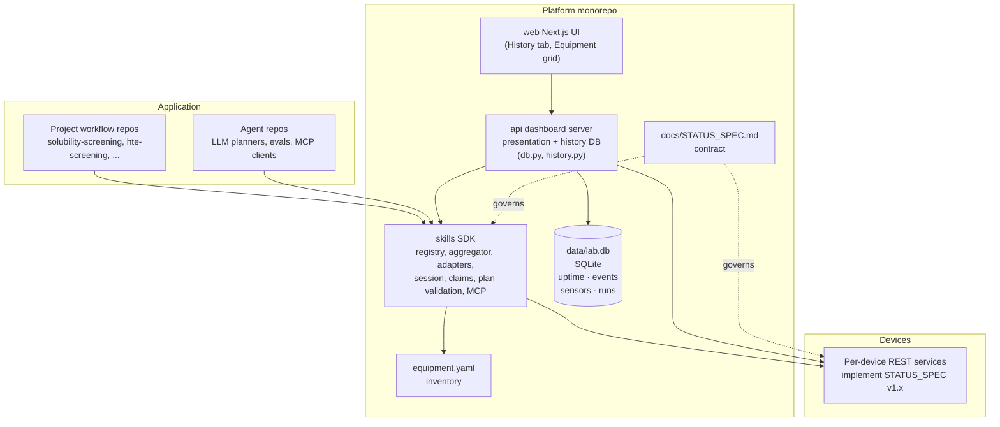

# AC Organic Self-driving Lab — Architecture

**Status:** living document. Last revised when the monorepo restructure landed.

This document describes the long-term architecture of the AC Organic Self-driving Lab software stack — what each piece is for, why it exists, and how the pieces fit together. For step-by-step implementation milestones see the working plan in `.cursor/plans/`.

## What this repo is

`ac-organic-lab` is a monorepo housing the platform-level pieces of the lab:

- The unified equipment status contract (`docs/STATUS_SPEC.md`)
- The equipment inventory (`equipment.yaml`)
- The Python SDK that workflows, agents, and the dashboard use to drive the lab (`skills/`)
- The dashboard's web server (`api/`) and Next.js UI (`web/`)
- Deployment and operations docs (`deploy/`, `docs/`)

It does **not** house:

- Per-device drivers / REST APIs (one repo per instrument: `agilent_plateloc`, `filter_every_well`, `xarm_translocation`, `dose_every_well`, `fume_hood_actuator`, ...)
- Project-specific workflow code (e.g. `solubility-screening`, `hte-screening`)
- Agent code (LLM planners, prompts, evals — future `ac-organic-lab-agents`)

## Layered system



Three responsibilities, three layers:

1. **Device layer** — each instrument runs its own REST service implementing `STATUS_SPEC`. Authoritative for that device's state.
2. **Platform layer** (this repo) — the SDK aggregates device state, provides typed control, manages claims/leases, and exposes the runtime skill catalog. The dashboard's web server is a thin client of the SDK. The Next.js UI calls the dashboard server.
3. **Application layer** — project workflows and agents consume the SDK to run experiments. Each project lives in its own repo with its own data model, recipes, and interlocks.

## Why a monorepo

The pieces inside `ac-organic-lab/` change together. Putting them in one repo means:

- One PR for cross-package changes (e.g. registry schema bumps that touch `skills/`, `api/`, and `web/` simultaneously)
- One canonical `equipment.yaml` at the root, no path/URL/sync games
- One CI pipeline with package-scoped jobs
- The Python packages still publish independently — workflow project repos depend on `lab-skills` via package, not on the whole monorepo

The pieces *outside* are deliberately separate repos because they have different lifecycles, audiences, and dependency profiles:

- Per-device repos are touched per-instrument, often by people who only care about one device
- Project workflow repos contain chemistry, not platform code
- Agent repos pull in heavy LLM/prompt dependencies that should not infect the platform

## Repo layout

```
ac-organic-lab/
├── pyproject.toml                  # uv workspace declaration
├── equipment.yaml                  # inventory (root)
├── data/
│   └── lab.db                      # SQLite history database (gitignored)
├── docs/
│   ├── STATUS_SPEC.md              # v1.0 contract
│   ├── STATUS_SPEC_v1_1.md         # v1.1 claims + allowed_actions
│   ├── ARCHITECTURE.md             # this document
│   ├── OBSERVABILITY.md            # logging, events, history DB schema
│   └── ROADMAP.md                  # milestone tracking
├── deploy/
│   ├── ac-dashboard-api.service    # systemd unit (FastAPI)
│   └── ac-dashboard-web.service    # systemd unit (Next.js)
├── skills/                         # PYTHON: lab-skills SDK
│   ├── pyproject.toml
│   └── src/lab_skills/
├── api/                            # PYTHON: dashboard web server
│   ├── pyproject.toml              # depends on ../skills
│   └── app/
│       ├── main.py                 # FastAPI app + lifespan + uptime poll task
│       ├── db.py                   # LabDatabase (SQLite, stdlib only)
│       ├── history.py              # /api/history/* + /api/ingest/* routes
│       ├── control.py              # control passthrough (cameras, plugs)
│       └── presentation.py        # dashboard snapshot types + tile/location
└── web/                            # Next.js UI
    └── src/
        ├── app/
        │   ├── page.tsx            # Lab Overview
        │   ├── history/page.tsx    # History tab (uptime, sensors, runs)
        │   └── platforms/hte/      # HTE platform detail
        └── lib/
            ├── history-api.ts      # typed fetch fns for history endpoints
            └── use-history.ts      # React Query hooks (30 s refetch)
```

## Component responsibilities

### `skills/` — `lab-skills`

The Python SDK and aggregator. **The single authoritative layer for control and runtime state.**

Owns:

- `equipment.yaml` parsing → `Registry` model
- One async polling loop per process (`EquipmentAggregator`) over all configured devices
- Per-device adapters for STATUS_SPEC v1.0, legacy pre-spec devices, and mocks
- The `Lab.connect()` / `LabSession` / `EquipmentClient` API used by workflow code
- `wait_until_state` and other state-machine helpers
- The `Skill` catalog — runtime view of "what's invokable right now" per role
- Claim/lease management (STATUS_SPEC v1.1+)
- Cross-device `validate_plan(plan)` for preflight checks
- The MCP server companion (exposes the skill catalog as MCP tools)
- The `serve` CLI (runs the aggregator as a standalone HTTP service)

Does **not** own:

- Per-device drivers (those live in their own repos)
- Project chemistry or interlocks (those live in project repos)
- LLM/agent code

### `api/` — dashboard web server

A FastAPI app that serves the dashboard. **Thin presentation + observability.**

Owns:

- HTTP routes consumed by the Next.js UI (`/api/equipment`, `/api/health`)
- Presentation-only types (`EquipmentSnapshot`, tile layout, location coords)
- The `_snapshot()` wrapper that decorates an `EquipmentEntry` with dashboard-specific fields like `tile` and `location`
- CORS / auth at the dashboard edge
- **Lab history database** (`db.py`, `history.py`): SQLite at `data/lab.db`
  - `equipment_events` — state transitions, errors, startup/shutdown
  - `service_uptime` — reachability transitions (up / down / recovered)
  - `sensor_readings` — environmental metrics, 1/min downsampled
  - `runs` + `well_results` — dosing run records and per-well outcomes
- **Background uptime poll task** (`main.py`): runs every 60 s, writes to
  `service_uptime` only on reachability *transitions* (not every poll)
- **History API** (`history.py`): `GET /api/history/*` read endpoints for
  the dashboard; `POST /api/ingest/*` write endpoints for device services

Does **not** own:

- Polling, adapters, or the registry model — all imported from `skills`
- Any control logic — control calls are forwarded to device gateways verbatim

### `web/` — Next.js UI

The user-facing dashboard. Reads from `api/`. No Python.

### `equipment.yaml` (root)

The static inventory of "what equipment exists in this lab". Edited by humans when hardware physically changes or goes into maintenance.

Each entry includes:

- `id`, `name`, `kind`, `platform`
- `adapter` (`http` for spec-conformant, `legacy_http` for pre-spec, `mock` for not-yet-deployed)
- `base_url`, `status_path`, `poll_timeout_seconds`
- `enabled: bool`, `maintenance: { reason, until, contact }` for soft maintenance toggling without commenting out
- `location` and `tile` for dashboard rendering (parsed only by `api/`, not `skills`)

### `docs/STATUS_SPEC.md`

The contract every per-device REST service implements. Stable for v1.0; v1.1 (claims + `allowed_actions`) is the next planned bump.

## Key design decisions

### 1. Skills SDK is the control authority

The dashboard polls. Workflows command. Both go through the same SDK code. The SDK owns the registry, the polling loop, the claim/lease state, and the skill catalog.

The dashboard does **not** write to devices. Workflows do. This split keeps the dashboard simple and ensures only one piece of code can change device state.

### 2. Per-device REST services are authoritative for their own state

The dashboard's aggregator and the SDK both *cache* device status. Neither is ever the source of truth — the device itself is. A workflow about to issue a control command always re-reads `/status` directly from the device, never from a cache, because cache staleness measured in seconds is forever in robotics.

### 3. Project repos depend only on `lab-skills`

A workflow author writing `solubility-screening` adds **one** dependency: `lab-skills`. They never `pip install ac-organic-lab` (too heavy) or import from `api/` (presentation, not control). They certainly never add per-device repos as dependencies — every device is reached through the SDK.

### 4. Roles, not equipment IDs, in workflow code

Workflow code says `lab.role("sealer").seal_start(...)`, never `lab.get("plateloc").seal_start(...)`. A `binding: dict[str, str]` config in the project repo maps role → equipment_id. This makes workflows portable across labs and survivable through device replacements.

### 5. Inventory: one file, two views

`equipment.yaml` is the single source of truth. The SDK reads `id`/`adapter`/`base_url`/etc. The dashboard reads the same file plus presentation fields (`tile`, `location`). Neither owns the file; both read it.

### 6. Soft maintenance over commented-out lines

Taking a device offline for maintenance is a one-line `enabled: false` flip with optional `maintenance: { reason, until, contact }`. The dashboard renders the tile in maintenance state; the SDK raises a typed `EquipmentInMaintenance` exception. Comment-out is reserved for actual hardware removal.

### 7. Agents talk to the SDK via MCP

Future agent repos do not import the SDK directly. They speak [Model Context Protocol](https://modelcontextprotocol.io) against an MCP server the SDK exposes. This keeps prompt engineering, LLM clients, and eval frameworks out of the platform layer, and lets any MCP-aware agent (Claude Desktop, Cursor, custom) plug in without per-agent glue.

### 8. STATUS_SPEC ships before code

Every contract change is a doc PR first (`docs/STATUS_SPEC_v*.md`), then a reference implementation in one device repo, then SDK support, then rollout to remaining devices. Spec is the negotiated artifact; code follows.

### 9. History database is append-only and owned by the aggregator

`data/lab.db` (SQLite) is written exclusively by the `api/` dashboard server — never by device services directly. The aggregator observes reachability from its existing poll loop and records transitions. Device services push domain events via `POST /api/ingest/events` rather than opening a DB connection. This keeps the database on one host with one writer, eliminates connection pooling concerns, and lets the file be backed up with a single `cp` while the server is running (WAL mode).

## Long-term goals

These are non-binding directional commitments — not a roadmap.

### LG1. Multi-lab portability

The platform should run unchanged in a second lab. Only `equipment.yaml`, deployment config, and the binding YAMLs in project repos differ between labs. No per-lab forks of `skills/`, `api/`, or `web/`.

### LG2. Spec-first device migrations

Every device currently using `adapter: legacy_http` migrates to `adapter: http` (full STATUS_SPEC compliance). The legacy adapter is a transition tool, not a permanent feature. Sunset target: when zero entries in `equipment.yaml` use `legacy_http`.

### LG3. Claim/lease as a first-class operational primitive

Multi-operator and multi-workflow safety becomes a guarantee: any device under workflow control is leased, with automatic release on workflow crash via heartbeat expiry. The dashboard surfaces who holds what.

### LG4. Crash-safe workflow runs

Project repos persist run manifests + append-only event logs. Resuming or replaying a run is a first-class operation. No experiment is lost because an orchestrator crashed mid-flight.

### LG5. Shared status contract package

Once 3+ device repos have shipped on STATUS_SPEC v1.1 cleanly for ~1 month, extract `lab-status-contract` as a tiny shared Python package. Per-device repos and the SDK then `from lab_status_contract import EquipmentStatus, ...` instead of vendoring a copy.

### LG6. Agent-native operations

The lab is operable by humans, by scripted workflows, and by agents — using the same SDK and the same MCP surface. Agent ops are subject to the same claim/lease, plan validation, and audit trail as human ops.

### LG7. Deterministic dry-run for the entire lab

The SDK should run end-to-end in dry-run mode without any device powered on. Per-device dry-run modes (already implemented in `agilent_plateloc`, `filter_every_well`) compose into a full simulated lab usable for CI, dev, and agent training.

## Glossary

- **Device** — one piece of physical equipment with its own REST service
- **Adapter** — `skills/` code that translates a device's responses into `EquipmentStatus`
- **Aggregator** — the polling loop in `skills/` that fans out to all configured devices
- **Skill** — a named capability (e.g. `seal.start`) invokable on a role; computed at runtime from `/status` + the equipment kind
- **Role** — a logical capability slot in a workflow (e.g. `sealer`, `filtration`, `plate_mover`); bound to an `equipment_id` per project
- **Claim / lease** — a short-lived, heartbeated lock on a device that prevents concurrent control by other clients
- **Plan validation** — preflight check that runs project interlocks and device state checks before a workflow does anything destructive
- **STATUS_SPEC** — the contract defining what `/status`, `/health`, `/`, and `/control/*` look like for every device

## See also

- `docs/STATUS_SPEC.md` — current device contract (v1.0)
- `docs/SKILLS_CATALOG.md` — skill catalog design (`SkillDef` / `Skill`, runtime availability, evolution from hard-coded → device-declared)
- `docs/INTERLOCKS.md` — four-layer safety model and the project interlock API (`add_interlock`, `validate_plan`, `PlanReport`)
- `equipment.yaml` — the lab's inventory
- `skills/README.md` — SDK usage (created when v0.1 ships)
- `api/README.md` — dashboard server (created when api/ is reorganized in v0.1)
- `.cursor/plans/build_lab-skills_*.plan.md` — current working milestone plan
