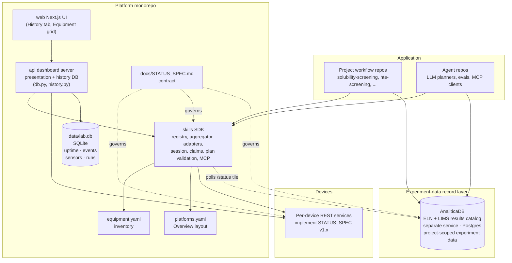

# AC Organic Self-driving Lab — Architecture

**Status:** living document. Last revised to record the `AGENTS.md`-based agent memory policy (design decision #11).

This document describes the long-term architecture of the AC Organic Self-driving Lab software stack — what each piece is for, why it exists, and how the pieces fit together. For step-by-step implementation milestones see the working plan in `.cursor/plans/`.

## What this repo is

`ac-organic-lab` is a monorepo housing the platform-level pieces of the lab:

- The unified equipment status contract (`docs/STATUS_SPEC.md`)
- The equipment inventory (`equipment.yaml`)
- The platform layout config (`platforms.yaml`)
- The Python SDK that workflows, agents, and the dashboard use to drive the lab (`skills/`)
- The dashboard's web server (`api/`) and Next.js UI (`web/`)
- Deployment and operations docs (`deploy/`, `docs/`)
- The canonical agent-instruction base (`AGENTS.md` + `CLAUDE.md`) — shared working instructions and the agent memory policy that every other lab repo inherits (see design decision #11)

It does **not** house:

- Per-device drivers / REST APIs (one repo per instrument: `agilent-plateloc-server`, `filter_every_well`, `xarm_translocation`, `dose_every_well`, `fume_hood_actuator`, ...)
- Project-specific workflow code (e.g. `solubility-screening`, `hte-screening`)
- Agent code (LLM planners, prompts, evals — future `ac-organic-lab-agents`)
- The experiment-data record store (**AnaliticaDB**, the ELN + LIMS results catalog) — its own service/repo on the data server, distinct from the platform's operational history DB (`data/lab.db`). See the *Layered system* section below.

## Layered system



Three responsibilities, three layers:

1. **Device layer** — each instrument runs its own REST service implementing `STATUS_SPEC`. Authoritative for that device's state.
2. **Platform layer** (this repo) — the SDK aggregates device state, provides typed control, manages claims/leases, and exposes the runtime skill catalog. The dashboard's web server is a thin SDK client for *reads*; for operator-initiated *writes* it proxies single `/control/*` actions to devices directly (per-request claim, bypassing the SDK — see design decision #1). The Next.js UI calls the dashboard server.
3. **Application layer** — project workflows and agents consume the SDK to run experiments. Each project lives in its own repo with its own data model, recipes, and interlocks.

Alongside these three sits the **experiment-data record layer — AnaliticaDB**, the lab's analytical-chemistry results catalog being generalized into an ELN + LIMS record store (a separate FastAPI service on the data server at `100.64.254.6:8010`, backed by Postgres; its data API lives under `/experiments`, `/samples`, `/measurements`, `/files`). It is deliberately **not** part of the platform monorepo and is **distinct from the platform's operational history DB** (`data/lab.db`, owned by `api/`): `lab.db` holds public lab telemetry (uptime, events, sensors, dosing runs), whereas AnaliticaDB holds **project-scoped scientific results** — application-layer workflows and agents write their results there, and reads are governed by the data-isolation `can_read(project, caller)` policy shared with `ac_auth` (see [`AUTH_DESIGN.md`](AUTH_DESIGN.md) and [`DATABASE_DESIGN.md`](DATABASE_DESIGN.md)). Because it also serves a STATUS_SPEC `/status` envelope, the dashboard registers it (`analytica_db` in `equipment.yaml`) and the aggregator polls it for a "Services" tile like any other endpoint — the dotted edge in the diagram above.

## Why a monorepo

The pieces inside `ac-organic-lab/` change together. Putting them in one repo means:

- One PR for cross-package changes (e.g. registry schema bumps that touch `skills/`, `api/`, and `web/` simultaneously)
- One canonical `equipment.yaml` at the root, no path/URL/sync games
- One CI pipeline with package-scoped jobs
- The Python packages still publish independently — workflow project repos depend on `lab-skills` via package, not on the whole monorepo

The pieces *outside* are deliberately separate repos because they have different lifecycles, audiences, and dependency profiles:

- Per-device repos are touched per-instrument, often by people who only care about one device
- Project workflow repos contain chemistry, not platform code
- Agent repos pull in heavy LLM/prompt dependencies that should not infect the platform

## Repo layout

```
ac-organic-lab/
├── pyproject.toml                  # uv workspace declaration
├── AGENTS.md                       # shared agent instructions + memory policy (canonical base)
├── CLAUDE.md                       # Claude-Code-specific notes (imports AGENTS.md)
├── equipment.yaml                  # inventory (root)
├── platforms.yaml                  # Overview layout / section config (root)
├── data/
│   └── lab.db                      # SQLite history database (gitignored)
├── docs/
│   ├── STATUS_SPEC.md              # combined v1.0 baseline + v1.1 (claims, allowed_actions)
│   ├── ARCHITECTURE.md             # this document
│   ├── LAB_MONITORING.md           # logging, events, history DB schema, alerting
│   └── ROADMAP.md                  # milestone tracking
├── deploy/
│   ├── ac-organic-lab-api.service    # systemd unit (FastAPI)
│   └── ac-organic-lab-web.service    # systemd unit (Next.js)
├── skills/                         # PYTHON: lab-skills SDK
│   ├── pyproject.toml
│   └── src/lab_skills/
│       ├── registry.py             # EquipmentEntry, Tile, PillConfig, Registry
│       ├── platforms.py            # PlatformSection, PlatformsConfig, load_platforms
│       └── aggregator.py           # EquipmentAggregator
├── api/                            # PYTHON: dashboard web server
│   ├── pyproject.toml              # depends on ../skills
│   └── app/
│       ├── main.py                 # FastAPI app + lifespan + uptime poll task
│       ├── db.py                   # LabDatabase (SQLite, stdlib only)
│       ├── history.py              # /api/history/* + /api/ingest/* routes
│       ├── control.py              # control passthrough (cameras, plugs)
│       ├── workflow.py             # Phase F: authorized-run executor (SSE, abort)
│       ├── assistant.py            # /api/assistant/chat — Claude Code CLI subprocess (SSE)
│       ├── mcp_server.py           # lab-history MCP server (read-only tools over lab.db)
│       └── presentation.py        # dashboard snapshot types + location
└── web/                            # Next.js UI
    └── src/
        ├── app/
        │   ├── page.tsx            # Overview (platforms.yaml-driven sections)
        │   ├── history/page.tsx    # History tab (uptime, sensors, runs)
        │   └── platforms/hte/      # HTE platform detail
        ├── components/
        │   ├── Nav.tsx             # auto-injects platform tabs from /api/platforms
        │   └── AssistantBubble.tsx # floating chat bubble, consumes the SSE stream
        └── lib/
            ├── use-equipment.ts    # React Query hook — equipment list
            ├── use-platforms.ts    # React Query hook — platforms config
            ├── api.ts              # typed fetch fns
            ├── history-api.ts      # typed fetch fns for history endpoints
            └── use-history.ts      # React Query hooks (30 s refetch)
```

## Component responsibilities

### `skills/` — `lab-skills`

The Python SDK and aggregator. **The single authoritative layer for control and runtime state.**

Owns:

- `equipment.yaml` parsing → `Registry` / `EquipmentEntry` model
- `platforms.yaml` parsing → `PlatformsConfig` / `PlatformSection` model
- One async polling loop per process (`EquipmentAggregator`) over all configured devices
- Per-device adapters for STATUS_SPEC v1.0, legacy pre-spec devices, and mocks
- The `Lab.connect()` / `LabSession` / `EquipmentClient` API used by workflow code
- `wait_until_state` and other state-machine helpers
- The `Skill` catalog — runtime view of "what's invokable right now" per role
- Claim/lease management (STATUS_SPEC v1.1+)
- Cross-device `validate_plan(plan)` for preflight checks
- The MCP server companion (exposes the skill catalog as MCP tools)
- The `serve` CLI (runs the aggregator as a standalone HTTP service)

Does **not** own:

- Per-device drivers (those live in their own repos)
- Project chemistry or interlocks (those live in project repos)
- LLM/agent code

### `api/` — dashboard web server

A FastAPI app that serves the dashboard. **Thin presentation + observability.**

Owns:

- HTTP routes consumed by the Next.js UI (`/api/equipment`, `/api/platforms`, `/api/health`)
- Presentation-only types (`EquipmentSnapshot`, tile layout, location coords, pill config)
- The `_snapshot()` wrapper that decorates an SDK snapshot with dashboard-specific fields: `platform` and `tile` are resolved from `PlatformsConfig` at compose time; `pill` is forwarded from `EquipmentEntry.pills`
- CORS / auth at the dashboard edge
- **Lab history database** (`db.py`, `history.py`): SQLite at `data/lab.db`
  - `equipment_events` — state transitions, errors, startup/shutdown
  - `service_uptime` — reachability transitions (up / down / recovered)
  - `sensor_readings` — environmental metrics, 1/min downsampled
  - `runs` + `well_results` — dosing run records and per-well outcomes
- **Background uptime poll task** (`main.py`): runs every 60 s, writes to
  `service_uptime` only on reachability *transitions* (not every poll)
- **Device-alert notifier** (`alert_notifier.py`): fed by the same 60 s
  sweep; pushes debounced device alerts (unreachable / error / e_stop /
  recovered, with cooldown + storm collapse) to PyPoe's `/alerts/device`
  webhook for Slack + investigation. Enabled by `PYPOE_ALERT_URL`; audits
  each alert as an `alert_emitted` event. See [`LAB_MONITORING.md`](LAB_MONITORING.md) §6b.
- **History API** (`history.py`): `GET /api/history/*` read endpoints for
  the dashboard; `POST /api/ingest/*` write endpoints for device services
- **Authorized-run executor** (`workflow.py`, Phase F — 2026-08-08/09): pulls
  a **run authorization** from bitácora by id, refuses unless it is still
  executable, independently recomputes the package digest, then drives the
  pinned package through `lab-skills`' `execute_plan` (per-step claims, live
  re-checks) as a background run with an SSE step stream and cooperative
  abort; the authorization is re-fetched between steps so revocation works
  mid-run. Lives here rather than in bitácora (AGENTIC_ELN_PLAN D-20) because
  this process already owns the claim dance and the audit row; every attempt —
  including refused ones — writes a `plan_run` event.
- **Operator control passthrough** (`control.py`): mirrors each device's
  `/control/*` surface for operator-initiated writes, runs the per-request
  claim → action → release dance for v1.1 devices, and writes one
  `control_action` audit row to `equipment_events` per call (actor, action,
  outcome). See design decision #1.
- **Lab assistant** (`assistant.py`, `mcp_server.py`): a read-only chat
  endpoint and the MCP server that backs it. See the *Lab assistant*
  component below and design decision #10.

Does **not** own:

- Polling, adapters, or the registry model — all imported from `skills`
- Any control *logic* or safety checks — the passthrough forwards actions
  verbatim and lets the device adjudicate (412 precondition / 423 claim
  conflict). Skill preconditions and plan interlocks live in `skills/`, not
  here.

### `web/` — Next.js UI

The user-facing dashboard. Reads from `api/`. No Python.

The Overview page (`page.tsx`) is entirely driven by `/api/platforms`: it iterates `sections` in order and dispatches on `kind` — `environmental_map` renders the `LabMap`; `platform` renders a `PlatformCard` with snapshots looked up by the section's equipment id list. Adding or reordering a section requires only a `platforms.yaml` edit; no frontend code changes.

The Nav (`Nav.tsx`) auto-injects one tab per section that has an `href` field, between the static `Overview` and `History` tabs.

### Lab assistant (chat bubble)

A **read-only** Claude assistant for operators, spanning `api/` and `web/`.
It answers "what's running right now / what happened to X" by querying the
history DB and live aggregator — it **cannot actuate hardware** (the system
prompt says so, and the toolset makes it impossible). See design decision #10.

Three pieces:

- **`web/src/components/AssistantBubble.tsx`** — a floating, draggable chat
  bubble mounted in the root layout. It POSTs the conversation to
  `/api/assistant/chat`, consumes the Server-Sent Events stream (`text` /
  `tool_use` / `tool_result` / `done` / `error` frames), and persists ~20
  turns in `sessionStorage`. It only renders if `GET /api/assistant/health`
  reports `configured: true`.
- **`api/app/assistant.py`** — `POST /api/assistant/chat`. Instead of calling
  the Anthropic API (which would need an `ANTHROPIC_API_KEY` in the dashboard
  env), it shells out to the locally-installed **`claude` CLI** in
  `--print --output-format stream-json` mode, translates each stream-json
  event into an SSE frame, and streams it to the browser. Auth/billing
  piggyback on the dashboard user's Claude Code OAuth login. The subprocess
  is locked down: `--allowedTools mcp__lab-history__*` (no Bash/file/web),
  `--mcp-config … --strict-mcp-config` (injects only the lab MCP server,
  ignores the user's other MCP config), `--no-session-persistence` (history
  is re-sent in the prompt each turn), a 120 s wallclock cap, and a minimal
  cwd outside the repo tree so Claude Code doesn't auto-load the ~50k-token
  `CLAUDE.md` doc bundle on every turn. Model defaults to `sonnet`.
- **`api/app/mcp_server.py`** — the `lab-history` MCP server (stdio,
  `lab-history-mcp` entry point). Exposes **eight read-only tools plus one
  append-only journal write** (`record_observation` — an actor-stamped
  `agent_observation` row through `/api/ingest/events`, failing closed
  without a verified operator; the HERMES_ACCESS_DESIGN Phase 4 learning
  loop, deliberately a shared audited journal and not a private memory):
  `list_equipment_now` (live, via the aggregator's `/api/equipment`),
  `get_equipment_status` (one device's full envelope — components, details,
  metrics — where `list_equipment_now` returns only a summary row),
  `query_equipment_events`, `query_service_uptime`, `query_sensor_readings`,
  `query_runs`, `query_well_results` (all over `data/lab.db`), and
  `tail_journald` (last N lines of a **whitelisted** dashboard systemd unit).
  Row counts and lookback are capped. The same server can be registered
  directly with a developer's own Claude Code via `claude mcp add` — the
  chat bubble is just one of its two consumers.

Configuration is via env vars (`ASSISTANT_CLAUDE_MODEL`,
`ASSISTANT_CLAUDE_BIN`, `ASSISTANT_CLAUDE_TIMEOUT_S`, `ASSISTANT_RUNTIME_DIR`).
Dependency-wise this adds `mcp>=1.0` to `api/` and the presence of the
`claude` CLI on the dashboard host; no new npm deps (the bubble is plain
React + an SSE `fetch`).

### `equipment.yaml` (root)

The static inventory of "what equipment exists in this lab". Edited by humans when hardware physically changes or goes into maintenance.

**Schema v2** — each entry includes:

- `id`, `name`, `kind`
- `adapter` (`http` for spec-conformant, `legacy_http` for pre-spec, `mock` for not-yet-deployed)
- `base_url`, `status_path`, `poll_timeout_seconds`
- `enabled: bool`, `maintenance: { reason, until, contact }` for soft maintenance toggling without commenting out
- `tiles: dict[section_id, {w, h}]` — per-section tile sizing for the equipment grid. A missing key defaults to `{w:2, h:1}`. The section id matches `platforms.yaml`
- `pills: {open: bool}` — shared Overview pill config. `open: true` renders an "Open ↗" link to `base_url` in the platform card pill row
- `location: {x, y, label}` — position on the lab floorplan map (environmental sensors only; parsed by `api/`, not `skills`)
- `camera:` / `plug:` — kind-specific blocks (lenses, outlets); parsed by `api/` and forwarded to the frontend via `EquipmentSnapshot`

> **`platform:` removed in schema v2.** Equipment entries no longer carry a `platform:` field. Section membership is declared exclusively in `platforms.yaml`; `EquipmentSnapshot.platform` is resolved by the API at compose time.

> **Stream visibility** is not a YAML field. When a platform has a camera the platform card shows a "Show stream / Hide stream" toggle — the live feed is collapsed by default. There is no `hide_stream` flag; the toggle is purely a runtime UI control.

### `platforms.yaml` (root)

Defines which sections appear on the Overview page, in what order, and which equipment ids belong to each. This is the single source of truth for the Overview layout and Nav tab list.

```yaml
sections:
  - id: lab_environment
    title: Lab Environment
    kind: environmental_map      # renders LabMap instead of PlatformCard
    equipment: [env_hte, ...]

  - id: hte
    title: HTE Platform
    href: /platforms/hte         # presence of href → tab appears in Nav
    kind: platform
    equipment: [cam_hte_tapo_c245, ot2_hte, ...]

  - id: web_services
    title: Web Services
    kind: platform               # no href → no Nav tab
    equipment: [pypoe_web]
```

Key behaviours:

- **Section order** determines render order on the Overview page and tab order in the Nav.
- **Equipment order** within a section determines tile order on the platform's detail page and pill order in the Overview card.
- **Shared equipment** — an equipment id may appear in more than one section. The resolved `EquipmentSnapshot.platform` for that id is the **first** section listing it (sections are in display order, so this is deterministic).
- **Missing file** raises immediately on startup; there is no fallback to defaults.
- Loaded once at API server startup via `load_platforms()` in `lab_skills.platforms`; exposed as `GET /api/platforms`.

### `docs/STATUS_SPEC.md`

The contract every per-device REST service implements. Combines the v1.0 baseline with the v1.1 additions (claims, `allowed_actions`, `details.claimed_by`); v1.0 devices remain conformant without changes.

## Key design decisions

### 1. Two writers, one authority: the device

There are **two** classes of writer, distinguished by privilege and lifetime — not by "who is allowed to write at all":

- **Workflows / agents** are the *programmatic* writers. They go through the `lab-skills` SDK, which owns the registry, the polling loop, the **skill catalog** (precondition checks), **plan validation / interlocks**, and **long-lived heartbeated claims**. A workflow holds a claim for the duration of a run and executes a validated multi-step `Plan`.
- **The dashboard** is the *operator-initiated* writer. When a human clicks a control in a tile, `api/app/control.py` proxies that single action to the device over HTTP, acquiring a **short-lived per-request claim** (`owner: ac-organic-lab-dashboard`), attaching `X-Claim-Token`, and releasing in a `finally`. This passthrough is deliberately **thin**: it does *not* go through the SDK, run interlocks, or hold a claim across calls. It mirrors the device's `/control/*` surface verbatim and relies on the device as the authority (§2) to refuse anything unsafe (412 precondition / 423 claim conflict).

> Earlier revisions of this doc said *"the dashboard does not write to devices."* That stopped being true when the control passthrough shipped. The invariant that actually holds is **the device is the single authority**: every writer — workflow or dashboard — competes for the same cooperative claim, and the device adjudicates. Two writers cannot both hold a claim, so a dashboard click while a workflow holds the sealer surfaces as a 423 with `claimed_by.owner` (and vice-versa).

What this buys, and what it costs:

- **Audit.** Because the dashboard is now a writer, every passthrough call is recorded to `equipment_events` (`event_type: "control_action"`, with the actor, action, and outcome) so "who moved the sash, when" is answerable. See [`LAB_MONITORING.md`](LAB_MONITORING.md).
- **Auth.** Operator writes are gated by `CONTROL_PASSWORD` today; the [`AUTH_DESIGN.md`](AUTH_DESIGN.md) auth module (email one-time-code login, `ac_auth`) will replace the generic `ac-organic-lab-dashboard` owner with a per-user identity, stamped into both the claim and the audit row.
- **No SDK safety net.** The passthrough skips skill-catalog preconditions and project interlocks — those run only in the workflow path. The dashboard tiles compensate client-side (disabling buttons when they can compute a precondition), and the device's 412/423 is the backstop. This is an accepted trade-off for keeping the operator path a one-hop proxy; destructive cross-device coordination must go through a workflow, not the dashboard.

### 2. Per-device REST services are authoritative for their own state

The dashboard's aggregator and the SDK both *cache* device status. Neither is ever the source of truth — the device itself is. A workflow about to issue a control command always re-reads `/status` directly from the device, never from a cache, because cache staleness measured in seconds is forever in robotics.

### 3. Project repos depend only on `lab-skills`

A workflow author writing `solubility-screening` adds **one** dependency: `lab-skills`. They never `pip install ac-organic-lab` (too heavy) or import from `api/` (presentation, not control). They certainly never add per-device repos as dependencies — every device is reached through the SDK.

### 4. Roles, not equipment IDs, in workflow code

Workflow code says `lab.role("sealer").seal_start(...)`, never `lab.get("plateloc").seal_start(...)`. A `binding: dict[str, str]` config in the project repo maps role → equipment_id. This makes workflows portable across labs and survivable through device replacements.

### 5. Two YAML files, cleanly separated concerns

`equipment.yaml` answers "what hardware exists and how to reach it". `platforms.yaml` answers "how should the UI present it". Keeping them separate means:

- Hardware changes (new device, maintenance, URL change) never touch the UI layout file
- UI layout changes (reorder sections, add a new platform page) never touch hardware config
- The SDK (`lab-skills`) parses both — `load_registry()` for equipment, `load_platforms()` for sections — but `EquipmentEntry` carries no UI concerns beyond tile sizing and pill config
- `platform` assignment is computed at API compose time, not stored on the equipment entry

### 6. Soft maintenance over commented-out lines

Taking a device offline for maintenance is a one-line `enabled: false` flip with optional `maintenance: { reason, until, contact }`. The dashboard renders the tile in maintenance state; the SDK raises a typed `EquipmentInMaintenance` exception. Comment-out is reserved for actual hardware removal.

### 7. Agents talk to the SDK via MCP

Future agent repos do not import the SDK directly. They speak [Model Context Protocol](https://modelcontextprotocol.io) against an MCP server the SDK exposes. This keeps prompt engineering, LLM clients, and eval frameworks out of the platform layer, and lets any MCP-aware agent (Claude Desktop, Cursor, custom) plug in without per-agent glue.

Shipped in v0.4 (`skills/src/lab_skills/mcp.py`, launched via `lab-skills mcp serve`): the catalog becomes MCP tools (`list_skills`, `validate_plan`, `preflight_plan`, and — behind `--allow-control` — `execute_plan`), device `/status` becomes MCP resources, and agent control runs through the same `execute_plan` path (per-step claims, layer-3 + layer-4 re-checks) as any workflow. This is the SDK's control-capable server; keep it distinct from the dashboard's read-only *history* MCP server (decision #10).

### 8. STATUS_SPEC ships before code

Every contract change is a doc PR first (`docs/STATUS_SPEC_v*.md`), then a reference implementation in one device repo, then SDK support, then rollout to remaining devices. Spec is the negotiated artifact; code follows.

### 9. History database is append-only and owned by the aggregator

`data/lab.db` (SQLite) is written exclusively by the `api/` dashboard server — never by device services directly. The aggregator observes reachability from its existing poll loop and records transitions. Device services push domain events via `POST /api/ingest/events` rather than opening a DB connection. This keeps the database on one host with one writer, eliminates connection pooling concerns, and lets the file be backed up with a single `cp` while the server is running (WAL mode).

### 10. The lab assistant is a proposer, not an actuator, and reuses the CLI rather than the API

The dashboard's chat bubble (the *Lab assistant* component above) is deliberately **not a hardware actuator**. In its default **Ask** mode it is a read-only surface — distinct from the three writers/readers in decision #1 — reading only the history DB, the live `/api/equipment` snapshot, and whitelisted journald units, through the `lab-history` MCP server. (Since 2026-08-13 that server also carries one append-only write, the `record_observation` journal row described above — a note in `lab.db`, still nothing that can reach a device.)

As of 2026-08-11 it also has a **Control** mode (UI_DESIGN §5 Step 1) that adds a second, **propose-only** MCP server (`lab-control`, `api/app/assistant_control.py`). This preserves the original invariant *at the level that matters*: **no model-driven code path POSTs to a device.** The model's most privileged act is returning a *validated proposal object*; actuation happens only when the operator clicks *Authorize*, over the existing `/api/equipment/{id}/control/{action}` passthrough (which owns identity, per-equipment authorization, the claim dance, and the audit row). The safety property is the toolset — with no actuating tool registered, a prompt injection can at worst raise a confirm card a human must read and click. So the assistant gains a *rendering* capability, not a *hardware* one; it still never holds a claim and never imports `lab-skills`.

Three choices are worth recording:

- **Subprocess, not SDK.** `assistant.py` shells out to the `claude` CLI instead of calling the Anthropic API. This keeps `ANTHROPIC_API_KEY` out of the dashboard environment — billing and rate limits ride the operator's existing Claude Code OAuth login — and lets the same MCP server serve both the bubble and a developer's own `claude mcp add`. The cost is an operational dependency: the `claude` binary must be installed on the dashboard host, and the bubble silently hides itself (`/api/assistant/health` → `configured: false`) when it isn't.
- **A separate MCP server from decision #7.** The read path is the *history/observability* MCP server (read-only, lives in `api/`), not the SDK's *skill-catalog* MCP server (`execute_plan`, control, lives in `skills/`). The new `lab-control` server is a *third* kind: it lives in `api/` but proposes only — it reads live `/status` + the skill catalog to validate an action and never issues a control call itself. All three are intentionally different servers with different trust levels; keep them apart.
- **Identity binds to the tool, not the prompt.** Control mode is honoured only for a verified `X-Auth-User` (never under the `DASHBOARD_CONTROL_OPEN` dev bypass), and the actor is passed to `lab-control` in its environment (`LAB_ACTOR`), never as a tool argument the model could choose. `propose_action` re-checks that actor holds `operator`+ on the target equipment against the same ac_auth sidecar the passthrough uses, failing closed. The audit trail stamps `X-Control-Origin: assistant` on the resulting `control_action` row and records the proposal as an `assistant_proposal` event.

### 11. Agent memory lives in committed instruction files, anchored on `AGENTS.md`

Coding agents (Hermes, Codex, Claude Code, and any future agent) keep their durable knowledge about this codebase in **committed, human-reviewable instruction files**, not in opaque per-agent stores. The repo-root [`AGENTS.md`](../AGENTS.md) is the single shared memory surface: model-agnostic conventions, commands, architecture facts, and recurring pitfalls learned while working here are written back to it, so every agent — regardless of vendor — reads the same accumulated knowledge. Per-agent files (e.g. `CLAUDE.md`) stay thin and hold only what is specific to that agent's tooling; nothing another agent would need may live there.

The policy itself (what goes where, and what never gets stored) is normatively specified in `AGENTS.md` §5; the load-bearing consequences for the architecture are:

- **This repo is the canonical base.** Every other repo in the workspace inherits the `AGENTS.md` + `CLAUDE.md` structure from here and layers only its own specifics on top — the same inheritance pattern the binding contract (`docs/AGENTIC_LAB_DESIGN.md` Part I, `docs/STATUS_SPEC.md`) already follows. Fixing a shared convention means fixing it here once.
- **Memory changes are diffs.** Because agent memory is ordinary committed markdown, it goes through the same review, history, and rollback as code. There is no hidden state that silently steers agent behavior.
- **Scope boundaries are explicit.** Repo-specific knowledge → that repo's `AGENTS.md`; cross-repo / machine-wide facts → the agent's global memory, *proposed for human approval*, never silently written into a repo; the binding contract files change only on explicit human request; temporary debugging notes and one-off observations go nowhere.

## Long-term goals

These are non-binding directional commitments — not a roadmap.

### LG1. Multi-lab portability

The platform should run unchanged in a second lab. Only `equipment.yaml`, `platforms.yaml`, deployment config, and the binding YAMLs in project repos differ between labs. No per-lab forks of `skills/`, `api/`, or `web/`.

### LG2. Spec-first device migrations

Every device currently using `adapter: legacy_http` migrates to `adapter: http` (full STATUS_SPEC compliance). The legacy adapter is a transition tool, not a permanent feature. Sunset target: when zero entries in `equipment.yaml` use `legacy_http`.

### LG3. Claim/lease as a first-class operational primitive

Multi-operator and multi-workflow safety becomes a guarantee: any device under workflow control is leased, with automatic release on workflow crash via heartbeat expiry. The dashboard surfaces who holds what.

### LG4. Crash-safe workflow runs

Project repos persist run manifests + append-only event logs. Resuming or replaying a run is a first-class operation. No experiment is lost because an orchestrator crashed mid-flight.

### LG5. Shared status contract package

Once 3+ device repos have shipped on STATUS_SPEC v1.1 cleanly for ~1 month, extract `sdl-lab-contract` as a tiny shared Python package. Per-device repos and the SDK then `from sdl_lab_contract import EquipmentStatus, ...` instead of vendoring a copy.

**In progress since 2026-07-25.** The package exists (`AccelerationConsortium/sdl-lab-contract`, versioned major.minor == spec revision, currently `v1.2.0`) and has three consumers: `lab-skills`, `torry-pines-shaker-server`, and `agilent-plateloc-server`. Device repos swap their vendored `models.py` for the import as part of their own v1.2 migration, keeping only the models they genuinely specialise (both device repos keep a stricter local `ClaimRequest`). LG5 closes when no `equipment.yaml` device still vendors a copy — see [`ROADMAP.md`](ROADMAP.md) for the per-device state.

### LG6. Agent-native operations

The lab is operable by humans, by scripted workflows, and by agents — using the same SDK and the same MCP surface. Agent ops are subject to the same claim/lease, plan validation, and audit trail as human ops.

### LG7. Deterministic dry-run for the entire lab

The SDK should run end-to-end in dry-run mode without any device powered on. Per-device dry-run modes (already implemented in `agilent-plateloc-server`, `filter_every_well`) compose into a full simulated lab usable for CI, dev, and agent training.

## Glossary

- **Device** — one piece of physical equipment with its own REST service
- **Adapter** — `skills/` code that translates a device's responses into `EquipmentStatus`
- **Aggregator** — the polling loop in `skills/` that fans out to all configured devices
- **Section** — one card on the Overview page, defined in `platforms.yaml`; either a `platform` (equipment tiles) or an `environmental_map`
- **Skill** — a named capability (e.g. `seal.start`) invokable on a role; computed at runtime from `/status` + the equipment kind
- **Role** — a logical capability slot in a workflow (e.g. `sealer`, `filtration`, `plate_mover`); bound to an `equipment_id` per project
- **Claim / lease** — a short-lived, heartbeated lock on a device that prevents concurrent control by other clients
- **Plan validation** — preflight check that runs project interlocks and device state checks before a workflow does anything destructive
- **STATUS_SPEC** — the contract defining what `/status`, `/health`, `/`, and `/control/*` look like for every device

## See also

- `AGENTS.md` — shared agent working instructions + memory policy (canonical base for all lab repos; see design decision #11)
- `docs/AGENTIC_LAB_DESIGN.md` — Part I: the binding lab operating rules agents must not weaken; Part II: the deployed agent operations layer
- `docs/STATUS_SPEC.md` — combined device contract (v1.0 baseline + v1.1 additions + SiLA comparison appendix)
- `docs/SKILLS_CATALOG.md` — skill catalog design (`SkillDef` / `Skill`, runtime availability, evolution from hard-coded → device-declared)
- `docs/INTERLOCKS.md` — four-layer safety model and the project interlock API (`add_interlock`, `validate_plan`, `PlanReport`)
- `docs/LAB_MONITORING.md` — logging, events, the central history DB, and alerting (Kuma + the aggregator notifier + PyPoe; overview + runbook)
- `docs/AUTH_DESIGN.md` — identity, authorization, and the data-isolation `can_read` policy AnaliticaDB shares
- `docs/DATABASE_DESIGN.md` — the experiment-data record layer (ELN + LIMS results catalog)
- `docs/EQUIP_GUIDE.md` — onboarding and maintenance guideline (§1–§6b)
- `docs/EQUIP_STATUS.md` — current per-device tile implementations (§7–§11)
- `docs/UI_DESIGN.md` — dashboard UI design & decisions (one numbered section per shipped interface; §1 is the OT-2 full-page interface)
- `docs/DEVICE_PC_SETUP.md` — canonical install recipe for a Windows device PC
- `docs/ROADMAP.md` — per-device migration status
- `equipment.yaml` — the lab's equipment inventory (schema v2)
- `platforms.yaml` — the Overview page layout and Nav tab config
- `skills/README.md` — SDK usage (created when v0.1 ships)
- `api/README.md` — dashboard server (created when api/ is reorganized in v0.1)
- `.cursor/plans/build_lab-skills_*.plan.md` — current working milestone plan
