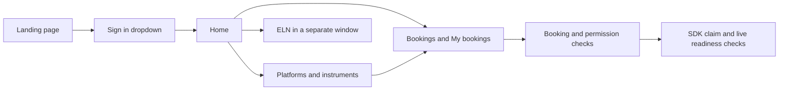

# Equipment booking and Home design

Status: proposed scope, 2026-10-09. Implementation and deployment are not approved
by this document. This proposal adds advance equipment reservations and a private
dashboard reached through a minimal sign-in landing page. Home becomes the
signed-in starting point, with Bookings, Platforms, and ELN as its main destinations.

The binding authorities remain [the lab contract](AGENTIC_LAB_DESIGN.md#part-i--binding-rules-normative)
and [the device contract](STATUS_SPEC.md). Product ownership follows
[the Bitácora integration direction](BITACORA_INTEGRATION_DIRECTION.md).
Reservations belong to laboratory operations here; scientific planning and evidence
remain in Bitácora and BitacoraDB. A booking grants neither equipment permission
nor execution approval.

See [the sidebar implementation and server handoff plan](DASHBOARD_SIDEBAR_IMPLEMENTATION_PLAN.md)
for the protected preview, preservation of the current Overview, shared vertical
navigation, account surfaces, assistant, Inventory, and Contact admin delivery.

## Scope

The first release includes a signed-out landing page, a signed-in Home, an
equipment calendar, personal reservations, admin booking management, versioned
per-equipment policies, maintenance blocks, and booking checks before supported
claims. Users reserve for themselves; admins may also reserve for an eligible
user, with both the actor and beneficiary recorded.

Start with single-instrument reservations. Platform filters group instruments
without implying that booking a platform reserves everything in it. Recurrence,
waitlists, billing, external calendar sync, quotas, arbitrary policy scripts,
automatic rescheduling, and automatic experiment starts are later scope.
Coordinated bookings across several instruments require a separate atomic bundle
design. Workflows using several instruments must still demonstrate valid
reservations for all required equipment before their first physical action.

Here, an outsider means an unauthenticated browser that can already reach the lab
entrypoint. This proposal does not expose the Tailnet service to the public
internet or introduce self-registration. Use existing roster-based email-code
authentication. Deployment addresses remain in existing local configuration.

## Landing page and navigation

| Route | Signed out | Signed in |
| --- | --- | --- |
| `/` | Lab name, brief welcome, top-right Sign in dropdown | Redirect to `/home` |
| `/home` | Redirect to sign-in landing | Home cards and personal upcoming bookings |
| `/bookings` | Redirect to sign-in landing | Calendar and My bookings |
| `/platforms` and existing detail routes | Redirect to sign-in landing | Existing platform views, with booking entry points |
| `/overview` | Redirect to sign-in landing | Existing detailed overview relocated from `/` |
| `/bitacora/` | Existing application sign-in gate | ELN in a separate window, subject to its own permissions |
| `/admin/bookings` | Sign-in required | Admin-only reservations, policies, and blocks |

Sign in expands an accessible popover with email, Send code, code entry, and
verification feedback using the existing auth service. Do not download or expose
an account dropdown containing the roster. Support keyboard interaction, Escape,
focus return, and a full-width panel on narrow screens. Keep one sign-in surface
rather than rendering both the current auth banner and a second login form.

After ordinary sign-in, go to Home. A direct protected link may return to a
validated same-origin application path after login; reject external redirect
targets. Logout clears private query caches and returns to the landing page.

Home presents three primary cards: **Book equipment**, **Platforms**, and
**ELN ↗**. Below them show the current user's next reservations and links to
My bookings and Overview. Secondary navigation holds Inventory, History, Tools,
and Admin where permitted. Avoid a fleet status wall on Home. Camera streams
remain opt-in per visit.

The ELN link uses the existing separate-window interaction with a normal new-tab
fallback, safe opener handling, and a visible external-window cue. Use the
production `/bitacora/` destination. The private beta was retired on 2026-10-09
per `BITACORA_PRIVATE_BETA.md`; do not reintroduce its routes or tester gate. A
Home link never changes ELN project permissions. Current source restores a
production Notebooks tab in `Nav.tsx`; older visibility prose is stale on that
point. Verify the installed production gate before rollout.

## Private application boundary

The current middleware gates many writes but deliberately allows most reads.
The root page and navigation mount equipment/platform queries immediately.
Replacing the visible page alone would leave data available anonymously.

Use a small explicit public allowlist: the landing page, required static assets,
the email-code authentication endpoints and minimal session bootstrap, and any
explicitly reviewed, data-free liveness endpoint. Default all dashboard pages
and data APIs to authenticated access, including inventory embeds, history,
equipment, platforms, assistant, workflow reads, downloads, and streams.
Client assets and landing metadata must contain no embedded private lab data.

Split public and authenticated layouts so anonymous rendering and prefetching
never mount the private navigation, assistant, equipment queries, or event feeds.
Validate authentication before returning server-rendered private data. APIs
return 401 JSON rather than login HTML; authenticated but forbidden requests
return 403. Mark private responses non-publicly-cacheable, and prevent shared
cache reuse across identities. A session expiring on an open page hides private
content and stops its polling.

Enforce the boundary in the API and trusted proxy path as well as Next routing.
Strip caller-supplied identity headers before injecting verified identity;
network-isolate backends that rely on proxy authentication. API-key machine
principals remain authenticated through their existing scoped service paths;
they do not gain browser, SSH, beta, or booking-admin authority.
Cookie-authenticated mutations need Origin/CSRF protection.

Preserve the WebSocket matcher exclusions and ticket-based authentication: broad
Next middleware matchers must not break upgrades. SSE, WebSocket subscriptions,
media brokers, and long-lived sessions each need their own verified admission
and revocation behavior. A global Caddy gate must preserve application-specific
authentication for service endpoints, ingest, and authorized integrations.
Review every same-origin route and direct backend listener for anonymous access;
a protected dashboard does not automatically protect another app or device UI.

Edge changes must be patches against the current installed configuration,
preserving unrelated routes, TLS, ordered header stripping, and current application gates.
Keep development auth bypasses disabled in production. This requires deployment
verification, not an assumption that the repository Caddy snapshot is current.

## Booking experience

The Bookings page opens to a day/week calendar with equipment rows, platform and
instrument filters, a date selector, and an always-visible timezone. Provide
an agenda/list view on small screens and a My bookings filter. Keyboard users
must be able to enter times directly; dragging is optional.

Selecting a free interval opens a form with instrument, start/end, beneficiary
(admin only), and optional project reference and short purpose. Show the
instrument's rules before confirmation: maximum duration, advance notice,
booking horizon, opening hours, approval requirement, and any setup/cleanup
buffer. The server's confirmation is authoritative even if the calendar looked
free a moment earlier. On conflict, retain the draft and show refreshed slots.

Use text as well as color to distinguish confirmed reservations, pending
requests, maintenance blocks, and current overrun/uncertain occupancy. Calendar
blocks visibly include setup/cleanup buffers, labelled separately from working
time. Show **Enforced** or **Schedule only** on calendar rows and instrument
cards; the API returns the verified coverage state. A confirmed reservation
provides scheduling priority, not a guarantee that physical work can start on
time.

Calendar availability, live device health, and a control claim are separate facts. An
instrument may be reservable next week while offline now; label that condition.
Ordinary users see other reservations as Busy by default, without names,
project references, or purpose text. Owners and authorized admins see details.
Redact those fields server-side; never send them hidden in a calendar response
or expose an ordinary user's filter for another user's reservations.

An instrument panel shows the user's current/next booking and **Book this
instrument**. At the booked time it may offer **Claim instrument** if the user
has control permission. It never auto-claims. Failed admission explains the
reason, such as “Your booking starts at 14:00”, “Approval pending”, or “Previous
session has not cleared the instrument”.

## Policies and authority

Use a validated, versioned operational policy record keyed by the existing
`equipment_id`. `equipment.yaml` remains the equipment identity source and may
declare booking eligibility; do not create a second instrument registry or two
editable policy authorities. An admin editor updates the policy service, not
Git files. Missing or invalid policy for a managed instrument denies new booking
admission rather than silently enabling unrestricted use.

| Policy | Meaning |
| --- | --- |
| `booking_mode` | `disabled`, `optional`, or `required` |
| `approval_mode` | Immediate confirmation or admin approval |
| Duration limits | Minimum/maximum reservation duration |
| Advance limits | Minimum notice and maximum booking horizon |
| Calendar rules | Opening hours, exceptions, and IANA lab timezone |
| Buffers | Setup/cleanup time included in exclusive occupancy |
| Cancellation cutoff | Latest self-service cancel/change time; admins can resolve later requests with a reason |
| Eligibility | Verified equipment permissions and any separately implemented qualification requirements |

`disabled` means not reservable, with existing control authorization unchanged.
`optional` permits walk-up use only through admission that protects confirmed
bookings: a walk-up declares a bounded expected duration and cannot occupy a
reserved interval or buffer. `required` admits a new claim only against the
actor's confirmed reservation for that equipment, within its authorized window.
No early claim grace in the initial release; users must book preparation time.
An already elapsed start is rejected for advance bookings; optional walk-up
admission uses server time. Policies apply to admins too.

Policy activation must reject `required` unless complete enforcement coverage is
verified. Schedule-only instruments can accept optional reservations, but their
UI explicitly says walk-up use and control are not technically constrained by
the calendar. For enforced optional instruments, walk-up admissions participate
in the same atomic conflict set as confirmed reservations and maintenance blocks.

Booking eligibility reuses current authz decisions rather than inventing a new
role hierarchy. Viewing a schedule does not grant permission to book or control.
Revocation prevents new admission even for an existing booking. Admin booking
on behalf of a user never impersonates that user during claim acquisition.
Automation must name its own verified service principal and an explicitly
authorized booking; a human's reservation is not transferable by supplying
their email or a booking ID.

Admin actions include approve/reject, book for a user, amend/cancel with a
reason, and create maintenance blocks. No blanket force-claim, overlap bypass,
or interlock exception is introduced. Creating a maintenance block that overlaps
existing reservations requires an explicit resolution of those reservations;
it cannot silently displace an active run.

| Actor | View details | Amend or cancel | Approve or change policy |
| --- | --- | --- | --- |
| Beneficiary | Own reservations, including admin-created ones | Within cutoff; after admission only a scheduling change with occupancy retained | No |
| Current authorized admin | Reservations in administered scope | With a reason, including after cutoff; no overlap or physical takeover bypass | Yes, within administered scope |
| Other user or former admin creator | Busy intervals only, unless also the beneficiary | No creator privilege survives loss of admin role | No |

An admin creation records its beneficiary as the booking owner. Notify that user
of creation and later admin changes. Maintenance conflicts are refused until
the affected future reservations are explicitly moved or cancelled and the
beneficiaries notified. All notifications are durable in-app notices in the
first release; external messaging integrations are deferred.

Policy edits carry actor, reason, version, and effective time. Preview affected
future reservations. Existing confirmed reservations retain their accepted
scheduling terms unless explicitly amended; current account authorization,
maintenance, and safety readiness are checked again at admission. A policy
change never silently rewrites or auto-cancels existing reservations.

## Reservation state and persistence

Persist operational booking state in a dedicated server-owned transactional
store outside Git. A SQLite WAL store is a reasonable first deployment if all
booking/admission writes pass through one service and transactions serialize
conflict checks; retain a repository interface for a later database change.
Do not store booking state in browser storage or rewrite equipment YAML.
Scientific results remain in BitacoraDB.

Store reservations with ID, equipment ID, beneficiary principal, creator,
UTC start/end, status, accepted policy version, revision, optional scoped project
reference, and timestamps. Separate tables hold policy versions, maintenance
intervals, admission/occupancy records, and append-only operational audit events.
Audit mutations in the same transaction as their state changes. Back up the
store with a restore procedure; never restore apparent availability without
reconciling unresolved occupancy.

Reservation states are `pending`, `confirmed`, `rejected`, and `cancelled`.
Time labels such as Upcoming, In progress, and Ended are derived from the clock,
not claims that physical work happened. Track actual admission and uncertain
occupancy separately; claim expiry is not evidence of completion. Manual-only
equipment may be scheduled, but absence of telemetry cannot establish a no-show
or physical vacancy. Do not add automatic no-show release in this release.
On enforced equipment, an elapsed reservation with no admission attempt is
labelled **Ended without check-in**, not a verified no-show. Early release of a
missed slot requires an explicit cancellation and verification that no admission
or unresolved occupancy exists. A manual no-show annotation never clears a hold.

Pending requests do not hold capacity and may overlap. Make that explicit in
the UI. Approval atomically rechecks conflicts and eligibility; only a confirmed
reservation occupies the calendar. Amendments needing approval create a pending
replacement linked to the original; the original remains confirmed until the
replacement is atomically approved. Approval targets an exact revision and
cannot approve a stale time or beneficiary. Time intervals are half-open `[start, end)`;
include setup and cleanup buffers when testing overlaps. Compare and persist
UTC instants, render the configured lab timezone, and reject ambiguous or
nonexistent local times unless the user supplies an explicit offset.

Create, approve, amend, extend, cancel, maintenance, and walk-up admission use the
same serialized conflict rules. Mutations accept idempotency keys scoped to
actor and operation, compare request hashes on reuse, and support revision
checks to prevent stale edits. No success toast before durable commit. Deny
new claims on managed equipment if the policy/admission service is unavailable.

## Booking admission and claims

The reservation service coordinates schedule and occupancy; the SDK owns the
equipment claim and precondition boundary. Keep the STATUS_SPEC device claim
wire contract unchanged. Do not put user-specific booking eligibility into the
device's global `allowed_actions`; expose a separate authenticated admission
verdict for the UI.

The supported path is:

1. Verify the acting principal, equipment authorization, reservation, accepted
   scheduling terms, current maintenance, and occupancy.
2. Atomically register an admission attempt bound to principal, equipment,
   reservation revision, session, and planned interval. Competing edits and
   admissions see this hold immediately.
3. Through the SDK, acquire the device's ordinary claim and validate live
   readiness. A booking alone never makes that succeed.
4. Associate confirmed admission with the actual claim session; keep claim
   heartbeats and audit attribution under the existing protocol.
5. On a definitely refused claim, close the attempt without cancelling the
   booking. On a timeout or ambiguous response, preserve an uncertain hold and
   reconcile before another claim attempt. Never blindly replay physical work.

No database transaction spans a device network call. This is a durable staged
operation: admission state is committed before the claim request, and recovery
handles each recorded stage. Cancellation or editing during admission must
serialize with that state and cannot transfer a potentially held instrument.
Multiple tabs cannot create independent simultaneous admissions for one booking.

Check coverage in `ClaimManager`/SDK clients, dashboard explicit claim routes,
the dashboard's implicit per-action claims, workflow/runner sessions, and native
device panels. The current `api/app/control.py` contains its own claim dance;
placing a hook only in `ClaimManager` misses it. Consolidate supported claim
acquisition behind the SDK admission boundary as part of the change.

An SDK hook alone cannot constrain old SDKs, direct device endpoints, or native
panels. For each required instrument, establish an authenticated gateway/device
integration and network restrictions so uncontrolled claim/control paths cannot
bypass admission. Preserve authorized telemetry and stop paths. Device-repo and
ACL changes are separate reviewed implementation work, not permission granted
by this proposal. Do not label an instrument “booking enforced” until this
coverage is proven. v1.0 devices with no enforced claims can offer scheduling
only; their current SDK claim fallback cannot satisfy mandatory enforcement.

## End times and safe overruns

Booking end never sends stop, disconnect, release, or a forced takeover and
never stops a required heartbeat. Existing safety-floor actions remain available
under their existing identity rules regardless of booking availability.

Before starting work, establish that its expected duration and cleanup fit the
admitted interval. For actions with unknown duration, require an explicit
operator estimate or a reviewed device-specific rule. Recheck the remaining
window before new work in a long-lived claim; booking once cannot authorize
indefinite new jobs. Continuation needed to finish already admitted physical
work safely follows the reviewed runner/device behavior, not a timer-generated
stop. Device-specific classification of new work versus safe continuation is a
release prerequisite for enforced booking on that device.

If work overruns, keep an occupancy hold, mark the following booking delayed,
and notify the current user, affected users, and admins in the application. Allow an extension
only if the serialized conflict check passes. Admins resolve conflicts by
changing future bookings with a recorded reason; they cannot clear physical
uncertainty by editing a calendar. Lost connectivity, expired claim, browser
closure, and service restart never prove the instrument is free. Handoff needs
authoritative terminal/idle evidence or the established human reconciliation
procedure. No automatic transfer to the next booking.

Cancelling a booking after admission changes scheduling intent, not physical
state. Keep its occupancy hold until handoff is established. Do not automatically
free a cleanup buffer on early claim release.

## API and implementation map

Proposed authenticated API surface:

| Surface | Purpose |
| --- | --- |
| `GET /api/bookings/availability` | Bounded calendar query, filtered by instrument/platform and redacted for caller |
| `GET /api/bookings` | Owner/admin reservation list |
| `POST /api/bookings` | Validate and create a pending or confirmed reservation |
| `PATCH /api/bookings/{id}` | Revision-checked amendment, revalidated atomically |
| `POST /api/bookings/{id}/cancel` | Attributable cancellation, preserving history |
| `POST /api/bookings/{id}/approve` or `/reject` | Admin decision with conflict recheck |
| `GET /api/equipment/{id}/booking-policy` | Effective rules and declared enforcement coverage |
| `GET /api/equipment/{id}/booking-access` | Advisory claim eligibility for the verified caller |
| `/api/admin/booking-policies` and `/api/admin/booking-blocks` | Versioned admin configuration and maintenance |

Admission calls use an authenticated internal service contract; browsers cannot
mint permits or choose another principal. Document schemas in OpenAPI and
regenerate web API types. Return stable reason codes for booking_required,
outside_window, pending_approval, booking_conflict, occupancy_uncertain,
policy_unavailable, forbidden, and stale_revision. Distinguish unauthenticated
401, permission 403, conflict 409, invalid input 422, and unavailable service 503.
All IDs and beneficiary/project references are authorized on the server.

Likely implementation locations: new booking domain/repository/service modules
and routes under `api/app/`; admission interfaces in `skills/src/lab_skills/`;
new Home/Bookings/Admin pages and components under `web/src/`; changes to
`web/src/middleware.ts`, the root layout, `Nav.tsx`, and the existing control and
workflow integrations. No dependencies on the API package from the SDK.
Use mocks for device admission tests, not live equipment.

## Delivery and acceptance

1. **Private Home:** public/authenticated layout split, Sign in dropdown, Home,
   Overview relocation, ELN window link, protected reads and service-path review.
2. **Scheduling:** durable store, calendar, ownership rules, policies, admin
   approval/blocks, idempotency, concurrency, timezone handling, and audit.
3. **Enforced pilot:** one selected instrument with every claim path covered,
   staged admission recovery, bounded new work, and safe overrun handling.
4. **Expansion:** enable required policies instrument by instrument after native
   panel/SDK/network coverage tests. Schedule-only devices remain clearly marked.

Acceptance checks include:

- Anonymous direct pages, API reads, cached responses, embeds, downloads, and
  streams expose no lab data; forged identity headers cannot authenticate.
- Sign-in uses the existing roster and defaults to Home; safe deep links work;
  logout removes cached private data; websocket ticket flows remain functional.
- ELN opens separately; production sign-in and project restrictions hold.
- Two racing overlapping writes cannot both confirm; approval versus walk-up,
  edits versus claims, buffers, and maintenance use the same conflict rules.
- Users cannot inspect others' booking details, impersonate a beneficiary,
  approve bookings, or mutate policies; admin actions are attributable.
- Required equipment refuses absent, pending, cancelled, wrong-owner,
  wrong-equipment, early, expired, and otherwise unauthorized reservations across
  dashboard, SDK, runner, and native-panel entrypoints.
- Service failure refuses new admission without disabling the safety floor or
  treating existing work as finished. Claim uncertainty survives restart.
- An overrun cannot force-stop hardware or grant the next user access; cancelled
  admitted bookings and expired claims do not erase occupancy.
- Device refusals retain existing meanings; bookings do not change plan approval,
  physical verification, claim identity, interlocks, or scientific records.

Before implementation rollout, the lab owner selects the pilot instruments,
per-instrument limits and approval requirements, lab timezone/opening hours,
and the reviewed safe-continuation/handoff behavior for each enforced device.
These are activation inputs, not reasons to block the shared UI and scheduling
implementation. Provisional UI defaults can be reviewed without enabling live
equipment enforcement.

## Design review

Claude Code using `claude-fable-5-1` reviewed the generic product proposal on
2026-10-09 and supported the scope and separation of reservations, claims, and
physical occupancy. The consultation covered the feature brief and a generic
design summary, not repository source or the lab contracts. Automatic approval
review rejected exporting those private documents; they were excluded from the
successful consultation.

The incorporated findings make approval and walk-up conflicts atomic, reject
mandatory policy activation without enforcement, specify booking ownership and
admin rights, show buffers and enforcement status, and enforce calendar privacy
in API responses. Overrun notifications include admins. The suggested admin
override is limited to attributable scheduling changes under the existing lab
contract; it does not force-release equipment. Automatic no-show release is
deferred because a missing claim cannot establish physical vacancy.
