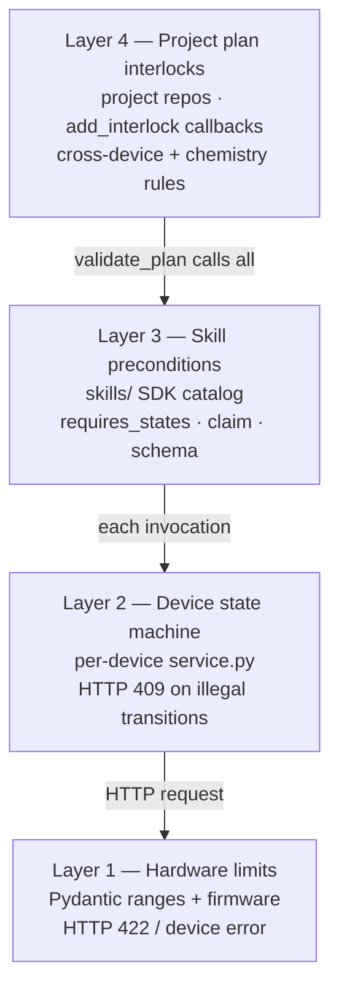

# Interlocks Design

**Status:** design. Implementation lands in `skills/` v0.3 alongside `validate_plan`.

This document specifies the interlock model used to keep the lab safe during multi-device workflows. It defines the four layers of safety enforcement, where each one lives, and the API project repos use to register their own rules.

## Why interlocks at multiple layers

A self-driving lab has at least four sources of "this isn't safe right now":

1. **The hardware** rejects bad commands (e.g. PlateLoc setpoint out of range).
2. **The device's state machine** rejects state-incoherent commands (e.g. seal cycle started while stage is out).
3. **Cross-device physics** rejects unsafe spatial coincidences (e.g. xArm reaching toward the sealer while the stage is not retracted).
4. **The chemistry of a campaign** rejects unsafe parameters (e.g. sealing at 170 °C with a flammable solvent below its flash point).

Each lives at a different layer. Pushing all of them into one place — or letting any of them be silent — leads to either tangled code or unsafe operations. The architecture splits responsibility cleanly.

## The four interlock layers



| Layer | Lives in | Triggers when | Failure looks like |
|---|---|---|---|
| 1. Hardware limits | Per-device repos (`models.py`, firmware) | Argument out of range; device complains | HTTP 422 from `/control/*`; device error log |
| 2. Device state machine | Per-device repos (`service.py`) | Command issued in wrong state | HTTP 409 from `/control/*`; structured `EquipmentBusy`/`RequiresInit` |
| 3. Skill preconditions | `skills/` SDK (`skill_catalog/`, `claims.py`) | SDK refuses to even send the request | `EquipmentBusy`, `EquipmentInMaintenance`, `ClaimRequired`, schema `ValidationError` |
| 4. Project plan interlocks | Project repos (e.g. `solubility-screening`) | A *plan* (not a single command) violates a chemistry/spatial rule | `InterlockViolation` from `validate_plan()` or `execute_plan()` |

Each layer is enforced by the closest authority. Workflows do not duplicate device-side checks; devices do not know about cross-device physics.

## Layer 1: hardware limits

Examples:

- `temperature_c: int = Field(ge=20, le=235)` on `SetSealingTemperatureRequest` in `agilent_plateloc/api.py`.
- Firmware refusing to seal below ambient.

Authored by: device-driver authors. Enforced by: Pydantic + firmware. Consumed by: 422 responses surfacing as Pydantic `ValidationError` in workflow code.

## Layer 2: device state machine

Examples:

- `agilent_plateloc/service.py` `_do()` raising `RuntimeError` when not connected.
- `filter_every_well/api.py` returning `equipment_status: stopped` when commands are issued before `/init`.

Authored by: device-driver authors. Enforced by: device REST returning HTTP 409. Consumed by: `EquipmentBusy`, `RequiresInit`, `Degraded` exceptions in `skills/`.

This layer **does not** know about other devices. It is purely the device's own state.

## Layer 3: skill preconditions

The SDK refuses to issue a command that obviously won't succeed. This is value-added on top of layer 2 — instead of an HTTP round-trip + 409, the SDK fails locally:

- The skill's `requires_states` (or device-declared `allowed_actions`) doesn't include the current `equipment_status`.
- A claim is required (STATUS_SPEC v1.1) but this `LabSession` does not hold one.
- The device is `enabled: false` or has an active `maintenance:` block.
- The args don't validate against the skill's `args_schema`.

Authored by: SDK + device-side `allowed_actions`. Enforced by: `EquipmentClient.command()` and the typed wrappers it exposes. Consumed by: workflow code via typed exceptions.

## Layer 4: project plan interlocks

The interesting layer. **Cross-device physics and project chemistry.** These cannot live in any single device because no device sees the whole picture.

Examples:

- *Spatial:* "xArm cannot move toward the sealer unless `sealer.components.stage.state == 'out'`."
- *Concurrency:* "Filtration press and sealer cannot both be claimed by the same plate at the same time."
- *Chemistry:* "Don't seal a plate at >130 °C if any well contains a solvent with flash point below the seal temperature."
- *Capacity:* "Don't dispense >5 mL into a 96-well plate."
- *Process:* "Plate must be sealed before it leaves the prep station."

These belong in **project repos** because they depend on the project's data model (samples, plate layout, recipe), not on the lab's hardware. Different projects have different rules.

## Plan validation: how layer 4 is consulted

Project repos register interlocks on a `LabSession`:

```python
from lab_skills import Lab, interlock, InterlockResult, Plan, Step

@interlock
async def stage_must_be_out_before_xarm_to_sealer(plan, lab):
    """xArm cannot approach plateloc unless its stage is OUT."""
    if not plan.touches_role_then_role("plate_mover", "sealer"):
        return InterlockResult.skip()

    sealer_status = await lab.role("sealer").status()
    stage = sealer_status.components.get("stage")
    if stage is None or stage.state != "out":
        return InterlockResult.violation(
            f"Cannot move plate to sealer: stage is {stage.state if stage else 'unknown'}, must be 'out'",
            actionable="POST /control/stage/out on the sealer first",
        )
    return InterlockResult.ok()


async with Lab.connect(binding=...) as lab:
    lab.add_interlock(stage_must_be_out_before_xarm_to_sealer)
    plan = Plan([
        Step(role="plate_mover", action="move", to="sealer.stage"),
        Step(role="sealer",      action="seal.start", temperature_c=170, seconds=3.0),
    ])
    report = await lab.validate_plan(plan)
    if not report.ok:
        for v in report.violations:
            print(v.message, v.actionable)
        raise PlanRejected(report)
    await lab.execute_plan(plan)   # runs interlocks again per step as it goes
```

`validate_plan(plan)` runs:

1. Layer 3 checks for every step (the args validate, the device states permit each step in order *as currently observed*).
2. All registered interlocks (layer 4) once over the full plan.
3. Returns a `PlanReport`.

`execute_plan(plan)` re-runs layer 3 + layer 4 *immediately before each step* (state changes between validation and execution; revalidation closes the race).

## Data shapes

```python
class InterlockResult(BaseModel):
    status: Literal["ok", "violation", "warning", "skip"]
    message: str | None = None
    actionable: str | None = None      # "what should the operator do to clear this?"
    severity: Literal["info", "warning", "error", "critical"] = "error"
    details: dict[str, Any] = Field(default_factory=dict)

    @classmethod
    def ok(cls): ...
    @classmethod
    def violation(cls, message: str, actionable: str | None = None, **details): ...
    @classmethod
    def warning(cls, message: str, **details): ...
    @classmethod
    def skip(cls): ...                  # interlock not relevant to this plan


class InterlockViolation(BaseModel):
    interlock_name: str
    message: str
    actionable: str | None
    severity: str
    step_index: int | None              # which step provoked it (None for whole-plan)


class PlanReport(BaseModel):
    ok: bool                            # True iff no violations (warnings allowed)
    violations: list[InterlockViolation]
    warnings: list[InterlockViolation]
    estimated_duration_s: float | None  # sum of skill estimated_duration_s across steps
    devices_required: list[str]         # equipment_ids the plan would touch
    claims_acquired: list[str] = []     # populated by execute_plan(), not validate_plan()
```

`InterlockResult.skip()` exists so an interlock can opt out of plans it doesn't apply to without producing noise. An interlock that always returns `ok` for irrelevant plans is harder to debug.

## Interlock function signature

```python
@interlock
async def my_rule(plan: Plan, lab: LabSession) -> InterlockResult: ...
```

- **Async** so interlocks can read live device state.
- Receives the *whole plan* (not one step) so multi-step rules are expressible.
- Receives the `LabSession` so it can read status, look up bindings, etc., but **must not issue control commands**. Interlocks are read-only; `validate_plan` is side-effect-free.

The `@interlock` decorator:

- registers a stable name on the function (default: `module.qualname`)
- ensures async wrapping
- attaches metadata used by `PlanReport` (which interlock fired which violation)

## Where interlocks are registered

Three valid scopes:

1. **Per-session** — `lab.add_interlock(fn)` on a single `LabSession`. Only that session enforces it. Useful for ad-hoc workflows.
2. **Per-binding / per-project** — registered in a project repo's `LabSession` factory or `interlocks.py` module. The default for project workflows.
3. **Per-SDK** — built-in interlocks in `skills/.../interlocks/builtin.py` apply globally. These should be conservative (e.g. "lease must be valid"); chemistry never goes here.

Project repos own their own interlock test suites. Test by constructing fake plans + a mocked `LabSession` whose `role(...).status()` returns canned `EquipmentStatus` values.

## Interlocks vs. claim/lease vs. plan validation

Three related-but-distinct safety mechanisms:

| | Purpose | When it fires |
|---|---|---|
| **Claim/lease** | Prevent two clients from controlling the same device | Whenever a control command is issued without a valid claim |
| **Skill preconditions** | Refuse obviously-unsafe single commands | Per-command, before HTTP send |
| **Project interlocks** | Refuse plans that violate cross-device or chemistry safety | At `validate_plan` and re-checked in `execute_plan` |

A workflow can fail any of these independently. Together they make a plan safe in three orthogonal ways: *who is allowed to move it* (claims), *can each command succeed by itself* (preconditions), *does the whole sequence make sense* (interlocks).

## What this is **not**

- It is **not** a real-time safety system. Interlocks fire before commands; they do not abort a running cycle. Hardware-level emergency stops live in the device firmware and STATUS_SPEC `e_stop` state.
- It is **not** a replacement for chemists' judgment. The interlock library encodes rules that have been thought through; novel situations still require human review before automation.
- It is **not** trying to be Datalog or a proof system. Interlock functions are plain async Python: easy to write, easy to test, easy to debug.

## Future directions (not in v0.3)

- **Static plan analysis** — analyze a `Plan` graph to detect rule violations purely syntactically (no device reads). Useful for agent planning where checking 100 candidate plans is cheap if no I/O is needed.
- **Interlock catalog publication** — expose the registered interlocks to agents via MCP so they can ask "what rules govern this plan?" before generating it.
- **Automatic interlock derivation** — derive simple interlocks from `STATUS_SPEC` component states (e.g. "this skill requires component X in state Y") to reduce hand-written rules.

## See also

- `docs/STATUS_SPEC.md` — equipment-side state contract
- `docs/SKILLS_CATALOG.md` — skill definitions interlocks check against
- `docs/ARCHITECTURE.md` — system-level layering
