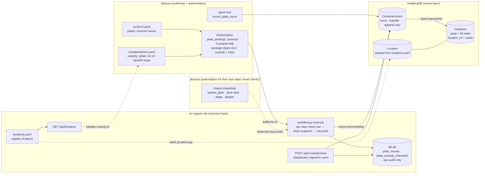

# Plate tracking — where every container is, and how it got there

**Status:** design agreed 2026-08-22; registry + digest fix shipped the same
day; AnaliticaDB Phase 2a (§5), bitácora Phase C (§6), the ac-organic-lab
executor Phase D (§7) and the views (Phase E) shipped 2026-08-23 — and were
**deployed the same day**: production AnaliticaDB migrated to `d1e2f3a4b5c6`
(contract 0.13.0, tag `contract-0.13.0`, pre-migration dump under
`/home/sdl2/backups/analiticadb/`), the 39 registry places seeded, and the
dashboard API/web and bitácora API/frontend restarted on the new code. A
rehearsal on a restored copy (`bitacora_stagging`, same Postgres) preceded
the production migration; the copy was left in place. What is *not* in
production yet is any plate — register the first one and authorize with
`plate_bindings`.

This document is the cross-repo authority for **location and custody
tracking of plates and the samples in them**, across `ac-organic-lab`
(registry + executor + dashboard), `bitácora` (authoring + authorization),
`AnaliticaDB` (the record layer), and the device repos. It answers one
question that came up three separate ways — *should we build a state machine
of deck positions like the OT-2 gateway's, drive it from a yaml in this repo,
and keep it consistent with AnaliticaDB?* — and the answer is: **no state
machine; a registry, a ledger, and a cache, each in the repo whose job it
already is.**

> **Location tracking and identity tracking are different problems.** "The
> vial was exactly where the system said it was; the contents were wrong. A
> perfect position audit passes both." (`bitácora/docs/ELN_LIMS_V2.md` §2.5.)
> This document is about *location* and *custody*. Identity (what is in the
> plate) stays with the record layer's `Container` / `Sample` design and the
> ledger's `transfer` rows (§2 D11); nothing here substitutes for it.

---

## 0. The answer in one paragraph

Three separate things, none of them a state machine:

| Thing | What it is | Where it lives | Mutability |
|---|---|---|---|
| **Registry of places** | every nameable place a container can be — a deck slot, a reader carrier, a sealer stage, the arm's gripper, a bench spot, waste | `ac-organic-lab/locations.yaml` (git-reviewed), loaded by `lab_skills.locations`, served as `GET /api/locations`, **seeds** AnaliticaDB `Location` | static; names immutable |
| **Ledger of moves** | what happened: an append-only `move` row per custody change, with `plan_id` / `step_id`, who, when, commanded vs observed | AnaliticaDB `ContainerAction` | append-only |
| **Current-location cache** | where each container is *now* | AnaliticaDB `Container.location_id`, set by the service in the same transaction as the `move` row | service-owned cache |

Device snapshots (`details.loaded_plate`, the OT-2 deck, `components.stage`,
the arm's `gripper.object_detected`) are the **observed** side, used to
*reconcile* the ledger — a contradiction is flagged, never auto-resolved,
exactly the OT-2 gateway's own `slot_state: mismatch` discipline.

**Who writes the ledger:** the run executor in this repo
(`api/app/workflow.py` + `record.py`, which already files `Plan` and `Note`
rows per run), plus two thin human front doors (a dashboard action and a
bitácora agent tool) for bench-top moves. **Devices never do** — the record
layer's own layering rule (`DATABASE_DESIGN.md` → *Plate identity* → *The
layering rule*). bitácora binds *nominal* plate names (`reaction`,
`acid_stock`) to physical `Container.hid`s at **authorization** time — never
in the protocol — and its compiler annotates the handoff-completing step of a
move sequence with a declared custody effect.

---

## 1. Why not a state machine — what the exploration found

- **Nothing tracks where a physical plate is today.** bitácora's `plates:`
  block is nominal by design (`PLATES_AS_OBJECTS.md`: "nominal only … never
  committed back into the protocol"). Device services carry `plate_id` as an
  opaque string with no slot binding (`plate.load{plate_id, model, wells}`;
  `move_labware{nickname, new_location}` — one names the plate, the other the
  place, nothing joins them). `equipment.yaml` and `platforms.yaml` have no
  positions. The one persisted `plate_id` in the whole stack is a free-text
  column on the solid-doser `runs` table.
- **The OT-2 gateway's "deck state" is not a state machine.** It is three
  per-device, last-write-wins JSON snapshots (`PlateStateStore`, one plate;
  `DeckDeclarationStore`, 12 slots; `TipStateStore`) merged by a *pure*
  `build_deck()` on every `/status` into `slot_state ∈ empty | declared |
  occupied | in_use | mismatch`. There are no slot transitions to hook, **no
  history**, and `plate.load` / `plate.unload` / `well.update` /
  `deck.declare` emit **no events at all** (they bypass `_run_action`, which is
  the only place `control_action` rows come from). The gateway even carries
  dead, unimported scaffolding — `labware/containers.py` (`Container`,
  `Location(device_id, slot)`) and `labware/events.py` (`ContainerMoved`) — with
  a README note that "full sample provenance should live in workflow state or
  a future inventory service." `docs/DECK_STATE.md`: "xArm never reports
  placements — the OT-2 owns its own loaded truth." That is the right posture
  for a device: it is authoritative for *its own* real-time state and nothing
  else (`ARCHITECTURE.md` decision #2). Copying that shape centrally would
  reproduce its limits — current state only, one plate, no history — at the
  one layer that needs history most.
- **Legal transitions are device-authoritative.** The xArm's motion graph
  (`xarm-translocation/src/settings/motion_graph.yaml`) already names every
  physical place and says where the gripper may open or close
  (`gripper_transitions` on `opentrons_{2,4,6}_low`, `deck_slot{1,2}_low`,
  `deck_solid_low`, `hood_shaker_low`, `hood_filter_{low,top_plate}`,
  `cytation_low`, `uplc_draw_open_max`; the `*_high` / `*_home` nodes are
  approach waypoints). The device publishes `details.motion_graph.{current_node,
  reachable_nodes, travel_targets}` and refuses illegal moves itself. A central
  transition table would be a second copy of that graph, wrong the first time
  the graph is re-recorded. What the central layer *should* enforce is an
  **interlock** (INTERLOCKS.md layer 4 — "plate must be sealed before it leaves
  the prep station" is literally the example), and an interlock needs the
  ledger, not a transition table.
- **AnaliticaDB already has the design, unbuilt.** `DATABASE_DESIGN.md` §6 +
  *Plate identity* and `AnaliticaDB/docs/eln-lims-generalization.md` §5–6
  specify `Container` (a plate is one row with 96 positional children,
  `UNIQUE(parent_container_id, position)`), a `Location` **registry table**
  ("not a string … an SDL needs 'where is plate X' to resolve to something a
  robot understands"), the `ContainerAction` ledger with a `move` verb, and
  `Container.location_id` as the cache. Two decisions there are load-bearing
  here: **a device's `plate_id` *is* the `Container.hid`**, and **the workflow
  layer does the joining.** Today plate/well identity exists only by convention
  (`sample.hid = "<plate>:<well>"`, `sample.meta.{plate, well}`); the ledger is
  what turns that label into a foreign key by value.

So the user's instinct — "a yaml in ac-organic-lab so each platform knows
where things are" — is right for **which places exist** and wrong for **where
things are**: the first is static and belongs in a reviewed file next to
`equipment.yaml`; the second changes every run and belongs in the record
layer. The bitácora inventory (SQLite, bottles-only, now "slated for absorption
into AnaliticaDB's ledger") is the cautionary tale for building a second state
store anywhere else.

---

## 2. Decisions

**D1 — Registry, not state machine.** `locations.yaml` enumerates places.
Which moves are legal is the device's business (xArm `reachable_nodes`, OT-2
deck occupancy). The central layer enforces *interlocks* computed from the
ledger ("plate X must be at L before step S" — layer 4, later), not
transitions.

**D2 — One-directional authority; names are immutable.**
`locations.yaml` is authoritative for *which places exist* (name, `type`,
`equipment`, `aliases`, `label`, `capacity`). AnaliticaDB is authoritative for
*what is where* (`Container.location_id`) and *what happened*
(`ContainerAction`). The yaml never carries state; the database never invents
places. Consequences:
- A location `name` is an identifier and is **never renamed**: a renamed place
  is a new entry plus `active: false` on the old one, because ledger rows point
  at names. Entries are never deleted.
- Seeding is an idempotent upsert-by-name script (`scripts/seed_locations.py`,
  §7) with a `--check` drift report (yaml-only = unseeded; DB-only = someone
  POSTed a `Location` by hand — convention: only the seeder does; type /
  equipment disagreement). It runs on demand, **not** at dashboard boot — the
  record layer is optional by `record.py` property 3 and boot must not depend
  on it. Drift is surfaced, never auto-resolved.
- `capacity` is informational (a dashboard warning), **never enforced by the
  ledger**: refusing a truthful record ("I did put it in slot 2; the other row
  is stale") is worse than a visible double-occupancy.

**D3 — Naming and types.** `<equipment_id>/<position>` for device-anchored
places, `<site>/<path>` otherwise; lowercase snake segments, at least one `/`
(`lab_skills.locations.NAME_RE`). `type` is exactly AnaliticaDB's
`location_type` enum — `storage | instrument | deck | fridge | waste` — and
there is deliberately **no `transport`**: the arm's gripper is itself a
location (`xarm_translocation/gripper`, `instrument`, `capacity: 1`). A plate
mid-transfer, or left in the gripper when a run aborts at a step boundary (the
*normal* abort state — abort is cooperative at boundaries), is honestly "in
gripper" with no special state; recovery is an ordinary human `move`.

**D4 — Identity.** Device `plate_id` == `Container.hid` (unchanged from
`DATABASE_DESIGN.md`). Protocols stay nominal. The binding nominal-plate →
`Container.hid` happens at **authorization** (`AuthorizationCreate.
plate_bindings: {nominal: hid}`), is resolved *into the package* through
`{<plate>_hid}` placeholders (the same convention as `{<factor>_source}`), is
stored beside `binding` as its own column, and is therefore covered by the
package digest — an authorization pins "this package on these plates". This
keeps two existing contracts intact: nothing physical is ever committed into
the protocol, and the executor "does not compile, does not re-plan, does not
substitute" (`workflow.py`). `hid` is free text for now — unique, never reused;
the ELN_LIMS_V2 §3.6 scheme (ULID internal, prefixed human label, barcode as a
dated alias) applies when the first label is printed.

**D5 — Writers.** The executor writes custody per step with `plan_id` /
`step_id` and the authorizing human as `performed_by`. Bench-top moves get
**one write path, two front doors**: `POST /api/custody/move` on the dashboard
(signed-in `X-Auth-User`, audited as `control_action` on pseudo-device
`custody`, mirrored to lab.db as `plate_moved`) and a bitácora agent tool
`record_plate_move` (the chat user's identity, via `RecordLayer`). Both POST
the same `ContainerActionCreate` shape from `ontology.json`. Neither keeps
local state. Devices never write (layering rule). `api/app/deck.py` (a
self-described stopgap slot→labware-type store) is retired in the same motion
so it cannot become a second "where is labware" answer.

**D6 — Custody is declared, on the handoff-completing step.** Custody does
not change on `graph.move_to`; it changes when the gripper opens or closes at
a `*_low` node, when the BioStack `present_plate`s, when a sealer `stage.in`s.
So the annotation lives on that sub-step in the project's
`compile/actions.yaml` — D-6: deck logistics stay out of the protocol — as
`custody: {plate: <nominal>, to: <location name>}`. The compiler validates
`plate` against the protocol's `plates` and `to` against the registry and
refuses unknowns (`CompileError`, same posture as an unmapped action): a
custody annotation nobody validates is a typo in the ledger. An arm transfer is
**two legs** (`to: xarm_translocation/gripper` on grip-close, `to: <dest>` on
grip-open). Annotations sit inside `steps[*]`, so they are in the digest by
construction — correct, since they determine what the ledger will *say* ran,
and they derive deterministically from protocol + actions.yaml at the
authorized commit. Inferring custody from xArm node ids (brittle: node tags are
graph-internal config) or from device snapshots (mostly absent, occasionally
confidently wrong — the silent-success failure class) is rejected.

**D7 — Commanded vs observed; mismatch only on contradiction.** After a
custody step reports `succeeded`, the executor posts the `move` row (the
commanded side), then reads a **fresh** device snapshot (`aggregator.fetch_one`,
not the cache) and derives an observation `{source, kind, value}` with
`kind ∈ plate_id | presence | none`: `details.loaded_plate.plate_id` (Cytation,
OT-2's single tracked plate), an OT-2 deck slot through the registry's
`aliases`, `components.stage / plate / handoff` (PlateLoc, press, doser,
BioStack), `details.gripper.object_detected` (xArm). A **mismatch is declared
only when an observation contradicts** the commanded move, never when it is
absent — most devices can report presence at best. Mismatch → deviation `Note`
+ `plate_custody_mismatch` event; a step that ends `unknown` (sent, no answer)
writes **no** `move` row, an `outcome_unknown` Note, and
`plate_custody_unknown` — the last known location stands (the same rule
`notes_from` already applies to liquid). At run start the executor cross-checks
each bound plate's `Container.location_id` against the device snapshot where
one exists and reports disagreement on the `started` SSE frame as a warning
(`CUSTODY_STRICT=1` promotes it to a refusal). Nothing ever auto-corrects.
`aliases` in the registry are **observation-only**: they read a device's
vocabulary back into ours; they are never used to infer a move.

**D8 — lab.db events are ops audit; custody is read from AnaliticaDB only.**
`plate_moved`, `plate_custody_mismatch`, `plate_custody_unknown` are registered
in `LAB_MONITORING.md`'s `event_type` table (reserved until the executor
emits them). No `/api/history/plates` reads custody out of lab.db; the "where
is every plate" view is a read-through to AnaliticaDB.

**D9 — `plan_id` on move rows ⇒ the Plan is opened at run start.**
`RunRecorder` today writes the `Plan` *after* the run; moves are written
*during* it, and `ContainerAction` is append-only, so `plan_id` cannot be
backfilled. `record.py` splits into `open_run_record` (ensure `Experiment`, POST
`Plan` with the planned steps, `approved → executing`) and `close_run_record`
(Notes, `completed | abandoned`, final summary Note with per-step statuses).
This is closer to AnaliticaDB's own semantics (Plan = intent, Notes = what
happened) than the end-of-run write, and it is its own tested phase. Until it
ships, move rows may carry `plan_id = null` + `step_id` + `params.
authorization_id` — acceptable for a bench trial, not for go-live.

**D10 — Lab scope (to confirm).** Locations, containers and their actions are
lab-shared, not project-owned. The minimal bend: nullable `project_id` on the
three tables, `None` = lab-scoped, readable by any caller with a non-empty
project scope or admin (`can_read_lab`), writable under the same rule. No
`ac_auth` change. The alternative in `DATABASE_DESIGN.md` (a `lab-inventory`
shared project with auto-enrolment) stays on the table; pick one before the
AnaliticaDB migration lands.

**D11 — Sample lineage is later, and the join key does not move.** `transfer`
rows (source/target well containers, commanded and — when an instrument
reports it — observed amounts, per ELN_LIMS_V2 §3.2) are emitted from the
`plates` mappings (`pairwise | identity | column_broadcast`) at run filing, not
in this slice. bitácora's `{plate}:{well}` join key (`record.py::_well_key`,
`plate-map-tab.tsx::wellKey`) stays; `Sample.meta.plate_hid` lands beside the
nominal `plate` when samples are minted; `ContainerContents` keeps its
`derived | asserted | measured` flag (ELN_LIMS_V2 §3.3). The OT-2 tip tracker's
`sample_id`-per-tip is a provenance thread "sitting in a device and connected
to nothing" (`DATABASE_DESIGN.md`) — a later consumer of the same ledger.

---

## 3. `locations.yaml` — schema and initial registry

Loaded by `lab_skills.locations.load_locations()` (path / `LAB_LOCATIONS_PATH`
/ ancestor walk, missing file raises — same as `load_registry`,
`load_platforms`); validated against `equipment.yaml` by
`LocationsConfig.validate_against(registry)` (the dashboard logs problems at
startup, `skills/tests/test_locations.py` asserts the committed file has
none); served as `GET /api/locations`.

```yaml
locations:
  - name: ot2_hte/slot_2          # identifier, IMMUTABLE; "<equipment_id>/<position>" or "<site>/<path>"
    type: deck                    # storage | instrument | deck | fridge | waste  (= AnaliticaDB location_type)
    equipment: ot2_hte            # must exist in equipment.yaml; required for `deck`
    capacity: 1                   # informational; never enforced by the ledger
    aliases:                      # OBSERVATION-ONLY device vocabulary → canonical name
      ot2_hte: "2"                #   OT-2 deck slot key in details.snapshot.deck.slots
      xarm_translocation: [opentrons_2_low, opentrons_2_high]   # graph nodes tagged for this place
    label: "OT-2 HTE · slot 2"
    active: true                  # removal = active:false, never delete
    notes: "…"                    # free text, not contract ("confirm with lab")
```

The committed registry (39 places as of 2026-08-22). Entries marked *confirm*
were named from the xArm graph's node tags and the live `/status` envelopes
without a human at the bench — fix `notes`, or add a new entry and deactivate
the old one if the *name* is wrong; never rename.

| Place(s) | `type` | Observed how | Note |
|---|---|---|---|
| `ot2_hte/slot_1..12`, `ot2_complexation/slot_1..12` | deck | OT-2 `details.snapshot.deck.slots[<n>]` (labware type + `plate_id` on the one tracked plate); xArm nodes `opentrons_{2,4,6}_*` on the HTE robot | no arm reaches the complexation robot — human-loaded |
| `cytation_5/carrier` | instrument | `details.loaded_plate.plate_id` (== hid); xArm `cytation_*` | the one place a device names the plate |
| `plateloc/stage` | instrument | presence: `components.stage ∈ in\|out`; xArm `plateloc_*` | |
| `torry_pines_shaker/nest` | instrument | unobservable (no plate sensor); xArm `hood_shaker_*` | |
| `filter_every_well/stage`, `filter_every_well/stage_top` | instrument | presence: `components.plate ∈ in\|out`; xArm `hood_filter_*` / `hood_filter_top_plate` | *confirm* — stacked filter plate over receiver plate |
| `dose_every_well/stage` | instrument | presence: `components.plate ∈ absent\|…`; xArm `deck_solid_*` | *confirm* |
| `agilent_uplc_ms/drawer` | instrument | xArm `uplc_draw_*`, `uplc_plate_home` | *confirm* — one position assumed |
| `agilent_biostack/handoff`, `/stack_in`, `/stack_out` | instrument | presence: `components.handoff`; stacks capacity 30 | *confirm* capacities / naming |
| `xarm_translocation/gripper` | instrument, capacity 1 | `details.gripper.object_detected` | **in-transit / aborted-run plates live here** |
| `xarm_translocation/deck_slot_1`, `/deck_slot_2` | storage | xArm `deck_slot{1,2}_*` | *confirm* — nests on the arm's track deck |
| `bench/hte_staging` | storage, capacity 10 | human only | front doors (D5) |
| `waste/hte_solid` | waste | — | terminal: a `dispose` row, not a `move` |

No fridge entries until one exists — names are immutable, so nothing is
guessed.

---

## 4. Data flow



---

## 5. AnaliticaDB "Phase 2a — custody slice" (contract for the next PR)

The minimal subset of the designed Phase 2 (`eln-lims-generalization.md`
§5–6) that location tracking needs: contract `0.12.0 → 0.13.0`. Defer
`Substance` / `Lot` / `ContainerContents` / `sample_ingredients` — they are
composition, not custody — but shape `ContainerAction` so they join later
without a second migration.

- **Enums** (`models/enums.py`): `LocationType(storage|instrument|deck|fridge|
  waste)`; `ContainerType(plate|well|vial|bottle|flask|filter_plate|reservoir|
  tiprack|other)`; `ContainerStatus(empty|in_use|dirty|retired)`;
  `ContainerActionType` with the **full** §5 vocabulary now (`receive | dose |
  transfer | filter | dilute | consume | dispose | adjust | move | seal | pierce
  | shake | read | store`) so later verbs need no enum migration; `Unit` as
  UCUM codes (`uL mL mg g umol mmol`, ELN_LIMS_V2 §3.4).
- **`Location`**: `location_id`, `name` (unique, the yaml name), `location_type`,
  `equipment_id?`, `capacity?`, `label?`, `active`, `creator`, `meta`.
  Mutable-with-audit on `label` / `active` only.
- **`Container`**: `container_id`, `hid` (unique; == device `plate_id`),
  `container_type`, `parent_container_id` self-FK + `position`,
  `UNIQUE(parent_container_id, position)`, `model?` (labware load name),
  `location_id?`, `status`, `project_id: uuid | None` (D10), `creator`, `meta`.
  `ContainerCreate.positions: list[str] | None` mints the positional children
  in one transaction (a plate + `A1…H12`). `ContainerUpdate` covers `status`,
  `model`, `meta` — **not `location_id`**: location changes only through the
  ledger, and the repository sets the cache in the same transaction as the
  `move` / `receive` row.
- **`ContainerAction`** (append-only, no PATCH/DELETE): `action_id`,
  `action_type`, `source_container_id?`, `target_container_id?`,
  `to_location_id?`, `lot_id` (reserved, null), `amount_commanded?`,
  `amount_observed?`, `unit?`, `experiment_id?`, `sample_id?`,
  `measurement_id?`, `plan_id?`, `step_id?`, `performed_by`, `performed_at`,
  `creator`, `params` JSONB (`observed: {source, kind, value}`,
  `authorization_id`, `reason`), `project_id?`. Validators per verb: `move` ⇒
  target + `to_location_id`; `transfer` ⇒ source + target; `receive` ⇒ target +
  `to_location_id`; `dispose` ⇒ source. Commanded and observed amounts are
  separate, nullable, never conflated (ELN_LIMS_V2 §3.2).
- **Service / API / contract**: `@audited` `create_location` /
  `update_location` / `create_container` / `update_container` /
  `create_container_action` owning the transaction; routers under
  `/locations`, `/containers`, `/container-actions` (+ list filters: location
  `{name, equipment_id, location_type, active}`; container `{hid, location_id,
  parent_container_id, container_type, status}`; action `{container_id
  (source or target), action_type, plan_id, to_location_id}`); `collections.py`
  + `ontology.py` ENTITIES + regenerated `ontology.json`; `SCHEMA_VERSION =
  "0.13.0"`; one alembic migration creating the named enums explicitly and the
  three tables with indexes on `containers.hid`, `containers.location_id`,
  `container_actions.{source,target}_container_id`, `container_actions.plan_id`.
- **Authz** (D10): `can_read_lab(caller)` + `can_read_scoped(project_id, caller)`
  dispatching on `None`; `scoped_readable_or_404` / `filter_scoped_readable`
  in `api/deps.py`.
- **Tests**: authz lab-scope cases; ontology entity set + list filters; action
  validators; `ContainerUpdate` rejects `location_id`; integration — plate +
  wells minted, `move` updates `location_id` and `GET /container-actions?
  container_id=` returns the history, duplicate `position` → 409, no PATCH on
  actions, lab-scoped row visible to a member of an unrelated project and
  invisible to an empty scope.

---

## 6. bitácora follow-up (D4, D6)

- `templates/hte/schema/actions.schema.json`: `substep.custody: {plate:
  plate_name, to: string}` (both required; the substep is
  `additionalProperties: false` so this is a template **MINOR** bump
  `1.10.0 → 1.11.0` with `CHANGELOG.md` and the `pins.yaml` self-pin — the
  existing tests enforce all three).
- `app/src/bitacora/compile.py`: `COMPILER_VERSION` bump (package shape
  changes); `compile_protocol(..., plate_bindings=None, locations=None)`; the
  per-well branch emits `plate` (= `step.dest`, else the single conditions
  plate, else `"plate"` for the shorthand; **omitted** when a step merges
  several plates — never guess) and `plate_hid` when bound; both branches
  resolve `custody` to `{plate, hid, to}` and raise `CompileError` for an
  unknown plate, an unknown location, or an unbound plate; the scope gains
  `{<plate>_hid}` so `plate.load: {plate_id: "{reaction_hid}"}` resolves (an
  unresolved one is the existing "supply it at authorization time" error).
- `app/src/bitacora/main.py`: `AuthorizationCreate.plate_bindings: dict[str,
  str] = {}`; `authorize_run` loads the registry (`LAB_LOCATIONS_PATH` in
  `config.py`, or `GET /api/locations` — open question §10) and passes bindings;
  422 naming an unbound plate; if the record layer is configured,
  `RecordLayer.find_container(hid)` and refuse an unknown hid (409, "register
  the plate first") — never mint.
- `app/src/bitacora/authorization.py`: `RunAuthorization.plate_bindings`,
  `_ADDED_COLUMNS += ("plate_bindings", "TEXT")`, insert/read/`to_dict`.
- `app/src/bitacora/record.py`: `find_container`, `list_locations`,
  `post_container_action` (used by the agent tools in §7 too).
- Web: Authorize dialog inputs for `plate_bindings` keyed by the protocol's
  `plates` names.
- Tests: `test_authorization.py` (custody lands in `steps` and the digest;
  unknown location / unbound plate refused; `{reaction_hid}` substitutes;
  bindings round-trip), `test_compile_api.py` (schema accepts/refuses
  `custody`), `test_protocol.py` (ambiguous per-well `plate` is omitted).

## 7. ac-organic-lab follow-up (D5, D7, D8, D9)

- `api/app/custody.py` (new): `CustodyRecorder(base_url, secret)` — never
  raises, returns status dicts (`record.py` property 1); `resolve(hid | name)`
  cached per run; `record_move(hid, to, *, step_id, plan_id, performed_by,
  observed, params)`; **pure** `observe(snapshot, entry, locations) →
  Observation{kind: plate_id|presence|none, value, source}` with per-kind
  readers; **pure** `reconcile(expected_hid, observation) → match | mismatch |
  unobservable` (mismatch only on contradiction). Router: `POST
  /api/custody/move {hid, to, note?}` (signed-in user; `control_action` audit on
  pseudo-device `custody`; lab.db `plate_moved`); `GET /api/custody/plates`
  (read-through to AnaliticaDB containers + locations; no local cache).
- `api/app/workflow.py`: `_drive_run` builds `custody_by_step` from
  `auth.steps`; in `on_step`, `succeeded` + custody → `record_move` → fresh
  `aggregator.fetch_one(equipment_id)` → `observe` / `reconcile`; mismatch →
  deviation Note + `plate_custody_mismatch`; `unknown` → `outcome_unknown` Note +
  `plate_custody_unknown`, no move; SSE `custody` frame; run-start cross-check
  → `started.custody_warnings` (refusal under `CUSTODY_STRICT=1`).
  `plan_row_from` meta += `plate_bindings`.
- `api/app/record.py`: `open_run_record` / `close_run_record` (D9);
  `RunState.record = {experiment_id, plan_id}`.
- `scripts/seed_locations.py`: idempotent upsert of `locations.yaml` into
  `/locations` (`POST`, 409 = exists; `PATCH` only `label` / `active`),
  `--check` drift report; uses `ANALITICADB_URL` + the edge secret the way
  `record.edge_secret()` does; removed names → `active: false`.
- Retire `api/app/deck.py` (+ `build_deck_router()`) after confirming `web/`
  has no `/api/equipment/*/deck` consumer left (the OT-2 picker reads the
  gateway's declared store, `DECK_STATE.md`).
- `docs/LAB_MONITORING.md`: move the three event types from *reserved* to
  emitted when the executor ships them.
- Tests: `api/tests/test_custody.py` (respx; payload shape vs `ontology.json`;
  observe/reconcile table incl. unobservable and presence-only; never raises),
  `test_workflow.py` (hook fires only on `succeeded`; `unknown` writes no move;
  mismatch emits Note + event; Plan opened before the first step and closed
  after `done`), `test_record.py` (open/close lifecycle; dry run stays draft).

## 8. Device-side asks (other repos — list only)

- **opentrons-server**: `plate.load` gains an optional `slot` (the second half
  of "no slot binding", `DATABASE_DESIGN.md` gap 2); a plate-per-slot store
  whenever the device repos decide to break the one-plate contract; delete the
  unused `src/opentrons_server/labware/{containers,events}.py`. Plate events
  on `plate.load` / `unload` would be welcome for ops history but are **not**
  required — custody is recorded by the executor.
- **agilent-cytation-server**, **xarm-translocation**: nothing required
  (`details.loaded_plate.plate_id` and `details.gripper.object_detected` are
  already the observations D7 reads).
- **All devices**: keep treating `plate_id` as an opaque string. Never resolve
  it, never call the record layer.

## 9. Phasing

| Phase | Repo | Content | Depends on | Status |
|---|---|---|---|---|
| 0 | ac-organic-lab | `_DIGEST_FIELDS` / `digest_payload_of` fix (optional-when-truthy `plates`) | — | **shipped 2026-08-22** |
| B | ac-organic-lab | `locations.yaml`, `lab_skills.locations`, `GET /api/locations`, tests, docs | — | **shipped 2026-08-22** |
| A | AnaliticaDB | Phase 2a custody slice (§5), contract 0.13.0, migration `d1e2f3a4b5c6` | D10 → decided: nullable `project_id` | **shipped 2026-08-23** (see note below) |
| C | bitácora | `custody` substeps, `plate_bindings`, compiler 0.4.0, template 1.11.0, Authorize UI (§6) | B (loader); A for the hid check | **shipped 2026-08-23** (see note below) |
| D1 | ac-organic-lab | `custody.py`, executor hook, front door, `seed_locations.py` (§7) | A, B, C | **shipped 2026-08-23** (see note below) |
| D2 | ac-organic-lab | Plan-at-start (`open_run_record` / `close_run_record`) | D1 | **shipped 2026-08-23** |
| E | bitácora + dashboard | agent tools (`register_plate`, `record_plate_move`, `where_is_plate`, `list_locations`), "Plates" views | A, D | **shipped 2026-08-23** (see note below) |
| F | all | `transfer` lineage rows, `ContainerContents` flag, Substance/Lot; device asks (§8) | E | not started |

A and B are independent; C can start on B's yaml with a fixture before A
lands; everything after needs all three.

**Phase E as shipped (2026-08-23):**
- **Dashboard `/utils/plates`** (`web/src/app/utils/plates/`): every registered
  plate grouped by place (read-through to `GET /api/custody/plates`, 10 s
  refresh; an unreachable ledger renders as unreachable, never as an empty
  lab), click a hid for its ledger history, and the **bench-top move form**
  (hid + a place picker fed by `GET /api/locations`, active places only →
  `POST /api/custody/move`; sign-in required — the middleware now gates
  `/api/custody/*` writes like labware writes and injects the verified user).
- **bitácora:** `GET /projects/{id}/plates/custody[?protocol=]` — for each
  protocol's *latest* authorization with `plate_bindings`, the hid per nominal
  plate and, via the record layer, where it is now + its last move
  (`configured: false` when no record layer; `found: false` for an
  unregistered hid; an unreachable ledger is an `error`, never "nowhere").
  The **Sample Map** shows a `PLT-0042 @ torry_pines_shaker/nest` badge on each
  plate section; the **Authorize** tab shows "last: PLT-0042 @ place" beside
  each binding input with one-click reuse. Chat tools shipped with Phase D.
- Not done: a location column in the Samples (wells) table — wells have no
  place of their own (their root plate's), so the badge on the plate is the
  honest unit; and per-device tile hints ("plate here: …") on the platform
  pages, which would need the registry alias → tile plumbing.

**Phase D as shipped (2026-08-23) — deltas from §7 worth knowing:**
- **Robot path:** `workflow.py::custody_after_step` runs after every step the
  compiler annotated (`Authorization.custody_by_step`, declared — never
  inferred). `succeeded` → `CustodyRecorder.record_move` (commanded:
  `performed_by` = the step's equipment id, `creator` = the launcher, the
  run's project as scope, `plan_id` + `step_id` when the Plan was opened) →
  fresh `aggregator.fetch_one(<destination's equipment>)` → `observe` /
  `reconcile` → SSE `custody` frame + lab.db `plate_moved`; `mismatch` adds a
  deviation Note + `plate_custody_mismatch`; `unknown` writes **no** move and
  files `outcome_unknown` + `plate_custody_unknown`; `dry_run`/`blocked`/
  `failed`/`skipped` record nothing. The hook can never stop a run.
- **Human path:** `POST /api/custody/move {hid, to, note?, performed_by?}`
  (signed-in; the registry name is checked locally first; audited as
  `control_action` on pseudo-device `custody` + `plate_moved`), plus
  `GET /api/custody/plates[/{hid}]` read-through (current place + history).
  Both paths write the identical ledger row. bitácora adds chat tools
  (`record_plate_move`, `where_is_plate`, `register_plate`, `list_locations`).
- **Plan-at-start (D9):** `RunRecorder.open` posts the planned steps and walks
  `approved → executing` before the first step; `close` files the notes, one
  `event` summary Note with the final per-step statuses (a Plan row is never
  edited), and `completed | abandoned`. Dry runs and a record layer that was
  down at start fall back to the old end-of-run `write`.
- **Run start:** the `started` frame carries `plate_bindings`, `custody_steps`,
  and where the record layer says each bound plate is now; `CUSTODY_STRICT=1`
  turns an unknown plate into a 409 refusal.
- **`observe` is table-driven and conservative:** OT-2 slot through the
  registry alias (`labware.plate_id`, else `slot_state`), `details.loaded_plate.
  plate_id`, `details.gripper.object_detected` for a gripper place, presence
  components (`stage|plate|handoff|plate_stage|nest|carrier` ∈ in/out…); a
  null `loaded_plate` is *unobservable*, never a mismatch — it is bookkeeping,
  not a sensor.
- **`deck.py` is not retired yet**: `web/src/lib/api.ts` still calls
  `/api/equipment/{id}/deck` (the OT-2 picker) — retire together with that
  consumer.
- `scripts/seed_locations.py`: `--check` drift report / idempotent upsert
  (`POST`, 409 = exists; `PATCH` label/capacity/active; db-only names →
  `active: false`); type/equipment disagreements are printed, never patched.

**Phase C as shipped (2026-08-23) — deltas from §6 worth knowing:**
- `custody: {plate, to}` is legal on a sub-step **and** on a single-`skill`
  action (the action *is* the completing step — `present_plate`, `stage.in`);
  on a `steps` action it is refused ("put it on the completing sub-step").
- The compiled annotation is `custody: {plate, hid, to}`; `{<plate>_hid}` is
  in scope for every branch's args; per-well steps carry `plate` (omitted when
  several conditions plates are merged — `compile.plate_for_step` mirrors
  `wells_for_step`, never guesses) and `plate_hid` when bound.
- `plate_bindings` is **not** a digest input (the runner's field set would
  have to grow in lockstep); the hids reach the digest through the steps.
  It is stored as its own column on the authorization (like `binding`).
- Registry: bitácora reads `locations.yaml` **from disk** via `lab_skills.
  load_locations` (`BITACORA_LOCATIONS_YAML`, deploy copy at
  `/data/bitacora/locations.yaml` — keep it in step like `equipment.yaml`),
  resolving §10 open question 4 in favour of offline-capable authorization.
  Without it custody destinations are carried unvalidated and the package
  warns once; with it an unknown or `active: false` place is a 422.
- Hid existence: when a record layer is configured, every bound hid must
  resolve via `GET /containers?hid=` (409 if not registered, 503 if the
  store cannot answer — including a contract older than 0.13.0, so an
  unmigrated production AnaliticaDB refuses rather than pretends).
- Web: the Authorize tab lists the chosen protocol's nominal plates with one
  hid input each; the authorization row shows `plates: reaction → PLT-0042`.

**Phase A as shipped (2026-08-23) — deltas from §5 worth knowing:**
- `lot_id` is **not** a reserved column; it arrives with the Phase 2b `Lot`
  table as one nullable FK (additive). Nothing else in §5 was dropped.
- `ContainerCreate.received_at_location_id` registers a container *at* a
  place in one POST — the service writes the `receive` row atomically, which
  is the only way a new container gets a location (`location_id` is absent
  from Create and Update).
- Children inherit their parent's `project_id`; a ledger row with no
  `project` inherits the scope of the vessel it acts on. A `move` of a *child*
  (well) is refused with 409 — move the root. `dispose` retires the container
  and may name a waste location.
- D10 was decided the minimal way: nullable `project_id`, `None` = lab-scoped,
  `authz.can_read_scoped` (`can_read_lab` = admin or ≥1 project in scope).
- The AnaliticaDB test harness gained a `TEST_DATABASE_URL` escape hatch
  (integration tests against a provided throwaway Postgres) because this
  host's Docker bridge network is down; the migration was validated with
  `alembic upgrade head` / `alembic check` (no diff vs models) / `downgrade`
  / `upgrade` on a scratch container. **Production has not been migrated** —
  that is a deploy step (`uv run alembic upgrade head` against the live DB,
  then tag `contract-0.13.0` and restart `analytica-db.service`).

## 10. Open questions

1. **D10 lab scope** — nullable `project_id` vs the `lab-inventory` shared
   project. Decide before the AnaliticaDB migration.
2. **Filtration press naming** — `filter_every_well/stage` + `/stage_top`
   assumes a receiver-plate-under-filter-plate stack; confirm at the bench.
3. **BioStack** — stack capacities and whether `stack_in` / `stack_out` is the
   right split (vs left/right).
4. **How bitácora reads the registry** — pin a copy via `pins.yaml` and read
   from disk, or fetch `GET /api/locations` with a cache and degrade to
   "unvalidated" with a warning. The latter keeps one source; the former keeps
   authorization offline-capable.
5. **Identity scheme** — when the first label is printed, adopt ELN_LIMS_V2
   §3.6 and decide the human-readable prefix.
6. **`agilent_uplc_ms/drawer`** — one position or a tray of N.

## See also

- [`DATABASE_DESIGN.md`](DATABASE_DESIGN.md) §6 and *Plate identity — the
  device ↔ record join* — the record-layer design this document builds on.
- `AnaliticaDB/docs/eln-lims-generalization.md` §5–6 — the same design from
  the record layer's side.
- `bitácora/docs/ELN_LIMS_V2.md` — the research behind identity, nominal vs
  actual, and "location ≠ identity"; `bitácora/docs/PLATES_AS_OBJECTS.md` —
  the nominal `plates:` block this binds to.
- [`ARCHITECTURE.md`](ARCHITECTURE.md) decisions #2 (devices are authoritative
  for their own state) and #5 (three YAML files).
- [`INTERLOCKS.md`](INTERLOCKS.md) — where ledger-backed "plate at L before
  step S" rules will live.
- [`LAB_MONITORING.md`](LAB_MONITORING.md) — the `event_type` registry
  (`plate_moved` and friends).
- `opentrons-server/docs/DECK_STATE.md` — the device-side snapshot model this
  deliberately does not copy.
