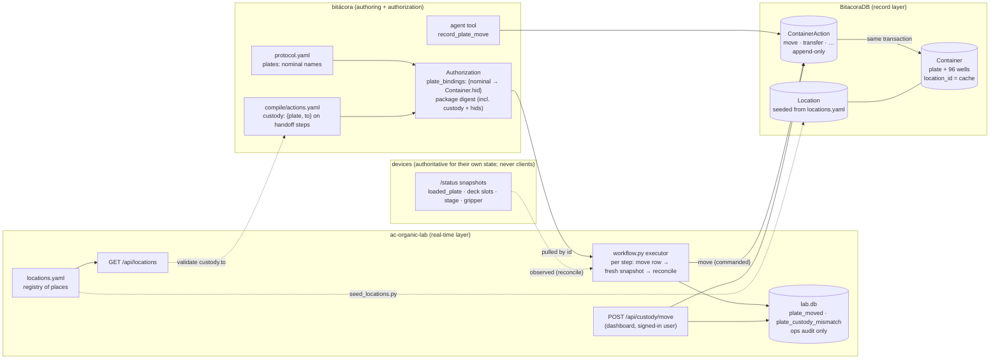

# Plate tracking — where every container is, and how it got there

**Status:** design agreed 2026-08-22; registry + digest fix shipped the same
day; BitacoraDB Phase 2a (§5), bitácora Phase C (§6), the ac-organic-lab
executor Phase D (§7) and the views (Phase E) shipped 2026-08-23 — and were
**deployed the same day**: production BitacoraDB migrated to `d1e2f3a4b5c6`
(contract 0.13.0, tag `contract-0.13.0`, pre-migration dump under
`/home/sdl2/backups/bitacoradb/`), the 39 registry places seeded, and the
dashboard API/web and bitácora API/frontend restarted on the new code. A
rehearsal on a restored copy (`bitacora_stagging`, same Postgres) preceded
the production migration; the copy was left in place. What is *not* in
production yet is any plate — register the first one and authorize with
`plate_bindings`. **2026-10-08:** §11 designs the next slice — removable
containers (vials, tubes) seated on *adapters* (racks, blocks) — as a
proposal; nothing in it is built or agreed with the other repos yet.

This document is the cross-repo authority for **location and custody
tracking of plates and the samples in them**, across `ac-organic-lab`
(registry + executor + dashboard), `bitácora` (authoring + authorization),
`BitacoraDB` (the record layer), and the device repos. It answers one
question that came up three separate ways — *should we build a state machine
of deck positions like the OT-2 gateway's, drive it from a yaml in this repo,
and keep it consistent with BitacoraDB?* — and the answer is: **no state
machine; a registry, a ledger, and a cache, each in the repo whose job it
already is.**

> **Location tracking and identity tracking are different problems.** "The
> vial was exactly where the system said it was; the contents were wrong. A
> perfect position audit passes both." (`bitácora/docs/ELN_LIMS_V2.md` §2.5.)
> This document is about *location* and *custody*. Identity (what is in the
> plate) stays with the record layer's `Container` / `Sample` design and the
> ledger's `transfer` rows (§2 D11); nothing here substitutes for it.

---

## 0. The answer in one paragraph

Three separate things, none of them a state machine:

| Thing | What it is | Where it lives | Mutability |
|---|---|---|---|
| **Registry of places** | every nameable place a container can be — a deck slot, a reader carrier, a sealer stage, the arm's gripper, a bench spot, waste | `ac-organic-lab/locations.yaml` (git-reviewed), loaded by `lab_skills.locations`, served as `GET /api/locations`, **seeds** BitacoraDB `Location` | static; names immutable |
| **Ledger of moves** | what happened: an append-only `move` row per custody change, with `plan_id` / `step_id`, who, when, commanded vs observed | BitacoraDB `ContainerAction` | append-only |
| **Current-location cache** | where each container is *now* | BitacoraDB `Container.location_id`, set by the service in the same transaction as the `move` row | service-owned cache |

Device snapshots (`details.loaded_plate`, the OT-2 deck, `components.stage`,
the arm's `gripper.object_detected`) are the **observed** side, used to
*reconcile* the ledger — a contradiction is flagged, never auto-resolved,
exactly the OT-2 gateway's own `slot_state: mismatch` discipline.

**Who writes the ledger:** the run executor in this repo
(`api/app/workflow.py` + `record.py`, which already files `Plan` and `Note`
rows per run), plus two thin human front doors (a dashboard action and a
bitácora agent tool) for bench-top moves. **Devices never do** — the record
layer's own layering rule (`DATABASE_DESIGN.md` → *Plate identity* → *The
layering rule*). bitácora binds *nominal* plate names (`reaction`,
`acid_stock`) to physical `Container.hid`s at **authorization** time — never
in the protocol — and its compiler annotates the handoff-completing step of a
move sequence with a declared custody effect.

---

## 1. Why not a state machine — what the exploration found

- **Nothing tracks where a physical plate is today.** bitácora's `plates:`
  block is nominal by design (`PLATES_AS_OBJECTS.md`: "nominal only … never
  committed back into the protocol"). Device services carry `plate_id` as an
  opaque string with no slot binding (`plate.load{plate_id, model, wells}`;
  `move_labware{nickname, new_location}` — one names the plate, the other the
  place, nothing joins them). `equipment.yaml` and `platforms.yaml` have no
  positions. The one persisted `plate_id` in the whole stack is a free-text
  column on the solid-doser `runs` table.
- **The OT-2 gateway's "deck state" is not a state machine.** It is three
  per-device, last-write-wins JSON snapshots (`PlateStateStore`, one plate;
  `DeckDeclarationStore`, 12 slots; `TipStateStore`) merged by a *pure*
  `build_deck()` on every `/status` into `slot_state ∈ empty | declared |
  occupied | in_use | mismatch`. There are no slot transitions to hook, **no
  history**, and `plate.load` / `plate.unload` / `well.update` /
  `deck.declare` emit **no events at all** (they bypass `_run_action`, which is
  the only place `control_action` rows come from). The gateway even carries
  dead, unimported scaffolding — `labware/containers.py` (`Container`,
  `Location(device_id, slot)`) and `labware/events.py` (`ContainerMoved`) — with
  a README note that "full sample provenance should live in workflow state or
  a future inventory service." `docs/DECK_STATE.md`: "xArm never reports
  placements — the OT-2 owns its own loaded truth." That is the right posture
  for a device: it is authoritative for *its own* real-time state and nothing
  else (`ARCHITECTURE.md` decision #2). Copying that shape centrally would
  reproduce its limits — current state only, one plate, no history — at the
  one layer that needs history most.
- **Legal transitions are device-authoritative.** The xArm's motion graph
  (`xarm-translocation/src/settings/motion_graph.yaml`) already names every
  physical place and says where the gripper may open or close
  (`gripper_transitions` on `opentrons_{2,4,6}_low`, `deck_slot{1,2}_low`,
  `deck_solid_low`, `hood_shaker_low`, `hood_filter_{low,top_plate}`,
  `cytation_low`, `uplc_draw_open_max`; the `*_high` / `*_home` nodes are
  approach waypoints). The device publishes `details.motion_graph.{current_node,
  reachable_nodes, travel_targets}` and refuses illegal moves itself. A central
  transition table would be a second copy of that graph, wrong the first time
  the graph is re-recorded. What the central layer *should* enforce is an
  **interlock** (INTERLOCKS.md layer 4 — "plate must be sealed before it leaves
  the prep station" is literally the example), and an interlock needs the
  ledger, not a transition table.
- **BitacoraDB already has the design, unbuilt.** `DATABASE_DESIGN.md` §6 +
  *Plate identity* and `BitacoraDB/docs/eln-lims-generalization.md` §5–6
  specify `Container` (a plate is one row with 96 positional children,
  `UNIQUE(parent_container_id, position)`), a `Location` **registry table**
  ("not a string … an SDL needs 'where is plate X' to resolve to something a
  robot understands"), the `ContainerAction` ledger with a `move` verb, and
  `Container.location_id` as the cache. Two decisions there are load-bearing
  here: **a device's `plate_id` *is* the `Container.hid`**, and **the workflow
  layer does the joining.** Today plate/well identity exists only by convention
  (`sample.hid = "<plate>:<well>"`, `sample.meta.{plate, well}`); the ledger is
  what turns that label into a foreign key by value.

So the user's instinct — "a yaml in ac-organic-lab so each platform knows
where things are" — is right for **which places exist** and wrong for **where
things are**: the first is static and belongs in a reviewed file next to
`equipment.yaml`; the second changes every run and belongs in the record
layer. The bitácora inventory (SQLite, bottles-only, now "slated for absorption
into BitacoraDB's ledger") is the cautionary tale for building a second state
store anywhere else.

---

## 2. Decisions

**D1 — Registry, not state machine.** `locations.yaml` enumerates places.
Which moves are legal is the device's business (xArm `reachable_nodes`, OT-2
deck occupancy). The central layer enforces *interlocks* computed from the
ledger ("plate X must be at L before step S" — layer 4, later), not
transitions.

**D2 — One-directional authority; names are immutable.**
`locations.yaml` is authoritative for *which places exist* (name, `type`,
`equipment`, `aliases`, `label`, `capacity`). BitacoraDB is authoritative for
*what is where* (`Container.location_id`) and *what happened*
(`ContainerAction`). The yaml never carries state; the database never invents
places. Consequences:
- A location `name` is an identifier and is **never renamed**: a renamed place
  is a new entry plus `active: false` on the old one, because ledger rows point
  at names. Entries are never deleted.
- Seeding is an idempotent upsert-by-name script (`scripts/seed_locations.py`,
  §7) with a `--check` drift report (yaml-only = unseeded; DB-only = someone
  POSTed a `Location` by hand — convention: only the seeder does; type /
  equipment disagreement). It runs on demand, **not** at dashboard boot — the
  record layer is optional by `record.py` property 3 and boot must not depend
  on it. Drift is surfaced, never auto-resolved.
- `capacity` is informational (a dashboard warning), **never enforced by the
  ledger**: refusing a truthful record ("I did put it in slot 2; the other row
  is stale") is worse than a visible double-occupancy.

**D3 — Naming and types.** `<equipment_id>/<position>` for device-anchored
places, `<site>/<path>` otherwise; lowercase snake segments, at least one `/`
(`lab_skills.locations.NAME_RE`). `type` is exactly BitacoraDB's
`location_type` enum — `storage | instrument | deck | fridge | waste` — and
there is deliberately **no `transport`**: the arm's gripper is itself a
location (`xarm_translocation/gripper`, `instrument`, `capacity: 1`). A plate
mid-transfer, or left in the gripper when a run aborts at a step boundary (the
*normal* abort state — abort is cooperative at boundaries), is honestly "in
gripper" with no special state; recovery is an ordinary human `move`.

**D4 — Identity.** Device `plate_id` == `Container.hid` (unchanged from
`DATABASE_DESIGN.md`). Protocols stay nominal. The binding nominal-plate →
`Container.hid` happens at **authorization** (`AuthorizationCreate.
plate_bindings: {nominal: hid}`), is resolved *into the package* through
`{<plate>_hid}` placeholders (the same convention as `{<factor>_source}`), is
stored beside `binding` as its own column, and is therefore covered by the
package digest — an authorization pins "this package on these plates". This
keeps two existing contracts intact: nothing physical is ever committed into
the protocol, and the executor "does not compile, does not re-plan, does not
substitute" (`workflow.py`). `hid` is free text for now — unique, never reused;
the ELN_LIMS_V2 §3.6 scheme (ULID internal, prefixed human label, barcode as a
dated alias) applies when the first label is printed.

**D5 — Writers.** The executor writes custody per step with `plan_id` /
`step_id` and the authorizing human as `performed_by`. Bench-top moves get
**one write path, two front doors**: `POST /api/custody/move` on the dashboard
(signed-in `X-Auth-User`, audited as `control_action` on pseudo-device
`custody`, mirrored to lab.db as `plate_moved`) and a bitácora agent tool
`record_plate_move` (the chat user's identity, via `RecordLayer`). Both POST
the same `ContainerActionCreate` shape from `ontology.json`. Neither keeps
local state. Devices never write (layering rule). `api/app/deck.py` (a
self-described stopgap slot→labware-type store) is retired in the same motion
so it cannot become a second "where is labware" answer.

**D6 — Custody is declared, on the handoff-completing step.** Custody does
not change on `graph.move_to`; it changes when the gripper opens or closes at
a `*_low` node, when the BioStack `present_plate`s, when a sealer `stage.in`s.
So the annotation lives on that sub-step in the project's
`compile/actions.yaml` — D-6: deck logistics stay out of the protocol — as
`custody: {plate: <nominal>, to: <location name>}`. The compiler validates
`plate` against the protocol's `plates` and `to` against the registry and
refuses unknowns (`CompileError`, same posture as an unmapped action): a
custody annotation nobody validates is a typo in the ledger. An arm transfer is
**two legs** (`to: xarm_translocation/gripper` on grip-close, `to: <dest>` on
grip-open). Annotations sit inside `steps[*]`, so they are in the digest by
construction — correct, since they determine what the ledger will *say* ran,
and they derive deterministically from protocol + actions.yaml at the
authorized commit. Inferring custody from xArm node ids (brittle: node tags are
graph-internal config) or from device snapshots (mostly absent, occasionally
confidently wrong — the silent-success failure class) is rejected.

**D7 — Commanded vs observed; mismatch only on contradiction.** After a
custody step reports `succeeded`, the executor posts the `move` row (the
commanded side), then reads a **fresh** device snapshot (`aggregator.fetch_one`,
not the cache) and derives an observation `{source, kind, value}` with
`kind ∈ plate_id | presence | none`: `details.loaded_plate.plate_id` (Cytation,
OT-2's single tracked plate), an OT-2 deck slot through the registry's
`aliases`, `components.stage / plate / handoff` (PlateLoc, press, doser,
BioStack), `details.gripper.object_detected` (xArm). A **mismatch is declared
only when an observation contradicts** the commanded move, never when it is
absent — most devices can report presence at best. Mismatch → deviation `Note`
+ `plate_custody_mismatch` event; a step that ends `unknown` (sent, no answer)
writes **no** `move` row, an `outcome_unknown` Note, and
`plate_custody_unknown` — the last known location stands (the same rule
`notes_from` already applies to liquid). At run start the executor cross-checks
each bound plate's `Container.location_id` against the device snapshot where
one exists and reports disagreement on the `started` SSE frame as a warning
(`CUSTODY_STRICT=1` promotes it to a refusal). Nothing ever auto-corrects.
`aliases` in the registry are **observation-only**: they read a device's
vocabulary back into ours; they are never used to infer a move.

> *Update 2026-08-30:* the cross-check now also runs **per step, mid-run**
> (`workflow.py::custody_preflight`, branch `worktree-overnight-custody-lineage`).
> Before every custody-annotated step the executor reads the ledger fresh and
> compares it against the run's expected-location chain
> (`RunState.custody_expected` — seeded from the run-start check, advanced only
> by moves the ledger accepted; an `unknown` outcome or a refused write makes
> the plate *unverifiable* rather than falsely mismatched). Verdicts land on a
> `custody_preflight` SSE frame; a contradiction files the same deviation Note
> and `plate_custody_mismatch` row as the after-step check, with
> `payload.phase: "preflight"`. Advisory by default; `CUSTODY_STRICT=1` aborts
> the run at the gate (never in a dry run). The same rule is available to
> project repos as an opt-in SDK interlock,
> `lab_skills.interlocks_custody.require_plate_at` — the layer-4 consumer D1
> promised.

**D8 — lab.db events are ops audit; custody is read from BitacoraDB only.**
`plate_moved`, `plate_custody_mismatch`, `plate_custody_unknown` are registered
in `LAB_MONITORING.md`'s `event_type` table (reserved until the executor
emits them). No `/api/history/plates` reads custody out of lab.db; the "where
is every plate" view is a read-through to BitacoraDB.

**D9 — `plan_id` on move rows ⇒ the Plan is opened at run start.**
`RunRecorder` today writes the `Plan` *after* the run; moves are written
*during* it, and `ContainerAction` is append-only, so `plan_id` cannot be
backfilled. `record.py` splits into `open_run_record` (ensure `Experiment`, POST
`Plan` with the planned steps, `approved → executing`) and `close_run_record`
(Notes, `completed | abandoned`, final summary Note with per-step statuses).
This is closer to BitacoraDB's own semantics (Plan = intent, Notes = what
happened) than the end-of-run write, and it is its own tested phase. Until it
ships, move rows may carry `plan_id = null` + `step_id` + `params.
authorization_id` — acceptable for a bench trial, not for go-live.

**D10 — Lab scope (to confirm).** Locations, containers and their actions are
lab-shared, not project-owned. The minimal bend: nullable `project_id` on the
three tables, `None` = lab-scoped, readable by any caller with a non-empty
project scope or admin (`can_read_lab`), writable under the same rule. No
`ac_auth` change. The alternative in `DATABASE_DESIGN.md` (a `lab-inventory`
shared project with auto-enrolment) stays on the table; pick one before the
BitacoraDB migration lands.

**D11 — Sample lineage is later, and the join key does not move.** `transfer`
rows (source/target well containers, commanded and — when an instrument
reports it — observed amounts, per ELN_LIMS_V2 §3.2) are emitted from the
`plates` mappings (`pairwise | identity | column_broadcast`) at run filing, not
in this slice. bitácora's `{plate}:{well}` join key (`record.py::_well_key`,
`plate-map-tab.tsx::wellKey`) stays; `Sample.meta.plate_hid` lands beside the
nominal `plate` when samples are minted; `ContainerContents` keeps its
`derived | asserted | measured` flag (ELN_LIMS_V2 §3.3). The OT-2 tip tracker's
`sample_id`-per-tip is a provenance thread "sitting in a device and connected
to nothing" (`DATABASE_DESIGN.md`) — a later consumer of the same ledger.

> *Update 2026-08-30 — first slice built* (lineage rows only; amounts,
> `ContainerContents`, Substance/Lot still open). One planning discovery
> reshaped it: the compiled package carries `protocol` as a *name string*, so
> the step-level `source`/`dest`/`mapping` never reached the executor — the
> mappings could not be consumed "at run filing" without a compiler change.
> Rather than re-implement mapping semantics reader-side (the second-copy
> anti-pattern §1 warns about), the D6 custody pattern was reused: bitácora's
> compiler now expands the declared mappings into a package-level `lineage`
> field (compiler 0.6.0, optional-when-truthy in the digest, one entry per
> (source plate, dest well) pair with hids resolved from `plate_bindings`;
> branch `worktree-lineage-package`), and the executor posts one `transfer`
> row per pair whose gating compiled steps all `succeeded`
> (`api/app/lineage.py`, child well containers resolved via
> `parent_container_id`, `plan_id`/`step_id`-anchored, never raises; summary
> on the run's `done` frame under `record.transfers`). The rows are topology
> first, per PLATES_AS_OBJECTS §7.
>
> *Update 2026-08-31 — `amount_commanded` where the package settles it.* The
> commanded volume does sit in the gating steps' `args`, and is now read from
> there, but only when nothing has to be inferred: exactly one declared pair
> into that destination well, and exactly one gating step naming a volume
> (`dispense` preferred, being the half that landed). A pairwise merge keeps
> the null — the package says how much *arrived*, never how much each source
> contributed, and that split lives in the protocol's mapping rather than in
> any compiled step. Only `volume_ul` is read (`uL`), because it is the one
> catalog argument whose name states its unit. `amount_observed` stays null
> throughout: no device reports what it actually poured.

---

## 3. `locations.yaml` — schema and initial registry

Loaded by `lab_skills.locations.load_locations()` (path / `LAB_LOCATIONS_PATH`
/ ancestor walk, missing file raises — same as `load_registry`,
`load_platforms`); validated against `equipment.yaml` by
`LocationsConfig.validate_against(registry)` (the dashboard logs problems at
startup, `skills/tests/test_locations.py` asserts the committed file has
none); served as `GET /api/locations`.

```yaml
locations:
  - name: ot2_hte/slot_2          # identifier, IMMUTABLE; "<equipment_id>/<position>" or "<site>/<path>"
    type: deck                    # storage | instrument | deck | fridge | waste  (= BitacoraDB location_type)
    equipment: ot2_hte            # must exist in equipment.yaml; required for `deck`
    capacity: 1                   # informational; never enforced by the ledger
    aliases:                      # OBSERVATION-ONLY device vocabulary → canonical name
      ot2_hte: "2"                #   OT-2 deck slot key in details.snapshot.deck.slots
      xarm_translocation: [opentrons_2_low, opentrons_2_high]   # graph nodes tagged for this place
    label: "OT-2 HTE · slot 2"
    active: true                  # removal = active:false, never delete
    notes: "…"                    # free text, not contract ("confirm with lab")
```

The committed registry (39 places as of 2026-08-22). Entries marked *confirm*
were named from the xArm graph's node tags and the live `/status` envelopes
without a human at the bench — fix `notes`, or add a new entry and deactivate
the old one if the *name* is wrong; never rename.

| Place(s) | `type` | Observed how | Note |
|---|---|---|---|
| `ot2_hte/slot_1..12`, `ot2_complexation/slot_1..12` | deck | OT-2 `details.snapshot.deck.slots[<n>]` (labware type + `plate_id` on the one tracked plate); xArm nodes `opentrons_{2,4,6}_*` on the HTE robot | no arm reaches the complexation robot — human-loaded |
| `cytation_5/carrier` | instrument | `details.loaded_plate.plate_id` (== hid); xArm `cytation_*` | the one place a device names the plate |
| `plateloc/stage` | instrument | presence: `components.stage ∈ in\|out`; xArm `plateloc_*` | |
| `torry_pines_shaker/nest` | instrument | unobservable (no plate sensor); xArm `hood_shaker_*` | |
| `filter_every_well/stage`, `filter_every_well/stage_top` | instrument | presence: `components.plate ∈ in\|out`; xArm `hood_filter_*` / `hood_filter_top_plate` | *confirm* — stacked filter plate over receiver plate |
| `dose_every_well/stage` | instrument | presence: `components.plate ∈ absent\|…`; xArm `deck_solid_*` | *confirm* |
| `agilent_uplc_ms/drawer` | instrument | xArm `uplc_draw_*`, `uplc_plate_home` | *confirm* — one position assumed |
| `agilent_biostack/handoff`, `/stack_in`, `/stack_out` | instrument | presence: `components.handoff`; stacks capacity 30 | *confirm* capacities / naming |
| `xarm_translocation/gripper` | instrument, capacity 1 | `details.gripper.object_detected` | **in-transit / aborted-run plates live here** |
| `xarm_translocation/deck_slot_1`, `/deck_slot_2` | storage | xArm `deck_slot{1,2}_*` | *confirm* — nests on the arm's track deck |
| `bench/hte_staging` | storage, capacity 10 | human only | front doors (D5) |
| `waste/hte_solid` | waste | — | terminal: a `dispose` row, not a `move` |

No fridge entries until one exists — names are immutable, so nothing is
guessed.

---

## 4. Data flow


```mermaid
flowchart LR
  subgraph bitacora["bitácora (authoring + authorization)"]
    proto["protocol.yaml<br/>plates: nominal names"]
    actions["compile/actions.yaml<br/>custody: {plate, to} on handoff steps"]
    auth["Authorization<br/>plate_bindings: {nominal → Container.hid}<br/>package digest (incl. custody + hids)"]
    tool["agent tool<br/>record_plate_move"]
    proto --> auth
    actions --> auth
  end

  subgraph acol["ac-organic-lab (real-time layer)"]
    yaml["locations.yaml<br/>registry of places"]
    api["GET /api/locations"]
    exec["workflow.py executor<br/>per step: move row → fresh snapshot → reconcile"]
    door["POST /api/custody/move<br/>(dashboard, signed-in user)"]
    labdb[("lab.db<br/>plate_moved · plate_custody_mismatch<br/>ops audit only")]
    yaml --> api
    exec --> labdb
    door --> labdb
  end

  subgraph adb["BitacoraDB (record layer)"]
    loc[("Location<br/>seeded from locations.yaml")]
    cont[("Container<br/>plate + 96 wells<br/>location_id = cache")]
    ledger[("ContainerAction<br/>move · transfer · …<br/>append-only")]
    ledger -->|same transaction| cont
    loc --- cont
  end

  subgraph devices["devices (authoritative for their own state; never clients)"]
    dev["/status snapshots<br/>loaded_plate · deck slots · stage · gripper"]
  end

  auth -->|pulled by id| exec
  yaml -.->|seed_locations.py| loc
  exec -->|"move (commanded)"| ledger
  door --> ledger
  tool --> ledger
  dev -.->|"observed (reconcile)"| exec
  api -.->|validate custody.to| actions
```

---

## 5. BitacoraDB "Phase 2a — custody slice" (contract for the next PR)

The minimal subset of the designed Phase 2 (`eln-lims-generalization.md`
§5–6) that location tracking needs: contract `0.12.0 → 0.13.0`. Defer
`Substance` / `Lot` / `ContainerContents` / `sample_ingredients` — they are
composition, not custody — but shape `ContainerAction` so they join later
without a second migration.

- **Enums** (`models/enums.py`): `LocationType(storage|instrument|deck|fridge|
  waste)`; `ContainerType(plate|well|vial|bottle|flask|filter_plate|reservoir|
  tiprack|other)`; `ContainerStatus(empty|in_use|dirty|retired)`;
  `ContainerActionType` with the **full** §5 vocabulary now (`receive | dose |
  transfer | filter | dilute | consume | dispose | adjust | move | seal | pierce
  | shake | read | store`) so later verbs need no enum migration; `Unit` as
  UCUM codes (`uL mL mg g umol mmol`, ELN_LIMS_V2 §3.4).
- **`Location`**: `location_id`, `name` (unique, the yaml name), `location_type`,
  `equipment_id?`, `capacity?`, `label?`, `active`, `creator`, `meta`.
  Mutable-with-audit on `label` / `active` only.
- **`Container`**: `container_id`, `hid` (unique; == device `plate_id`),
  `container_type`, `parent_container_id` self-FK + `position`,
  `UNIQUE(parent_container_id, position)`, `model?` (labware load name),
  `location_id?`, `status`, `project_id: uuid | None` (D10), `creator`, `meta`.
  `ContainerCreate.positions: list[str] | None` mints the positional children
  in one transaction (a plate + `A1…H12`). `ContainerUpdate` covers `status`,
  `model`, `meta` — **not `location_id`**: location changes only through the
  ledger, and the repository sets the cache in the same transaction as the
  `move` / `receive` row.
- **`ContainerAction`** (append-only, no PATCH/DELETE): `action_id`,
  `action_type`, `source_container_id?`, `target_container_id?`,
  `to_location_id?`, `lot_id` (reserved, null), `amount_commanded?`,
  `amount_observed?`, `unit?`, `experiment_id?`, `sample_id?`,
  `measurement_id?`, `plan_id?`, `step_id?`, `performed_by`, `performed_at`,
  `creator`, `params` JSONB (`observed: {source, kind, value}`,
  `authorization_id`, `reason`), `project_id?`. Validators per verb: `move` ⇒
  target + `to_location_id`; `transfer` ⇒ source + target; `receive` ⇒ target +
  `to_location_id`; `dispose` ⇒ source. Commanded and observed amounts are
  separate, nullable, never conflated (ELN_LIMS_V2 §3.2).
- **Service / API / contract**: `@audited` `create_location` /
  `update_location` / `create_container` / `update_container` /
  `create_container_action` owning the transaction; routers under
  `/locations`, `/containers`, `/container-actions` (+ list filters: location
  `{name, equipment_id, location_type, active}`; container `{hid, location_id,
  parent_container_id, container_type, status}`; action `{container_id
  (source or target), action_type, plan_id, to_location_id}`); `collections.py`
  + `ontology.py` ENTITIES + regenerated `ontology.json`; `SCHEMA_VERSION =
  "0.13.0"`; one alembic migration creating the named enums explicitly and the
  three tables with indexes on `containers.hid`, `containers.location_id`,
  `container_actions.{source,target}_container_id`, `container_actions.plan_id`.
- **Authz** (D10): `can_read_lab(caller)` + `can_read_scoped(project_id, caller)`
  dispatching on `None`; `scoped_readable_or_404` / `filter_scoped_readable`
  in `api/deps.py`.
- **Tests**: authz lab-scope cases; ontology entity set + list filters; action
  validators; `ContainerUpdate` rejects `location_id`; integration — plate +
  wells minted, `move` updates `location_id` and `GET /container-actions?
  container_id=` returns the history, duplicate `position` → 409, no PATCH on
  actions, lab-scoped row visible to a member of an unrelated project and
  invisible to an empty scope.

---

## 6. bitácora follow-up (D4, D6)

- `templates/hte/schema/actions.schema.json`: `substep.custody: {plate:
  plate_name, to: string}` (both required; the substep is
  `additionalProperties: false` so this is a template **MINOR** bump
  `1.10.0 → 1.11.0` with `CHANGELOG.md` and the `pins.yaml` self-pin — the
  existing tests enforce all three).
- `app/src/bitacora/compile.py`: `COMPILER_VERSION` bump (package shape
  changes); `compile_protocol(..., plate_bindings=None, locations=None)`; the
  per-well branch emits `plate` (= `step.dest`, else the single conditions
  plate, else `"plate"` for the shorthand; **omitted** when a step merges
  several plates — never guess) and `plate_hid` when bound; both branches
  resolve `custody` to `{plate, hid, to}` and raise `CompileError` for an
  unknown plate, an unknown location, or an unbound plate; the scope gains
  `{<plate>_hid}` so `plate.load: {plate_id: "{reaction_hid}"}` resolves (an
  unresolved one is the existing "supply it at authorization time" error).
- `app/src/bitacora/main.py`: `AuthorizationCreate.plate_bindings: dict[str,
  str] = {}`; `authorize_run` loads the registry (`LAB_LOCATIONS_PATH` in
  `config.py`, or `GET /api/locations` — open question §10) and passes bindings;
  422 naming an unbound plate; if the record layer is configured,
  `RecordLayer.find_container(hid)` and refuse an unknown hid (409, "register
  the plate first") — never mint.
- `app/src/bitacora/authorization.py`: `RunAuthorization.plate_bindings`,
  `_ADDED_COLUMNS += ("plate_bindings", "TEXT")`, insert/read/`to_dict`.
- `app/src/bitacora/record.py`: `find_container`, `list_locations`,
  `post_container_action` (used by the agent tools in §7 too).
- Web: Authorize dialog inputs for `plate_bindings` keyed by the protocol's
  `plates` names.
- Tests: `test_authorization.py` (custody lands in `steps` and the digest;
  unknown location / unbound plate refused; `{reaction_hid}` substitutes;
  bindings round-trip), `test_compile_api.py` (schema accepts/refuses
  `custody`), `test_protocol.py` (ambiguous per-well `plate` is omitted).

## 7. ac-organic-lab follow-up (D5, D7, D8, D9)

- `api/app/custody.py` (new): `CustodyRecorder(base_url, secret)` — never
  raises, returns status dicts (`record.py` property 1); `resolve(hid | name)`
  cached per run; `record_move(hid, to, *, step_id, plan_id, performed_by,
  observed, params)`; **pure** `observe(snapshot, entry, locations) →
  Observation{kind: plate_id|presence|none, value, source}` with per-kind
  readers; **pure** `reconcile(expected_hid, observation) → match | mismatch |
  unobservable` (mismatch only on contradiction). Router: `POST
  /api/custody/move {hid, to, note?}` (signed-in user; `control_action` audit on
  pseudo-device `custody`; lab.db `plate_moved`); `GET /api/custody/plates`
  (read-through to BitacoraDB containers + locations; no local cache).
- `api/app/workflow.py`: `_drive_run` builds `custody_by_step` from
  `auth.steps`; in `on_step`, `succeeded` + custody → `record_move` → fresh
  `aggregator.fetch_one(equipment_id)` → `observe` / `reconcile`; mismatch →
  deviation Note + `plate_custody_mismatch`; `unknown` → `outcome_unknown` Note +
  `plate_custody_unknown`, no move; SSE `custody` frame; run-start cross-check
  → `started.custody_warnings` (refusal under `CUSTODY_STRICT=1`).
  `plan_row_from` meta += `plate_bindings`.
- `api/app/record.py`: `open_run_record` / `close_run_record` (D9);
  `RunState.record = {experiment_id, plan_id}`.
- `scripts/seed_locations.py`: idempotent upsert of `locations.yaml` into
  `/locations` (`POST`, 409 = exists; `PATCH` only `label` / `active`),
  `--check` drift report; uses `BITACORADB_URL` + the edge secret the way
  `record.edge_secret()` does; removed names → `active: false`.
- Retire `api/app/deck.py` (+ `build_deck_router()`) after confirming `web/`
  has no `/api/equipment/*/deck` consumer left (the OT-2 picker reads the
  gateway's declared store, `DECK_STATE.md`).
- `docs/LAB_MONITORING.md`: move the three event types from *reserved* to
  emitted when the executor ships them.
- Tests: `api/tests/test_custody.py` (respx; payload shape vs `ontology.json`;
  observe/reconcile table incl. unobservable and presence-only; never raises),
  `test_workflow.py` (hook fires only on `succeeded`; `unknown` writes no move;
  mismatch emits Note + event; Plan opened before the first step and closed
  after `done`), `test_record.py` (open/close lifecycle; dry run stays draft).

## 8. Device-side asks (other repos — list only)

- **opentrons-server**: `plate.load` gains an optional `slot` (the second half
  of "no slot binding", `DATABASE_DESIGN.md` gap 2); a plate-per-slot store
  whenever the device repos decide to break the one-plate contract; delete the
  unused `src/opentrons_server/labware/{containers,events}.py`. Plate events
  on `plate.load` / `unload` would be welcome for ops history but are **not**
  required — custody is recorded by the executor.
- **agilent-cytation-server**, **xarm-translocation**: nothing required
  (`details.loaded_plate.plate_id` and `details.gripper.object_detected` are
  already the observations D7 reads).
- **All devices**: keep treating `plate_id` as an opaque string. Never resolve
  it, never call the record layer.

## 9. Phasing

| Phase | Repo | Content | Depends on | Status |
|---|---|---|---|---|
| 0 | ac-organic-lab | `_DIGEST_FIELDS` / `digest_payload_of` fix (optional-when-truthy `plates`) | — | **shipped 2026-08-22** |
| B | ac-organic-lab | `locations.yaml`, `lab_skills.locations`, `GET /api/locations`, tests, docs | — | **shipped 2026-08-22** |
| A | BitacoraDB | Phase 2a custody slice (§5), contract 0.13.0, migration `d1e2f3a4b5c6` | D10 → decided: nullable `project_id` | **shipped 2026-08-23** (see note below) |
| C | bitácora | `custody` substeps, `plate_bindings`, compiler 0.4.0, template 1.11.0, Authorize UI (§6) | B (loader); A for the hid check | **shipped 2026-08-23** (see note below) |
| D1 | ac-organic-lab | `custody.py`, executor hook, front door, `seed_locations.py` (§7) | A, B, C | **shipped 2026-08-23** (see note below) |
| D2 | ac-organic-lab | Plan-at-start (`open_run_record` / `close_run_record`) | D1 | **shipped 2026-08-23** |
| E | bitácora + dashboard | agent tools (`register_plate`, `record_plate_move`, `where_is_plate`, `list_locations`), "Plates" views | A, D | **shipped 2026-08-23** (see note below) |
| F | all | `transfer` lineage rows, `ContainerContents` flag, Substance/Lot; device asks (§8) | E | **first slice built 2026-08-30** (lineage rows, no amounts — see the D11 note; `ContainerContents` / Substance/Lot / device asks still open) |
| G | BitacoraDB → ac-organic-lab → bitácora | removable containers on adapters — seating as custody (§11: G1 ledger, G2 custody + lab map, G3 nominal containers + bindings, G4 run-time site resolution) | A, D1, E | **design 2026-10-08**, not started; G1 blocks the rest |

A and B are independent; C can start on B's yaml with a fixture before A
lands; everything after needs all three.

**Phase E as shipped (2026-08-23):**
- **Dashboard `/utils/plates`** (`web/src/app/utils/plates/`): every registered
  plate grouped by place (read-through to `GET /api/custody/plates`, 10 s
  refresh; an unreachable ledger renders as unreachable, never as an empty
  lab), click a hid for its ledger history, and the **bench-top move form**
  (hid + a place picker fed by `GET /api/locations`, active places only →
  `POST /api/custody/move`; sign-in required — the middleware now gates
  `/api/custody/*` writes like labware writes and injects the verified user).
- **bitácora:** `GET /projects/{id}/plates/custody[?protocol=]` — for each
  protocol's *latest* authorization with `plate_bindings`, the hid per nominal
  plate and, via the record layer, where it is now + its last move
  (`configured: false` when no record layer; `found: false` for an
  unregistered hid; an unreachable ledger is an `error`, never "nowhere").
  The **Sample Map** shows a `PLT-0042 @ torry_pines_shaker/nest` badge on each
  plate section; the **Authorize** tab shows "last: PLT-0042 @ place" beside
  each binding input with one-click reuse. Chat tools shipped with Phase D.
- Not done: a location column in the Samples (wells) table — wells have no
  place of their own (their root plate's), so the badge on the plate is the
  honest unit; and per-device tile hints ("plate here: …") on the platform
  pages, which would need the registry alias → tile plumbing.

**Phase D as shipped (2026-08-23) — deltas from §7 worth knowing:**
- **Robot path:** `workflow.py::custody_after_step` runs after every step the
  compiler annotated (`Authorization.custody_by_step`, declared — never
  inferred). `succeeded` → `CustodyRecorder.record_move` (commanded:
  `performed_by` = the step's equipment id, `creator` = the launcher, the
  run's project as scope, `plan_id` + `step_id` when the Plan was opened) →
  fresh `aggregator.fetch_one(<destination's equipment>)` → `observe` /
  `reconcile` → SSE `custody` frame + lab.db `plate_moved`; `mismatch` adds a
  deviation Note + `plate_custody_mismatch`; `unknown` writes **no** move and
  files `outcome_unknown` + `plate_custody_unknown`; `dry_run`/`blocked`/
  `failed`/`skipped` record nothing. The hook can never stop a run.
- **Human path:** `POST /api/custody/move {hid, to, note?, performed_by?}`
  (signed-in; the registry name is checked locally first; audited as
  `control_action` on pseudo-device `custody` + `plate_moved`), plus
  `GET /api/custody/plates[/{hid}]` read-through (current place + history).
  Both paths write the identical ledger row. bitácora adds chat tools
  (`record_plate_move`, `where_is_plate`, `register_plate`, `list_locations`).
- **Plan-at-start (D9):** `RunRecorder.open` posts the planned steps and walks
  `approved → executing` before the first step; `close` files the notes, one
  `event` summary Note with the final per-step statuses (a Plan row is never
  edited), and `completed | abandoned`. Dry runs and a record layer that was
  down at start fall back to the old end-of-run `write`.
- **Run start:** the `started` frame carries `plate_bindings`, `custody_steps`,
  and where the record layer says each bound plate is now; `CUSTODY_STRICT=1`
  turns an unknown plate into a 409 refusal.
- **`observe` is table-driven and conservative:** OT-2 slot through the
  registry alias (`labware.plate_id`, else `slot_state`), `details.loaded_plate.
  plate_id`, `details.gripper.object_detected` for a gripper place, presence
  components (`stage|plate|handoff|plate_stage|nest|carrier` ∈ in/out…); a
  null `loaded_plate` is *unobservable*, never a mismatch — it is bookkeeping,
  not a sensor.
- **`deck.py` is not retired yet**: `web/src/lib/api.ts` still calls
  `/api/equipment/{id}/deck` (the OT-2 picker) — retire together with that
  consumer.
- `scripts/seed_locations.py`: `--check` drift report / idempotent upsert
  (`POST`, 409 = exists; `PATCH` label/capacity/active; db-only names →
  `active: false`); type/equipment disagreements are printed, never patched.

**Phase C as shipped (2026-08-23) — deltas from §6 worth knowing:**
- `custody: {plate, to}` is legal on a sub-step **and** on a single-`skill`
  action (the action *is* the completing step — `present_plate`, `stage.in`);
  on a `steps` action it is refused ("put it on the completing sub-step").
- The compiled annotation is `custody: {plate, hid, to}`; `{<plate>_hid}` is
  in scope for every branch's args; per-well steps carry `plate` (omitted when
  several conditions plates are merged — `compile.plate_for_step` mirrors
  `wells_for_step`, never guesses) and `plate_hid` when bound.
- `plate_bindings` is **not** a digest input (the runner's field set would
  have to grow in lockstep); the hids reach the digest through the steps.
  It is stored as its own column on the authorization (like `binding`).
- Registry: bitácora reads `locations.yaml` **from disk** via `lab_skills.
  load_locations` (`BITACORA_LOCATIONS_YAML`, deploy copy at
  `/data/bitacora/locations.yaml` — keep it in step like `equipment.yaml`),
  resolving §10 open question 4 in favour of offline-capable authorization.
  Without it custody destinations are carried unvalidated and the package
  warns once; with it an unknown or `active: false` place is a 422.
- Hid existence: when a record layer is configured, every bound hid must
  resolve via `GET /containers?hid=` (409 if not registered, 503 if the
  store cannot answer — including a contract older than 0.13.0, so an
  unmigrated production BitacoraDB refuses rather than pretends).
- Web: the Authorize tab lists the chosen protocol's nominal plates with one
  hid input each; the authorization row shows `plates: reaction → PLT-0042`.

**Phase A as shipped (2026-08-23) — deltas from §5 worth knowing:**
- `lot_id` is **not** a reserved column; it arrives with the Phase 2b `Lot`
  table as one nullable FK (additive). Nothing else in §5 was dropped.
- `ContainerCreate.received_at_location_id` registers a container *at* a
  place in one POST — the service writes the `receive` row atomically, which
  is the only way a new container gets a location (`location_id` is absent
  from Create and Update).
- Children inherit their parent's `project_id`; a ledger row with no
  `project` inherits the scope of the vessel it acts on. A `move` of a *child*
  (well) is refused with 409 — move the root. `dispose` retires the container
  and may name a waste location.
- D10 was decided the minimal way: nullable `project_id`, `None` = lab-scoped,
  `authz.can_read_scoped` (`can_read_lab` = admin or ≥1 project in scope).
- The BitacoraDB test harness gained a `TEST_DATABASE_URL` escape hatch
  (integration tests against a provided throwaway Postgres) because this
  host's Docker bridge network is down; the migration was validated with
  `alembic upgrade head` / `alembic check` (no diff vs models) / `downgrade`
  / `upgrade` on a scratch container. **Production has not been migrated** —
  that is a deploy step (`uv run alembic upgrade head` against the live DB,
  then tag `contract-0.13.0` and restart `analytica-db.service`).

## 10. Open questions

1. **D10 lab scope** — nullable `project_id` vs the `lab-inventory` shared
   project. Decide before the BitacoraDB migration.
2. **Filtration press naming** — `filter_every_well/stage` + `/stage_top`
   assumes a receiver-plate-under-filter-plate stack; confirm at the bench.
3. **BioStack** — stack capacities and whether `stack_in` / `stack_out` is the
   right split (vs left/right).
4. **How bitácora reads the registry** — pin a copy via `pins.yaml` and read
   from disk, or fetch `GET /api/locations` with a cache and degrade to
   "unvalidated" with a warning. The latter keeps one source; the former keeps
   authorization offline-capable.
5. **Identity scheme** — when the first label is printed, adopt ELN_LIMS_V2
   §3.6 and decide the human-readable prefix.
6. **`agilent_uplc_ms/drawer`** — one position or a tray of N.

## 11. Removable containers and adapters — vials, tubes, racks (design 2026-10-08)

**Status: proposal.** Written in this repo because it is where lab-stack
context is kept (same reason as `DATABASE_DESIGN.md`); the schema change it
asks for belongs to BitacoraDB and the nominal-layer change to bitácora, and
neither has been agreed yet. Nothing below is built. Everything shipped in
§5–§7 keeps working unchanged. *Reviewed 2026-10-08 by a second agent (Codex,
`gpt-6-astra`, read-only over all three repos); it agreed with the core
decision and disagreed on three mechanics — "exactly one" placement,
DB-enforced site uniqueness, and free-string sites — and caught five
factual slips. Each verified against the code and folded in below.*

### 11.1 The problem

The custody slice models one kind of sub-container: a **fixed position** of a
vessel. A plate is one `Container` row and its wells are children
(`parent_container_id` + `position`, hid `PLT-0042:A1`); a child "is wherever
its root container is" and the ledger refuses to move it
(`repository/container_actions.py`, *move the root*). That is exactly right
for a well, which cannot leave its plate.

The same design said "a vial in a rack is the same shape" (`DATABASE_DESIGN.md`
→ *Container*; `ContainerType` docstring). Shipped, that is a trap:

- a vial registered as a child of a rack can never be moved out of it — there
  is no re-parenting (`parent_container_id` is create-only; no PATCH, no verb);
- a vial registered top-level can be moved, but the ledger cannot say *which
  rack and which slot* it is sitting in, only which registry place;
- racks hold no chemistry, yet as "parent containers" they would sit in the
  same containment relation that `transfer` lineage walks
  (`custody.py::resolve_children`), so a rack would look like a plate whose
  wells are tubes.

A tube on the bench goes to the balance, the UPLC tray, back into a rack
(possibly a different one, possibly a different slot), and the rack itself
goes on an aluminium block on an OT-2 slot. None of that fits containment.

### 11.2 The decision in one paragraph

**Two relations, not one.** *Containment* (`parent_container_id`) stays what
it is: a subdivision of one vessel, fixed at creation, never moved on its own.
*Seating* is new: one object sitting in a **site** of another object — a vial
in rack slot `B3`, a rack on a block, a block on a deck slot — and it changes
through the ledger like every other custody fact. A rack is therefore an
**adapter**, not a parent: a container that provides sites and holds no
material. Vials and tubes are **top-level containers** with their own `hid`,
own history, own contents; samples point at the vial itself
(`Sample.meta.container_id`), with no `well`. (Terminology: "adapter" is the
*ledger's* word for every site-providing, material-free object, borrowed from
Opentrons; the user's "adaptor (matable)" is the same idea. It is **not** the
Opentrons taxonomy one-to-one: Opentrons keeps `tubeRack`, `adapter` and
`aluminumBlock` as distinct display categories, and the OT-2 gateway maps
`aluminumBlock` → `adapter` while keeping `tuberack` separate
(`deck.py::_detect_category`); the labware builder offers all three. The mapping
from device category to ledger type is therefore explicit (`tubeRack` →
`rack`, `adapter`/`aluminumBlock` → `adapter`), never inferred from the
word.)

| | Containment (today) | Seating (new) |
|---|---|---|
| what | subdivision of one vessel | one object in a site of another |
| example | plate → `PLT-0042:A1` | vial `V-0107` → rack `RK-003` site `B3`; `RK-003` → block `AB-01`; `AB-01` → `ot2_hte/slot_3` |
| set | at creation (`positions`) | by a `move` row |
| moves alone? | never (*move the root*) | yes — that is the point |
| material verbs | wells are the `transfer` endpoints (D11) | adapters are refused as source/target; a seated vial is an ordinary endpoint |
| sensed by devices? | n/a | the OT-2 sees the rack (load name, slot), never the tubes |

### 11.3 Mechanism (what BitacoraDB would add — "G1")

Additive, one migration, next minor contract. Plates/wells and every existing
row are untouched.

- **Adapter-ness is a property of the type.** `ContainerType` gains
  `adapter`; `rack` (already in the enum) and `adapter` form a frozen
  `ADAPTER_TYPES` set in the service. No new "role" column: the type already
  "asserts what the thing physically is" (`ContainerBase` docstring), and a
  rack that holds material does not exist. Lids / sealing mats are *not*
  adapters (they provide no sites) — open question 2 below.
- **Seating cache on `Container`:** `seated_on_container_id` (self-FK,
  nullable) + `seated_at_site` (string, same shape rules as `position`:
  ≤ 32 chars, no slash/space), both-or-neither. Like `location_id`, it is
  **service-owned**: absent from Create and Update, written only by the
  ledger in the same transaction. **At most one** of `location_id` /
  `seated_on_container_id` is set on a top-level container — *both null is
  legal and already exists*: a container created without `received_at_*`,
  or `dispose`d with no waste place, has `location_id = None` today
  (`repository/container_actions.py` dispose branch;
  `test_container_patch_cannot_set_location`). "Unlocated" stays a truthful
  state; nothing backfills a place. Children have neither (their root's).
  Adapters may not have positional children: `ContainerCreate.positions` is
  refused for `ADAPTER_TYPES`, or a rack's "wells" would be material
  endpoints that slip past the adapter refusal below.
- **Site occupancy is reported, never enforced.** An earlier draft put a
  unique index on `(seated_on_container_id, seated_at_site)`. That
  contradicts D2's own rule for `capacity` — *"refusing a truthful record
  ('I did put it in slot 2; the other row is stale') is worse than a visible
  double-occupancy"* — and would make the ledger refuse a bench fact because
  the cache is stale. So: a second occupant at an occupied site is **recorded**,
  and the service flags the site as `conflict` on every read until a later
  row resolves it (one of the two moves away). Flagged, never auto-resolved,
  never silently evicted — the D7 `mismatch` discipline, one level down. The
  lab map shows it in the same colour as a device contradiction.
- **`move` gains a second kind of destination:** `to_container_id` +
  `to_site`, mutually exclusive with `to_location_id` (`ACTION_RULES` → "move
  requires a location *or* a seat"). `receive` the same, so a vial can be
  registered straight into a rack slot via `received_at_*`. Side effects, same
  transaction:
  - *seat* (move to a seat): the destination must be a top-level,
    non-`retired` container **whose site manifest names `to_site`**; the
    moved container must be top-level (the *move the root* rule is
    unchanged); the walk from the destination upward must not reach the
    moved container (no cycles). Sets `seated_on` / `seated_at_site`, clears
    `location_id`. Note the destination is *not* restricted to
    `ADAPTER_TYPES`: a vessel may expose stack sites too — a collector plate
    offers `top` for the filter plate seated on it (§11.8), a plate offers
    `lid`. What `ADAPTER_TYPES` decides is only who may be a material
    endpoint, below.
  - *unseat* (move or `store` to a location): clears both seating fields,
    sets `location_id` — today's row shape. `store` is in `LOCATION_VERBS`
    and gets the same treatment; `dispose` clears both seating fields too,
    and **disposing an adapter that still has occupants is refused** until
    they are moved — a rack cannot leave the system with tubes "in" it and
    the tubes nowhere.
  - *moving an adapter* is one row; everything seated on it comes along
    because their place is derived, not stored. No fan-out writes.
  - **Cycle check under concurrency.** Two concurrent rows `A → B` and
    `B → A` each pass a read-only walk against the old state. Today's
    `_container(..., for_update=…)` locks only the moved container; the seat
    path must also lock the destination's ancestry (walk up with
    `FOR UPDATE`), or run `SERIALIZABLE` with a retry. Either is fine;
    "walk then write" alone is not.
  - **Stale-state guard, extended.** `expected_location_id` keeps its
    meaning. For a seated container the caller passes
    `expected_seated_on_container_id` **and** `expected_seated_at_site`
    together — the adapter id alone cannot tell `B3 → C3` apart, and a raw
    `location_id = None` would make every seat look like "unlocated".
    Omitted-vs-null semantics stay as today (`model_fields_set`). The
    service stamps `from_seated_on_container_id` / `from_seated_at_site`
    on the row beside `from_location_id`, and `_replay`'s comparison
    includes them.
  - **One write path.** `containers.create` currently writes its own
    `receive` row and cache effect inline (`repository/containers.py`,
    `received_at_location_id` branch) instead of calling the action path. A
    `received_at_seat` variant must not grow a second copy of the seat
    rules — factor registration through the same validated routine.
- **Where is X** — `containers.root_of` grows one more hop: climb
  `parent_container_id` to the root, then `seated_on_container_id` until a
  container with a `location_id` (cycle-guarded, as today). `GET
  /containers` / `GET /containers/{id}` return the resolved place beside the
  raw cache (`resolved_location_id`, plus the seating chain) so no client
  re-implements the walk — the same "one copy of the join" rule as D11.
  **Every existing reader of the raw cache must move to the resolved value
  in the same change**, or a seated plate reads as unlocated: the GET
  routes (which do not call `root_of` today), the list filter
  `location_id=` (should match the resolved place), `custody.py::where_is`
  (reads `row["location_id"]` directly), bitácora's
  `/projects/{id}/plates/custody`, and any interlock that asks "plate at L".
  History has the same hole: `list(container_id=…)` matches rows whose
  source/target is the container, so a vial's history misses the moves of
  the rack it was seated in. The history view must union in **ancestor
  moves during the seating intervals** (an interval join, or at minimum a
  "moved with `RK-003`" annotation) — otherwise "how did it get there" is
  answered wrongly for exactly the objects this section adds.
- **Authorization is unchanged and must not leak through the chain.**
  Containers are read under `can_read_scoped` (`authz.py`): a lab-scoped
  row needs a caller with at least one project, a project-private row needs
  that project. A seating-chain or occupant list is a new way to learn that
  a private container exists; it must apply the same rule per element
  (omit or mask what the caller cannot read), not inherit the visibility of
  the adapter.
- **Material verbs refuse adapters:** `transfer` / `filter` / `dose` /
  `dilute` / `consume` with a source or target in `ADAPTER_TYPES` is a 422.
  `seal` / `shake` / `read` on an adapter are allowed (you do shake a rack).
- **Sites come from a manifest on the adapter, not from a definition the
  record layer fetches.** An earlier draft made `to_site` a free string;
  the review argued, correctly, that a seat a robot will address must be
  validated from day one or the first typo (`B03`, `b3`) becomes an
  un-pipettable ledger fact. The middle path: an adapter row carries a
  minimal, versioned **site manifest** (`meta.sites = ["A1", …, "D6"]`
  plus the definition id/version it came from), written at registration
  from the labware definition this stack already has (builder upload or
  Opentrons definition); the ledger validates `to_site ∈ manifest` and
  stays definition-free. An adapter with no manifest accepts shape-valid
  strings (a bench rack nobody will pipette into) and says so on read.

### 11.4 What changes in this repo ("G2", "G4")

- **`custody.py`** — `CustodyRecorder.record_move` accepts a seat destination
  (`{adapter_hid, site}`) beside a location name, resolving the adapter hid
  through the same `GET /containers?hid=` it uses for plates; the human front
  door `POST /api/custody/move` gains the same alternative; a new `POST
  /api/custody/register` is the dashboard's missing front door for
  registering a container *at* a place or seat. (Correction to an earlier
  draft: bitácora *does* register — its agent exposes
  `propose_plate_registration`, a proposal the human confirms from a chat
  card before the write (`agent.py`, `chat-panel.tsx`; `test_agent.py`
  requires the tool and requires that no tool is *named* as if it wrote by
  itself). The dashboard has only the move form, so an operator at the
  bench without a bitácora session has no way in.)
- **`observe` / `reconcile`** — a site is **unobservable** by every device we
  have: the OT-2 reports the rack's load name and slot (`deck.py` already
  classifies `tuberack` / `adapter` and walks `labwareId` → `moduleId` →
  `slotName` nesting in `run_slot_for`, collapsing it to the slot), never
  which tube is in which hole. So tube occupancy is **declared, not sensed**:
  reconciliation could contradict "rack `RK-003` is in `slot_3`" by load
  name (a different labware category in that slot is a contradiction; the
  same category is consistent, not proof of *which* rack — one tracked
  `plate_id` per run, D7), and must treat "vial `V-0107` is at `B3`" as
  `unobservable`, never a mismatch. Note `observe` reads only
  `labware.plate_id` today and compares no load names — the category check
  is new work, not an existing capability. The lab map shows seated vials as
  *recorded*, visibly distinct from device-confirmed plate placements.
- **Lineage (`lineage.py`, `resolve_children`)** — a `transfer` whose
  endpoint is a tube-rack position must resolve to **the vial seated there at
  run time**, not to a child of the rack (there are none). `resolve_children`
  lists whatever positional children a container has, so for a rack it
  returns `{}` and `lineage_after_run` records an explicit `skipped` entry
  for the pair (not silence — the run's `record.transfers` says so). A
  sibling `resolve_seated(adapter_hid) → {site: container_id}` reads the
  ledger's current seating. Two things follow from *when* lineage runs
  today: `lineage_after_run` fires after execution (`workflow.py`, before
  `done`), and `resolve_children` caches per run. Seating is mutable during
  a run, so site resolution must happen **before the liquid step**, must
  check that the occupant **is the authorized vial** (merely "occupied"
  would let a substituted tube pass), and must freeze the resolved ids in
  run state for the post-run lineage pass. An empty site, a different
  occupant, or an unregistered one is a refusal before the step — the
  reader path's "exactly one existing sample with an explicit physical
  identity" posture (`reader_measurements.py`).
- **Reader measurements** — `physical_sample` already tolerates a `None`
  well, but the acquisition path is plate-shaped end to end: `targets()`
  requires a preceding `plate.load` on the role, exactly one
  `plate_bindings` entry for that hid, and an explicit `wells` list, and
  preparation keys samples as `{hid}:{well}`. Reading a vial (UPLC, a
  single-cuvette reader) needs a parallel *container-shaped* target spec,
  not a relaxed well check.
- **Dashboard `/utils/plates` → a location-first lab map** — places grouped
  by platform; an adapter renders as a grid of sites with its occupants; a
  loose vial at its own place; click-through to history and, for samples the
  viewer can read (`can_read_scoped`, D10), to contents; one search box that
  takes a plate hid, vial hid, sample hid or place name. Project scoping is
  the one thing the page must get right, and it is **not** "everyone sees
  where, members see what": containers themselves are scoped
  (`can_read_scoped` — lab-scoped rows need a caller in at least one
  project; a project-private container is invisible outside it), and
  samples are scoped by their project on top. The map renders exactly what
  the record layer returns for the signed-in caller, per element of a
  seating chain, and nothing it infers.

### 11.5 What changes in bitácora ("G3")

Protocols stay nominal (D4). Today the nominal layer has `plates:` and
`plate_bindings: {nominal: hid}`. Tubes need the same two things one level
down: a nominal **containers** block (a tube rack with named nominal tubes, or
free vials) and a per-vial binding at authorization — the rack hid *and* which
nominal tube sits at which site, pinned into the package through the digest
the way `{<plate>_hid}` is. Note how that works today: `plate_bindings` is
**not** itself a digest input (§9 Phase C note) — the hids reach the digest
only because the compiler resolves them *into steps*. Vial/rack bindings and
site assignments must likewise be compiled into package data (per-step hids,
or a package-level block like `lineage`), and both digest implementations
(bitácora's and the runner's `_DIGEST_FIELDS`) updated together; a binding
that stays outside the package is not authorized. Liquid-command addressing
needs typed endpoints — *fixed well of a plate* vs *seat of an adapter* vs
*direct container* — so the executor knows which resolver to run. The
compiler's `custody: {plate, to}` annotation gains a seat form,
`to: {adapter: <nominal>, site: B3}`, on the step that completes the
hand-off, validated against the bound adapter's site manifest (§11.3); the
manual-step `from` check (`manual_steps.py`, "source does not match the
current custody ledger") compares the full placement, not the location
alone. Whether seating is authored per protocol or recorded only at the
bench is open question 4.

### 11.6 What this deliberately does not change

- **Plates and wells**: same rows, same hids, same *move the root* rule,
  same `transfer` endpoints. No data migration.
- **`locations.yaml` stays static.** Racks, blocks and carriers that can be
  picked up are **adapters (containers), never places**. The test is simple:
  bolted down → a place in the registry (shaker nest, Cytation carrier, OT-2
  slot); picks up → a container. The registry's "it never carries state" rule
  (file header) is why.
- **Samples stay separate from containers.** A vial is a vessel; what is in
  it is a `Sample` (and later `ContainerContents`). Reusing a vial for new
  material is a new sample, as with wells (`READER_MEASUREMENTS.md`).
- **Devices never resolve hids or call the record layer** (§8, unchanged).
  No device ask is *required*. One is *welcome*: the OT-2 gateway exposing
  the nesting chain it already walks (`labware → adapter → module → slot`)
  per slot in `details.snapshot`, so `observe` can confirm "rack-type labware
  on adapter in slot 3" instead of only the leaf load name.

### 11.7 Open questions (decide before G1)

1. **Spelling and enum shape** — `adapter` (Opentrons) is used here; and is
   `rack` kept as a distinct type inside `ADAPTER_TYPES`, or folded into
   `adapter` with the kind in `model`? Keeping `rack` costs nothing and reads
   better in a ledger.
2. **Lids and sealing mats** — they sit *on* a plate and travel with it but
   provide no sites. The seat rule as amended (§11.3: any container with a
   manifest site) already covers them as a seat at site `lid` on the plate,
   the same mechanism as the filter plate on its collector (§11.8).
   Recommendation: the model allows it; do not register lids until something
   reads them.
3. **Where the site manifest comes from** — resolved in principle (§11.3:
   a manifest on the adapter row, validated by the ledger, definition-free
   record layer); open in detail: who writes it at registration. The
   definitions live in this stack — repo-committed `labware/*.json`,
   builder uploads under `<data-dir>/labware/` beside `lab.db`
   (`api/app/labware.py`), the OT-2 gateway's Opentrons definitions — so a
   `GET /api/labware/{model}/sites` here is the natural source for both the
   register front door and bitácora's validation.
4. **Authored vs. recorded seating** — does a protocol *declare* which nominal
   tube goes in which rack site (reviewable, digest-covered, like plate maps)
   or is seating a bench fact recorded at authorization/run time? The
   PLATES_AS_OBJECTS argument ("the mapping determines what is in the well —
   it is science") says: declared when it determines contents, recorded when
   it is pure logistics. The review's sharper rule: **every site a pipette
   will address is declared and pinned**, reaction tubes included — the
   executor resolves the occupant against it (§11.4), so an undeclared site
   is one it cannot verify.
5. **Nesting depth** — allow rack-on-block-on-slot from day one (the walk
   is the same code) or cap at one level? Recommendation: no cap, but the
   cost is not only the cycle guard — it is the ancestry lock / serializable
   write (§11.3) and the interval-joined history. Budget for those.
6. **Identity scheme** — vials are where barcodes become unavoidable (open
   question §10.5). Decide the prefix set (`PLT-`, `RK-`, `V-`?) at the
   same time.

### 11.8 Compiled geometry is not custody — the balance plate, risers, filter stacks

The OT-2 gateway has its own way of putting one thing on top of another, and
it looks nothing like seating: it **compiles a new labware definition**. A
plate declared on the slot-6 balance of `ot2_complexation` (a local WZB254-N
peripheral; the gateway's default slot is 9) is loaded into the robot run as
a custom definition named `ac_balance_<geometry-hash>` whose wells are raised
by the qualified seating height (102 mm for the Agilent plate) and whose
envelope is the measured rim (121 mm), so the path planner treats it as one
tall labware (`PLATEBALANCE_V1.md` → *Plates on the balance*;
`platebalance.py::BalancePipettingGeometry.compile_definition`). A plate on
the 5 mm riser and a filter plate seated on a collector get the same
treatment: one compiled definition containing only the top plate's wells
(`PLATE_ASSEMBLIES.md`). To Opentrons, "the plate on the balance" *is* a new,
taller plate. The question is whether the ledger should think so too.

**No. The compiled definition is geometry; the ledger records identity and
place, and neither changed.** The gateway itself keeps the two apart — the
declaration for the slot carries the physical facts, `{load_name:
corning_96_wellplate_360ul_flat, support_module: platebalanceV1, plate_id:
collection_plate_001}`, and only the run's load name is the compiled one;
`/status` folds the declared definition and `plate_id` back onto the slot so
"readers draw the real plate" (`deck.py`, *readback confirms the compiled
definition name, not the physical stack*). The ledger follows that split:

| | Gateway (geometry, per run) | Ledger (custody, durable) |
|---|---|---|
| identity | `plate_id` on the declaration, carried into `/status` | `Container.hid == plate_id` (D4) — **the same row** as before it went on the balance; no new container is ever minted for a compiled definition |
| what it is | compiled `ac_balance_…` / assembly load name | `Container.model` = the **source** load name (`agilent_96_700ul_square_flat`), never the compiled one. The compiled name and its `definition_sha256` may travel in the move row's `params` as provenance — "this is the geometry the robot used" — not as identity |
| where it is | slot `6`, `support_module: platebalanceV1` | a `move` to the registry place for that slot. The balance is bolted down, so it is a **place, not an adapter** (§11.6 rule); the registry entry for the balance's slot should say so in its `label`/`equipment`, and `support_module` is device vocabulary — an observation alias like `aliases`, never a custody input |
| riser (5 mm) | part of the compiled geometry | **not custody by default.** It is removable, so the rule says "container" — but nothing needs to find a riser, and registering it would make every plate-on-riser a seat. Register it as a one-site adapter only if someone has to know where it is; until then it is geometry the gateway owns |
| filter plate on collector | one definition, top wells only; collector "covered", not addressable | **a seat on a vessel**: `filter_plate seated_on collector_plate @ top`, which is why the seat rule (§11.3) admits any container whose manifest names the site, not only adapters. The collector keeps its wells and its `location_id`; the filter plate's place derives from it; moving the stack is one move of the collector; unstacking is a move of the filter plate. `filter` rows (filter wells → collector wells, D11) are unaffected — the ledger never pretended the collector's wells were gone, only the robot could not reach them |

**Observation.** `observe` reads `labware.plate_id` from the slot, which the
gateway preserves through the compilation — the balance plate reconciles
exactly as any plate does. The load-name *category* check proposed for racks
(§11.4) must therefore read the declaration's **source** `load_name` or the
`support_module` marker, not the run's load name: `_detect_category` of
`ac_balance_…` is `None`, and a check that compared the compiled name would
flag every weighed plate as a contradiction.

**Why this matters beyond the balance.** It fixes the general rule for every
device that re-describes labware for its own kinematics (a stacked plate on
the xArm's nests, a plate in a sealer's carrier, a Flex plate on the
plate-weigher pan): the device may compile whatever geometry it needs for
the run, and reports the physical `plate_id`; the ledger records that
`plate_id` at a place or a seat and keeps the source `model`. A compiled
name is a fact *about a run*, which is where it belongs — in the step's
args and the move row's `params` — and never a second identity for a plate
that did not change.

## See also

- [`DATABASE_DESIGN.md`](DATABASE_DESIGN.md) §6 and *Plate identity — the
  device ↔ record join* — the record-layer design this document builds on.
- `BitacoraDB/docs/eln-lims-generalization.md` §5–6 — the same design from
  the record layer's side.
- `bitácora/docs/ELN_LIMS_V2.md` — the research behind identity, nominal vs
  actual, and "location ≠ identity"; `bitácora/docs/PLATES_AS_OBJECTS.md` —
  the nominal `plates:` block this binds to.
- [`ARCHITECTURE.md`](ARCHITECTURE.md) decisions #2 (devices are authoritative
  for their own state) and #5 (three YAML files).
- [`INTERLOCKS.md`](INTERLOCKS.md) — where ledger-backed "plate at L before
  step S" rules will live.
- [`LAB_MONITORING.md`](LAB_MONITORING.md) — the `event_type` registry
  (`plate_moved` and friends).
- `opentrons-server/docs/DECK_STATE.md` — the device-side snapshot model this
  deliberately does not copy.
