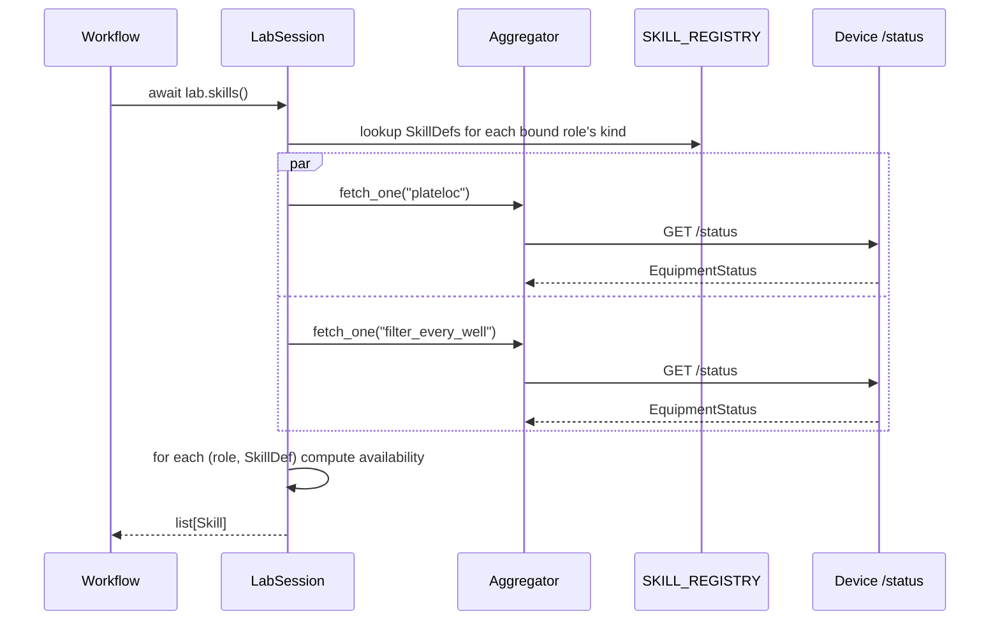

# Skill Catalog Design

**Status:** design. Implementation lands in `skills/` v0.2 (static catalog) and v0.3 (runtime availability via STATUS_SPEC v1.1 `allowed_actions`).

This document specifies how the SDK describes "what the lab can do right now" — the `Skill` data model, where the catalog lives, how availability is computed, and how it evolves from a hard-coded table to a self-describing protocol.

## Why a skill catalog at all

Workflow code, agents, and the dashboard all need a structured answer to:

- *What capabilities exist on a given role?*
- *Which of them are invokable right now?*
- *What arguments does each one take?*
- *If one is not invokable, why?*

This information already exists *implicitly* in the device's REST surface: every `POST /control/*` endpoint is a skill, every `EquipmentState` value gates which endpoints are valid, and every Pydantic request model is a schema. The catalog makes that knowledge **explicit, typed, and uniform across devices** so consumers don't reverse-engineer it case-by-case.

## Two data shapes: `SkillDef` (static) and `Skill` (runtime)

```python
# Static description of a capability - one entry per (kind, action) pair.
# Lives in the SDK's catalog registry; does not depend on any running device.
class SkillDef(BaseModel):
    name: str                                # e.g. "seal.start"
    kind: EquipmentKind                      # which equipment kind exposes it
    description: str                         # human-readable
    endpoint: str                            # e.g. "/control/seal/start"
    method: Literal["GET", "POST"] = "POST"
    args_schema: type[BaseModel]             # Pydantic class for the request body
    returns_schema: type[BaseModel] | None   # for skills that return values
    requires_states: list[EquipmentState]    # states that permit this skill
                                             # (used in v0.2 before allowed_actions exists)
    estimated_duration_s: float | None       # rough cost hint for planners


# Runtime instance bound to a specific role + computed availability.
# This is what `await lab.skills()` returns.
class Skill(BaseModel):
    name: str                                # e.g. "seal.start"
    role: str                                # project's role binding, e.g. "sealer"
    equipment_id: str                        # the bound device id
    kind: EquipmentKind
    description: str
    args_schema: type[BaseModel]
    estimated_duration_s: float | None

    available: bool
    reason: str | None                       # populated when available=False
                                             # e.g. "device is busy", "claim required",
                                             # "device under maintenance"
```

`SkillDef` is a *catalog entry*: properties of a capability independent of any specific instrument. `Skill` is a *runtime view* binding a `SkillDef` to a project role and a live availability assessment.

## Where the catalog lives

```
skills/src/lab_skills/
├── skill_catalog/
│   ├── __init__.py
│   ├── registry.py        # SKILL_REGISTRY: dict[EquipmentKind, list[SkillDef]]
│   ├── plate_sealer.py    # skill defs for kind = plate_sealer
│   ├── press.py           # skill defs for kind = press
│   ├── robot_arm.py       # ...
│   ├── solid_doser.py
│   ├── liquid_handler.py
│   ├── plate_reader.py
│   ├── plate_stacker.py
│   ├── fume_hood.py
│   └── env_sensor.py
└── ...
```

One module per `EquipmentKind`, each populating `SKILL_REGISTRY`. Adding a new device kind = adding one file. The registry is a pure-Python dict at import time; no I/O, no parsing.

Example for `plate_sealer`:

```python
# skills/.../skill_catalog/plate_sealer.py
from pydantic import BaseModel, Field
from .registry import register

class SealStartArgs(BaseModel):
    temperature_c: int = Field(ge=20, le=235)
    seconds: float = Field(ge=0.5, le=12.0)

class StageInArgs(BaseModel):
    pass

register("plate_sealer", [
    SkillDef(
        name="seal.start",
        kind="plate_sealer",
        description="Run a seal cycle at the given temperature and duration.",
        endpoint="/control/seal/start",
        args_schema=SealStartArgs,
        returns_schema=None,
        requires_states=["ready"],
        estimated_duration_s=8.0,
    ),
    SkillDef(
        name="stage.in",
        kind="plate_sealer",
        description="Move plate stage into the sealing chamber.",
        endpoint="/control/stage/in",
        args_schema=StageInArgs,
        requires_states=["ready"],
        estimated_duration_s=3.0,
    ),
    # ... seal.stop, stage.out, etc.
])
```

## How `await lab.skills()` is computed



For each (role, equipment_id) in the binding:

1. Look up `kind = registry.entry(equipment_id).kind`
2. Look up `defs = SKILL_REGISTRY[kind]`
3. Fetch the latest `/status` snapshot (via the aggregator's cache; refresh if older than `poll_timeout_seconds`)
4. For each `SkillDef`, build a `Skill`:
   - **Available** if and only if all of:
     - `status.equipment_status in def.requires_states` (or `status.allowed_actions` contains `def.name` once v1.1 is in)
     - the device is reachable (no `fetch_error`)
     - if claims are required (v0.3), this session holds a valid lease
     - the device is not under maintenance
   - **Reason** populated with the failing condition's human-readable message

The result is a snapshot — calling `lab.skills()` again returns fresh availability without re-importing anything.

## Three sources of truth for "what's invokable", evolving over time

| Source | Authority | When it's used |
|---|---|---|
| **Local `requires_states` per `SkillDef`** | SDK's hard-coded knowledge of equipment kinds | v0.2: only source until devices ship v1.1 |
| **Device's `/openapi.json`** | What the device actually accepts | optional cross-check / auto-discovery (v0.4+) |
| **Device's `/status.allowed_actions`** | Authoritative runtime list from the device | v0.3+: source of truth wherever available |

The SDK uses these in priority order:

1. If `status.allowed_actions` is present (STATUS_SPEC v1.1 device), use it directly. The local table is a *hint* for missing fields like `description` and `args_schema`.
2. Else fall back to `def.requires_states` (v1.0 devices).

This means devices migrating to v1.1 progressively make the catalog more accurate without any SDK rebuild. The SDK never needs to "know" the precondition rules of a specific device — the device declares them.

## Auto-derivation from OpenAPI (deferred)

Every device already publishes `/openapi.json` (FastAPI is free). A future SDK release can:

1. Discover skills by walking `paths` in the OpenAPI document, filtering to `/control/*`.
2. Resolve `requestBody` schemas to dynamic Pydantic models via `pydantic.create_model` from the JSON Schema.
3. Use `operationId` (or path-derived names) for `Skill.name`.
4. Use `summary` / `description` for documentation.

This eliminates the per-kind catalog file. The cost is more SDK complexity (JSON Schema → Pydantic at startup) and less editorial control over `Skill.name` formatting.

We ship the hard-coded catalog first because:

- The exact set of devices is small and known.
- Hand-curated names (`seal.start` vs `controlSealStart`) read better in agent prompts and dashboards.
- Errors fail at import time, not when an agent first calls a skill.

We revisit OpenAPI derivation when the device count grows past ~10 or when a third-party device is added that we don't want to ship a hand-written catalog for.

## What this enables

- **`await lab.skills()`** — a list of typed, currently-available capabilities, used by workflows and the dashboard.
- **`lab.role("sealer").seal_start(...)`** — typed methods on `EquipmentClient` are *generated* from the catalog, not hand-written per device repo (avoids drift).
- **Plan validation** (`docs/INTERLOCKS.md`) — `validate_plan` consults the catalog to verify each step's args match the schema before any side-effects.
- **MCP server** (v0.4) — tools listed to agents are `Skill` objects converted to MCP tool descriptors. Adding a new equipment kind to the lab automatically extends the agent's toolbelt.
- **Dashboard skill panels** — UI can render "what can be done now" by reading the catalog instead of hard-coding buttons per device.

## Versioning the catalog

Skill names are part of the SDK's API surface. Renaming a skill is a breaking change. Rules:

- New skills can be added in minor releases.
- Skill schemas can be extended (new optional fields) in minor releases.
- Removing a skill, renaming a skill, or changing a required field requires a major version bump and a deprecation period.
- The set of `EquipmentKind` enum values is governed by `STATUS_SPEC.md`, not the catalog.

## See also

- `docs/STATUS_SPEC.md` — the device contract that the catalog mirrors
- `docs/INTERLOCKS.md` — how the catalog feeds plan validation
- `docs/ARCHITECTURE.md` — overall system layering
